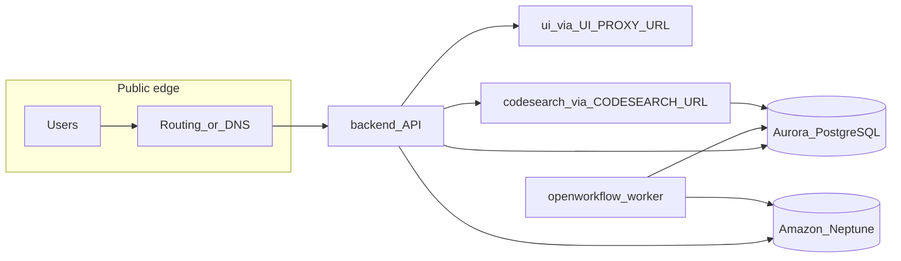

# AWS CDK self-hosting package

## 0. Product decisions locked for v1 (supersedes exploratory wording elsewhere)

These guide `CtxPipe` API design and documentation so the gap review’s “minimal construct” criteria stay concrete.

### 0.1 Minimal `CtxPipe` props (“required only”; YAGNI for configuration)

- **Expose only props that must be supplied by the customer for a correct first boot.** Everything else gets sensible **internal defaults** inside the construct (including isolated data stores created in-account). Do **not** add optional knobs in v1 “for completeness.”
- **Draft required prop categories** (finalize exact fields during implementation cross-check with `apps/backend/src/config/env.ts`):
  - **Auth**: secret material sufficient for Better Auth (`AUTH_SECRET`-equivalent length and delivery pattern — plain value accepted from CDK or reference to Secrets Manager ARN if you prefer ops to pre-seed secrets).
  - **Public origin**: stable **browser-visible** backend URL (`AUTH_BASE_URL` / equivalent) so cookies, OAuth redirects, and CORS match the hostname users hit — either the **ALB’s default DNS name** or a **custom domain** created via optional **`CtxPipe` DNS/TLS props** (**§0.7**). The string you pass here must match the deployed endpoint exactly (`https://…`).
  - **Model / LLM (API key or bearer to an OpenAI-compatible HTTP API):** **required for first boot** — ctxpipe **does not function** without a working inference endpoint. Same contract as **Compose / self-host today**: customers supply **`CtxPipe` values** (or Secrets Manager ARNs) so CDK injects the equivalent **`env.ts`** variables (base URL, API key, model id, etc.). Covers vendors reached via **HTTPS + token** (e.g. OpenAI, **OpenRouter**, other routers). **Amazon Bedrock** (AWS-native inference + **IAM**) is **not** in v1 — deferred (**§0.4**).
- **PostgreSQL:** v1 **always creates** Aurora Postgres scoped to this stack so ctxpipe **data stays isolated** from the customer’s other systems. Consumers do **not** pass BYO Postgres connection strings as a first-class v1 workflow.
- **`DATABASE_URL`:** constructed and stored by CDK (**Secrets Manager** → ECS), not a mandatory hand-typed consumer prop.

### 0.2 Connectors — first boot vs optional IaC-managed deployment secrets

- **GitHub and Atlassian (Forge/OAuth)** are **not** required for the **first successful deploy** — the product onboarding flow configures org-scoped integrations **after** infra is running.
- **Per-org connector state** (installations, tokens, metadata) lives in application Postgres in the **`connections` table (`connections.config`)** — **outside CDK**. IaC must not try to replicate or migrate that JSON as part of `@ctxpipe/aws-cdk`.
- **Deployment-wide** connector prerequisites (same for all orgs on the instance — see `env.ts`): e.g. `GITHUB_APP_ID`, `GITHUB_PRIVATE_KEY`, `GITHUB_WEBHOOK_SECRET`, `GITHUB_CLIENT_ID`, `GITHUB_CLIENT_SECRET`, `ATLASSIAN_CLIENT_ID`, `ATLASSIAN_CLIENT_SECRET` are **environment-level** secrets. For v1:
  - Customers may omit them initially (connectors disabled until onboarding + ops wire env).
  - **Optional `CtxPipe` props** (recommended pattern for teams wanting GitOps/IaC): values are written to **Secrets Manager** and injected into ECS task defs on **`cdk deploy`** — typically a **second** deploy **after** they have created the GitHub App and Atlassian OAuth apps and copied credentials. Docs: “deploy stack → onboarding / create apps → redeploy with optional connector props.”
- No conflict with `connections.config`: CDK scopes optional connector knobs to **shared app identity** secrets only; onboarding continues to populate **per-org** rows in Postgres.

### 0.3 Internal-only runtime wiring

- **`GRAPH_DB_URI` / Neptune, `UI_PROXY_URL`, `CODESEARCH_URL`, internal service discovery** — owned by CDK defaults (private subnets + Service Connect / Cloud Map naming). Consumers do **not** need these as exposed props unless a future version adds explicit VPC import/advanced escape hatches.

### 0.4 Explicitly out of scope for this plan (revisit later)

- **Amazon Bedrock in CDK**: task/instance **IAM** for `InvokeModel`, inference profiles, optional **VPC interface endpoints**, and any Bedrock-specific env mapping — **not** designed or implemented in v1; track as a separate epic when product prioritizes Bedrock on self-host. **In v1 instead:** **OpenAI-compatible HTTP APIs** secured with **API keys or bearer tokens** — **required** `CtxPipe` / Secrets Manager wiring per **§0.1** so first boot has inference.
- **OTEL collector / telemetry export via CDK**: no **`otel-collector`** sidecar or ECS service, no **`CtxPipe`** knobs for OTLP endpoints, ADOT, or vendor fan-out (Datadog, Sentry, etc.) in this plan — **ignored for now**; revisit when self-host observability is prioritized (operators may still configure app/env outside IaC if needed).

### 0.5 Distribution, topology, and parity decisions (answers to gap-review questions)

| Topic | Decision |
| ----- | -------- |
| **Registry / visibility (Q1, Q10)** | **`@ctxpipe/aws-cdk`** is **public** on **GitHub Packages** (`npm.pkg.github.com`) — consumers install with scope registry config **without** a PAT (**§4**). |
| **Multi-account (Q2)** | **v1 is not single-account-only:** CDK should implement **cross-account patterns consistent with hosted production ctxpipe** (IAM trust, role boundaries, resource ownership across accounts — align with internal reference architecture / Terraform for hosted). Concrete wiring is validated during implementation against the live hosted model. |
| **Connectors / bootstrap (Q3)** | Unchanged — **§0.2** (optional connectors; onboarding; optional second deploy for deployment-wide secrets). |
| **Public ingress (Q5)** | **Single public edge:** **Application Load Balancer → backend service only.** **UI** is **not** on its own public listener; traffic reaches the UI **only** via **`UI_PROXY_URL`** from the backend (same pattern as today’s integrated app). Codesearch/worker remain private. |
| **Custom domain (Q5b)** | **First-class optional `CtxPipe` support:** customers often already have a **Route 53 public hosted zone**. Accept an **existing** `IHostedZone` (or attributes for `HostedZone.fromHostedZoneAttributes` / lookup), an **ACM certificate** in the **same region as the ALB** (`ICertificate`), and the **FQDN** (e.g. `ctxpipe.example.com`). CDK attaches **HTTPS (443)** to the ALB, serves the cert, and creates a **Route 53 alias** (A/AAAA) to the ALB. **Default** when omitted: use ALB **default DNS name** and document **`AUTH_BASE_URL`** from stack output. **Cross-account DNS** (zone in another account) is **not** day-one automation — document **manual NS delegation / alias** or a follow-up; same-account is the **easy path**. |
| **Outbound internet (Q6)** | **NAT Gateway(s)** for private subnets are **acceptable** for v1 (image pulls, vendor APIs, GitHub/Atlassian outbound). Stricter VPC endpoints-only egress is **not** a day-one requirement. |
| **CDK package ↔ container images (Q8)** | **Yes — pin by release:** each published **`@ctxpipe/aws-cdk`** version should **default** ECS task images to the **GHCR tags (or digests) produced from the same git commit** as that npm package version (single release train). Customers may override image tags via props for hotfixes, but **documented defaults** stay **commit-aligned**. Implementation detail: embed or derive default tag from package build metadata / changelog convention. |
| **Data backups (Q9)** | **v1 `CtxPipe` turns on opinionated backup retention by default** — blackbox “good defaults” so customers are not left without durability settings (**§0.6**). |

### 0.6 Backups (Q9) — opinionated defaults in v1

**Principle:** match the **sensible-defaults** mindset: CDK should **provision backup/retention** for stateful data so operators do not have to design DR from scratch. Exact numbers (e.g. retention days, backup windows) are chosen during implementation and documented in the package README; optional **`CtxPipe` props** may later expose overrides — **not** required for minimal installs.

**Scope:**

- **Amazon Aurora** — enable **automated backups** with a **documented default retention** window (PITR-compatible window per engine capability); align with AWS best-practice minimums unless product chooses longer retention.
- **Amazon Neptune** — enable cluster **automated backups** with **documented retention** and backup window suitable for low-impact maintenance periods.
- **Amazon EFS** (codesearch `/data`) — enable **AWS Backup**–style or **EFS automatic backups** / backup policy with **documented retention** (operator may still rebuild index from git as a secondary recovery path — document trade-offs).

**Docs:** README must state **what is backed up**, **retention defaults**, and **how restore works at a high level** (point-in-time vs snapshot restore flows per service).

### 0.7 Custom domain & TLS (public backend)

Operators typically want a **stable branded hostname** instead of the ALB default **`*.elb.amazonaws.com`** name. v1 should make the **common case** (hosted zone already exists **in the same account/region** as the stack) **one optional prop group** on **`CtxPipe`**.

**Behavior:**

- **No custom domain (default):** ALB uses AWS **issued DNS name**; HTTP and/or HTTPS as implemented; document that **`AUTH_BASE_URL`** / **`publicUrls`** must use that hostname (from **`CfnOutput`**). Lowest friction for a quick install.
- **Custom domain (optional):** Customer supplies:
  - **FQDN** for the backend (e.g. `app.example.com`).
  - **ACM certificate** (`ICertificate`) **in the same AWS region as the ALB** (required by ELB; **not** `us-east-1` unless the ALB is there).
  - **Route 53 hosted zone** (`IHostedZone`) they already manage — e.g. `HostedZone.fromLookup`, `fromHostedZoneAttributes` with **zone id + zone name**, or a zone created elsewhere in the same app.
  - CDK: add **HTTPS listener** on the ALB with that certificate; create **Route 53 alias record(s)** from the FQDN to the ALB; optionally **redirect HTTP → HTTPS**. Ensure **`AUTH_BASE_URL`** / required **public origin** props document **`https://app.example.com`** (must match the certificate CN/SAN).

**Certificate issuance:** Support **bring-your-own ARN** (customer creates cert in ACM first — **DNS validation** in their zone). Optionally document a **second pattern**: CDK-created **`aws-certificatemanager.Certificate`** with **DNS validation** against the supplied hosted zone (same account) so **`cdk deploy`** can complete validation when Route 53 is writable — choose one primary story in README to avoid confusion.

**Out of scope for v1 automation:** **Cross-account** hosted zones (delegate outside CDK or manual records); **third-party DNS only** (no Route 53) — customer adds **CNAME/ALIAS** to ALB per README; **wildcard** edge cases — document SAN coverage.

---

## 1. What the hosted stack does today (source of truth)

Read together: [infra/module/ctxpipe/railway.tf](infra/module/ctxpipe/railway.tf) (runtime wiring) and [infra/module/ctxpipe/neon.tf](infra/module/ctxpipe/neon.tf) (Postgres). [infra/README.md](infra/README.md) summarizes the six Railway services and GHCR image flow.

| Railway service   | Image / data                        | Role                                                                                   |
| ----------------- | ----------------------------------- | -------------------------------------------------------------------------------------- |
| **backend**       | `ghcr.io/ctxpipe-ai/backend`        | Hono API + MCP; public domain + custom domain                                          |
| **openworkflow**  | `ghcr.io/ctxpipe-ai/worker`         | OpenWorkflow worker ([apps/backend/Dockerfile.worker](apps/backend/Dockerfile.worker)) |
| **ui**            | `ghcr.io/ctxpipe-ai/ui`             | Nitro server on 3002; `UI_PROXY_URL` from backend                                      |
| **codesearch**    | `ghcr.io/ctxpipe-ai/codesearch`     | Zoekt + API; **persistent volume** `/data`                                             |
| **falkordb**      | `falkordb/falkordb`                 | Graph (`GRAPH_DB_URI`); **persistent volume**                                          |
| **otelcollector** | `ghcr.io/ctxpipe-ai/otel-collector` | Hosted/Railway: OTLP fan-out. **v1 CDK stack does not deploy this service** (**§0.4**). |

**AWS CDK self-host (this plan)** replaces the Railway **FalkorDB** service with **Amazon Neptune** — see §2. Hosted SaaS above remains FalkorDB-backed until you migrate or dual-support operationally.

Neon supplies `**DATABASE_URL`** via pooler URI (`neon_project.this.connection_uri_pooler`). Postgres is **PostgreSQL 17** per [ADR-012](.ai/memory/decisions/ADR-012-postgres-17-neon-compatibility.md) (aligned with local `pgvector/pgvector:pg17`).

Backend/worker env validation lives in [apps/backend/src/config/env.ts](apps/backend/src/config/env.ts). Terraform still sets `LANGSMITH_API_KEY` on Railway (`[railway.tf](infra/module/ctxpipe/railway.tf)`), but **application code does not read it** (no references in `apps/backend`). When `ENABLE_LANGSMITH=true`, [apps/backend/src/routes/langsmith.ts](apps/backend/src/routes/langsmith.ts) only mounts the embedded LangGraph API under `/langsmith` and uses `AUTH_BASE_URL` for the Studio URL log — it does **not** use `LANGSMITH_API_KEY`. **Self-hosting / CDK customer docs:** do **not** treat `LANGSMITH_API_KEY` as required; leave it in internal hosted Terraform for now if you want parity with Railway env shape without cleanup.

---

## 2. AWS resource options (equivalents and trade-offs)

**PostgreSQL (replaces Neon)**

- **v1 scope:** provision **Amazon Aurora PostgreSQL inside the stack** for ctxpipe isolation (no BYO cluster / URI from consumer as the default path — see **§0.1**).  
- **Amazon Aurora PostgreSQL** (engine version matching **PostgreSQL 17** compatibility where available in target regions; confirm per-region [Aurora version matrix](https://docs.aws.amazon.com/AmazonRDS/latest/AuroraUserGuide/aurora-postgresql.relnotes.html)). Use **cluster storage, fast failover, and read scaling** (optional reader endpoint for read-heavy workloads later).  
- Enable `**pgvector`** (and any other extensions you rely on in Drizzle migrations) via Aurora parameter groups and the supported extension list for that engine version — same concern as Neon/pgvector in ADR-012.  
- `**DATABASE_URL` (full URI, Neon-style):** Store the **complete** `postgresql://…` connection string in **Secrets Manager** (single secret string). After the Aurora cluster exists, CDK (or a one-time Custom Resource / deploy step) **writes** the final URL (writer host, port, db name, user, password). **Fargate** task definitions map that secret to the container env var `DATABASE_URL` via `secrets` + **task execution role** `GetSecretValue` — same mental model as pasting Neon’s pooler URL, but sourced from AWS. **RDS Proxy for Aurora** remains optional in front of the writer for connection pooling.

**Graph store — default: Amazon Neptune**

- **Amazon Neptune** is the graph backend for AWS self-host: managed OpenCypher, **VPC-private** cluster, no container volume to operate for graph data.  
- **App wiring:** set `GRAPH_DB_PROVIDER=neptune` and `GRAPH_DB_URI` to the Neptune **Bolt** endpoint (the backend uses the Neo4j Bolt driver path — see [apps/backend/src/platform/graph/client.ts](apps/backend/src/platform/graph/client.ts)). Store URI (and any auth material Neptune requires for your chosen auth mode) in **Secrets Manager** and inject into backend + worker tasks like `DATABASE_URL`.  
- **Validation:** run automated + manual checks that org-scoped graph queries behave correctly on Neptune’s **OpenCypher dialect** (document any limitations vs other engines). Track gaps before GA of the CDK package.

**Note:** **ElastiCache / MemoryDB** are **not** substitutes for **Neptune** for OpenCypher graph workloads in this stack.

**Application compute (replaces Railway services)**

- **Amazon ECS on Fargate** is the closest match: one **task definition** per **application** service (**backend, worker, ui, codesearch** — **no** `otel-collector` task in v1 per **§0.4**). **Neptune** is a **managed cluster** (not a Fargate task). Use **private subnets**, **Service Connect** or **Cloud Map** for stable internal DNS (replaces `*.railway.internal` and `${{service.RAILWAY_PRIVATE_DOMAIN}}` references in [railway.tf](infra/module/ctxpipe/railway.tf)).  
- **Application Load Balancer** in front of **backend only** (**§0.5**): **no** separate public listener for **ui**. Your product assumes **backend** is the browser entry with **`UI_PROXY_URL`** — mirror that: **single public listener → backend**, backend → internal **`ui:3002`** (private subnets / internal LB or Service Connect as designed).

**Public hostname, TLS, Route 53 (custom domain — §0.7)**

- **TLS:** Prefer **HTTPS** for production; ACM cert on the ALB **HTTPS listener** matches **custom FQDN** when **`CtxPipe` custom-domain props** are set.
- **DNS:** **`route53.ARecord`** / **`AAAA`** **alias** to the ALB (`route53.RecordTarget.fromAlias(new route53_targets.LoadBalancerTarget(alb)))`) for the customer’s **existing** hosted zone.
- **Outputs:** Export both **ALB DNS name** and (when applicable) **canonical public URL** (`https://<custom-fqdn>`) so **`AUTH_BASE_URL`** / docs stay aligned.

**Codesearch persistent data**

- **Default: Amazon EFS** mount for Zoekt index and cache (Compose: [docker-compose.yml](docker-compose.yml) `codesearch` volumes). Same **durable `/data`** idea as Railway’s volume: the index survives **task replacement and deploys** because the filesystem outlives any single Fargate task. Size/perf: tune EFS **throughput mode** and **backup** policy as needed.  
- **Why EFS over EBS for this stack:** **ECS on Fargate can attach Amazon EBS** (Linux platform 1.4.0+, native integration since 2024 — see [Use Amazon EBS volumes with Amazon ECS](https://docs.aws.amazon.com/AmazonECS/latest/developerguide/ebs-volumes.html)). For tasks run under an **ECS service**, however, AWS documents that **attached EBS volumes are not preserved and are deleted when the task terminates** — so a rolling deploy or stop/start would **drop on-disk Zoekt state** unless you adopt a **snapshot-and-rehydrate** workflow (new volume from snapshot per task). That is heavier operationally than one shared EFS mount. **EFS** keeps one persistent NFS namespace across task lifecycles and matches “long-lived index under `/data`” with simpler ops. **Advanced:** EBS-from-snapshot on Fargate remains an option if you prioritize block I/O characteristics and accept owning snapshot lifecycle.

**Email delivery — default: Amazon SES (minimal customer setup)**

- **Default self-host path:** provision **Amazon SES** in CDK and wire app email through SES SMTP so customers do not need an external provider (no SendGrid/Mailgun setup).  
- **Secret wiring:** generate/store SES SMTP credentials in **Secrets Manager** and inject `SMTP_CONNECTION_URL` + `EMAIL_FROM_ADDRESS` into backend tasks by default.
- **Minimal customer actions that remain:** verify sender domain/address in SES, add DNS records (DKIM/SPF), and request SES production access if the account is still in sandbox.

**Observability / OTEL**

- **Ignored in v1 `CtxPipe`:** do **not** provision the **`otel-collector`** image, **ADOT**, or OTLP routing in CDK (**§0.4**). Hosted SaaS and **Compose** may still run collectors separately; self-host telemetry consolidation is a **future** add-on.

**Images**

- Use **public GHCR images** (`ghcr.io/ctxpipe-ai/...`) for self-host so no registry auth setup is required.  
- Optional enterprise path: document mirroring to **ECR** for air-gapped or compliance-driven environments.

---

## 3. Environment variables customers must supply

Cross-check three layers: `**parseEnv`** ([env.ts](apps/backend/src/config/env.ts)), **Compose deploy** ([docker-compose.yml](docker-compose.yml) + [docker-compose.env.example](docker-compose.env.example)), **Terraform/Railway** ([railway.tf](infra/module/ctxpipe/railway.tf)).

Align this section with **§0**: distinguish **CtxPipe-required consumer input** vs **values CDK derives** vs **optional second-deploy connector secrets**.

**Mapped onto `CtxPipe` required props** (consumers configure these explicitly; CDK translates to ECS + Secrets Manager as needed):

| Logical input        | Typical env/task mapping                                                                                             |
| -------------------- | -------------------------------------------------------------------------------------------------------------------- |
| Auth secret          | `AUTH_SECRET` (≥ 32 chars); storage pattern TBD (`SecretValue` vs Secrets Manager ARN from customer).                |
| Public backend origin | `AUTH_BASE_URL`; derive or require `AUTH_ALLOWED_ORIGINS` with a documented default                                  |
| Model (API-key / OpenAI-compatible) | **Required** — per **`env.ts`** (e.g. base URL, API key, default model); CDK maps into Secrets Manager → backend/worker ECS. Without this, ctxpipe cannot serve requests. **Amazon Bedrock** — **out of scope** until **§0.4** follow-on (**IAM**, not token-only). |

**Optional — custom public DNS & TLS (recommended when not using ALB default hostname)**

When **`CtxPipe`** receives **`customDomain`** (name TBD): **FQDN**, **`route53.IHostedZone`** (existing zone), **`acm.ICertificate`** (same region as ALB). CDK creates **alias** record(s) and **HTTPS** listener (**§0.7**). **`AUTH_BASE_URL`** / **public origin** must still be set to **`https://<that-FQDN>`** (required props stay required; custom domain only wires infra).

**Provided entirely by CDK (not consumer hand-paste for minimal install)**

| Variable / concern | Notes                                                                                                                                       |
| ------------------ | ------------------------------------------------------------------------------------------------------------------------------------------- |
| `DATABASE_URL`     | Aurora created in-stack; CDK builds full URI → **Secrets Manager** → backend, worker, codesearch                                            |
| `GRAPH_DB_URI`     | Neptune Bolt URL from deployed cluster → secret; inject with `GRAPH_DB_PROVIDER=neptune`                                                    |
| `UI_PROXY_URL`     | Internal URL from stable private service naming (Service Connect / Cloud Map)                                                               |
| `CODESEARCH_URL`   | Same pattern — internal DNS; not a minimal consumer prop                                                                                  |

For CDK default graph: set **`GRAPH_DB_PROVIDER=neptune`** alongside **`GRAPH_DB_URI`** (Bolt endpoint from Neptune).

**Optional — deployment-wide connectors (recommended after onboarding + GitHub/Atlassian app registration)**

Omitting these at first deploy yields a runnable stack **without live GitHub App / Forge** credentials; onboarding can still run partially until ops complete app registration **and optionally** redeploy with `CtxPipe` **optional connector props** that push equivalent env into Secrets Manager → ECS (`GITHUB_APP_ID`, `GITHUB_PRIVATE_KEY`, `GITHUB_WEBHOOK_SECRET`, `GITHUB_CLIENT_ID`, `GITHUB_CLIENT_SECRET`, `ATLASSIAN_CLIENT_ID`, `ATLASSIAN_CLIENT_SECRET`). **Per-org installations** remain **`connections.config` in Postgres** — never CDK-managed.

**CDK-managed defaults without extra vendor setup (where feasible)**

| Area              | Approach                                                                                                                                    |
| ----------------- | ------------------------------------------------------------------------------------------------------------------------------------------- |
| Email             | SES + `SMTP_CONNECTION_URL`, `EMAIL_FROM_ADDRESS` populated by CDK defaults; verification steps remain customer-visible                     |

**Deferred / intentionally not surfaced as v1 `CtxPipe` props**

| Topic                           | Approach                                                                                                                                    |
| ------------------------------- | ------------------------------------------------------------------------------------------------------------------------------------------- |
| OTEL / collector / OTLP         | **Deferred** (**§0.4**) — no collector service or telemetry props in v1                                                                  |
| **Amazon Bedrock**              | IAM roles, policies, endpoints — **deferred** (**§0.4**). API-key OpenAI-compatible providers are **required for first boot** (**§0.1**). |
| Per-org Forge/GitHub JWT fields | Persisted via app onboarding into `connections`; not IaC                                                                                  |
| Many tuning knobs               | Omit until customers request — internal defaults                                                                                          |

**Strongly recommended for production parity (after connectors are configured)**

Additional variables from hosted stacks may still appear in **`env.ts`**; document the **recommended second deploy** path for IaC-aligned teams wiring GitHub App + Atlassian OAuth credentials above.

| Variable                        | Source in hosted stack                                                                                                                      |
| ------------------------------- | ------------------------------------------------------------------------------------------------------------------------------------------- |
| GitHub App / OAuth              | `GITHUB_APP_ID`, `GITHUB_PRIVATE_KEY`, `GITHUB_CLIENT_ID`, `GITHUB_CLIENT_SECRET`, `GITHUB_WEBHOOK_SECRET` (**optional IaC props** when ready) |
| Atlassian                       | `ATLASSIAN_CLIENT_ID`, `ATLASSIAN_CLIENT_SECRET` (**optional IaC props** when ready)                                                     |
| LLM (API-key / OpenAI-compatible) | **Required** **`CtxPipe`** / Secrets Manager → **`env.ts`** mappings (**§0.1**); **Bedrock** deferred (**§0.4**)                             |
| OTEL                            | Deferred (**§0.4**) — not part of v1 CDK contract                                                                                              |
| Optional LangGraph studio route | `ENABLE_LANGSMITH=true` (hosted sets this); **does not use** `LANGSMITH_API_KEY` — see [langsmith.ts](apps/backend/src/routes/langsmith.ts) |

**Not a customer requirement:** `LANGSMITH_API_KEY` remains in Terraform/Railway for historical/internal reasons only; do not document or wire it as required for AWS self-host.

**Not in self-host scope:** product analytics (`AMPLITUDE_API_KEY`, `AMPLITUDE_REGION`) are hosted-only telemetry and should not be required or configured by the AWS self-host CDK package.

**Email defaults for self-host:** CDK should auto-provision SES and populate `SMTP_CONNECTION_URL` / `EMAIL_FROM_ADDRESS`; customers only complete SES domain/address verification + DNS + sandbox exit.

**Codesearch**

- `AUTH_SECRET`, `AUTH_TOKEN_AUDIENCE_CODESEARCH`, `DATABASE_URL`, `PORT`, `ZOEKT_WEBSERVER_URL` — align with [railway.tf](infra/module/ctxpipe/railway.tf) `code_search` block. Optional `**GITHUB_TOKEN`** in Compose for cloning private repos ([docker-compose.yml](docker-compose.yml)).

**API shape:** Prefer a **`CtxPipeProps`** interface with **required** nested props **`auth`**, **`publicUrls`** (or equivalent), and **`modelProvider`** (API-key / OpenAI-compatible — maps to **`env.ts`**), plus **optional** buckets (`customDomain` / **Route 53 + ACM** per **§0.7**, `connectorSecrets`, `advanced` reserved for future). **`modelProvider` for Bedrock/IAM** — **deferred** (**§0.4**). Avoid a flat mega-prop list. Minimal install = three required groups + CDK-derived infra secrets; add **`customDomain`** when using a branded hostname.

---

## 4. Publish flow: GitHub Packages (npm)

- Add a new workspace package at `**packages/aws-cdk`** with package name `@ctxpipe/aws-cdk` scoped to the GitHub org. Scaffold the package with `cdk init lib --language=typescript` (run in an empty package directory), then layer `CtxPipe` on top of the generated CDK lib template.  
- Root [pnpm-workspace.yaml](pnpm-workspace.yaml) already includes `packages/`*.  
- `**package.json`**: `"publishConfig": { "registry": "https://npm.pkg.github.com" }`, **`"access": "public"`** (GitHub Packages — **public** so **consumers install without a PAT**), `"files": ["lib", "README.md"]`, main/types for compiled JS.  
- **Consumers**: scoped installs still need the GitHub npm registry for **`@ctxpipe`** (e.g. `@ctxpipe:registry=https://npm.pkg.github.com` in `.npmrc` or `pnpm` config) — **no** `read:packages` token when the package is **public**.  
- **Publish CI**: retain **`NODE_AUTH_TOKEN`** / **`GITHUB_TOKEN`** with **`packages: write`** only for the **release workflow** that runs **`changeset publish`** (not required on consumer machines).

### 4.1 Changesets baseline (greenfield — not in repo today)

Root [package.json](package.json) has **no** `@changesets/cli` and there is **no** `.changeset/` directory yet. Implement the full Changesets setup **once for the monorepo**, scoped so **`@ctxpipe/aws-cdk`** can ship independently (other workspaces stay `private` / unpublished unless you opt in later).

**Dependencies and layout**

- Add **`@changesets/cli`** to **root** `devDependencies` (`pnpm add -Dw @changesets/cli`).
- Run **`pnpm changeset init`** from repo root (or equivalent) to create **`.changeset/config.json`** at the monorepo root. Commit `.changeset/` to git.

**`.changeset/config.json` (decisions to lock when initializing)**

- **`changelog`**: default **`@changesets/cli/changelog`** is fine for repo-root `CHANGELOG.md` per package; optionally adopt **`@changesets/changelog-github`** later if you want richer GitHub Release integration.
- **`fixed` vs `independent` versioning**: prefer **`independent`** so only `@ctxpipe/aws-cdk` gets semver bumps while apps stay off the registry; alternatively **`fixed`** if you intentionally version all workspace packages together (usually **not** desired here).
- **`access`**: **`public`** — matches **`publishConfig.access`** / public GitHub Package (**§4**); consumers install without registry tokens.
- **`baseBranch`**: **`main`** (or your default trunk name).
- **`updateInternalDependencies`**: **`true`** so dependent workspace packages get compatible bumps when you add more publishables later.
- **`ignore`**: optional array to skip **`apps/**`** (and other non-publishable paths) from changeset **selection** prompts if CLI noise becomes annoying — does not block versioning `@ctxpipe/aws-cdk`.

**Root `package.json` scripts (add)**

- **`changeset`**: `changeset` — contributors record semver intent before merge.
- **`ci:version`** (optional): `changeset version` — local dry-run of version + changelog generation.
- **`release`** (used by CI): sequence such as **`pnpm turbo build --filter @ctxpipe/aws-cdk`** then **`changeset publish`** — exact filter must match what must build before npm publish.

**`packages/aws-cdk/package.json`**

- Already noted: **`publishConfig.registry`** → `https://npm.pkg.github.com`, **`publishConfig.access`** → **`public`**, **`name`** `@ctxpipe/aws-cdk`, **`repository`** / **`files`** so publish tarball includes compiled `lib/` + README.

**GitHub Actions — npm auth for GitHub Packages**

- In the workflow that runs **`changeset publish`**, configure npm to authenticate to **`npm.pkg.github.com`**: repo-root **`.npmrc`** fragment or workflow step writing  
  `@ctxpipe:registry=https://npm.pkg.github.com` and  
  `//npm.pkg.github.com/:_authToken=${NODE_AUTH_TOKEN}`  
  with **`NODE_AUTH_TOKEN: ${{ secrets.GITHUB_TOKEN }}`** (default token works when **`permissions.packages: write`** is set for the job, same repo).
- Confirm repository **Settings → Actions → General**: workflows allowed to **create pull requests** if using the Version Packages PR flow.

**GitHub Actions — `changesets/action` release pipeline**

- Add a workflow (e.g. **`.github/workflows/release.yml`**) using **`changesets/action`** ([changesets/action](https://github.com/changesets/action)) with:
  - **`permissions`**: `contents: write`, `pull-requests: write`, **`packages: write`** (publish).
  - **`publish`**: `pnpm release` (or `pnpm install && pnpm release`) so publish runs only after successful install + build.
  - Typical flow: **`changeset version`** produces a **Version packages** PR when pending `.changeset/*.md` files land on **`main`**; merging that PR bumps **`packages/aws-cdk`** version + changelog; **`changeset publish`** runs on the merge that contains version bumps (follow upstream recommended recipe for monorepos + pnpm — pin **`changesets/action`** major version and align Node/pnpm with root **`packageManager`**).
- **CI gate**: before publish, run **`pnpm turbo build --filter @ctxpipe/aws-cdk`** (and **`pnpm --filter @ctxpipe/aws-cdk test`** when tests exist) so broken builds never ship.

**Contributor docs**

- Document in **root `CONTRIBUTING.md`** or **`AGENTS.md`**: any PR that changes **`@ctxpipe/aws-cdk`** in a release-worthy way should include a **new `.changeset/*.md`** from **`pnpm changeset`** (patch/minor/major + summary).

---

## 5. Implementation plan (phased)

**Phase A — Design lock-in**

- Freeze the **target topology**: ECS Fargate + single public ALB (**backend target only**; **§0.5**) + **NAT** egress + **Aurora PostgreSQL** + **Amazon Neptune** + **EFS** (codesearch index/cache); **no** OTEL collector service (**§0.4**).  
- Freeze **hosted parity — cross-account** (**§0.5 Q2**): CDK layout matches **production ctxpipe** multi-account patterns (not “single AWS account only”); reconcile with internal hosted IaC before GA.  
- Freeze **`CtxPipeProps` v1** per **§0** / **§0.4**: required (**auth**, **public URLs**, **API-key / OpenAI-compatible model** → **`env.ts`** mappings); **optional `customDomain`** (**FQDN** + **existing** `IHostedZone` + **`ICertificate`** — **§0.7**); **no** **Bedrock/IAM** model integration in this iteration; CDK-internal **DATABASE_URL**, **Neptune Bolt URI**, **`UI_PROXY_URL`**, **`CODESEARCH_URL`**; **optional `connectorSecrets` (name TBD)** for deployment-wide GitHub App + Atlassian OAuth only → Secrets Manager → ECS (**second deploy** documented); **explicit non-goal**: IaC/templating of **`connections.config`**.  
- Produce a **customer env checklist** (markdown generated from the tables above) and a **single default install profile** for CDK (no separate observability stack variant until OTEL returns to scope).

**Phase B — CDK package skeleton**

- New package with **CDK v2** + TypeScript exposing a **single public construct: `CtxPipe`**. `CtxPipe` composes all required infrastructure (Aurora, Neptune, ECS services, ALB, codesearch storage, secrets wiring) behind one high-level API so customers do not wire low-level services manually.  
- Scaffold the package baseline using `cdk init lib --language=typescript` in `packages/aws-cdk`, then adapt generated files/scripts to monorepo `pnpm` + Changesets conventions.
- Keep any lower-level building blocks (cluster/service/database/network helpers) as **internal/private implementation details**; do not require consumers to compose them directly.  
- `CtxPipe` outputs should include customer-usable values only (for example: app URL, auth URL, important secret ARNs/ids, and optional diagnostics references), not an overwhelming set of low-level resource handles by default.
- **Database secret:** create/populate a Secrets Manager secret containing the **full** `DATABASE_URL` after Aurora is available; wire all relevant task definitions to inject it (decision: **Option A — full URI in one secret**).  
- **Backups:** wire **§0.6** defaults on **Aurora**, **Neptune**, and **EFS** (automatic backups / AWS Backup policy as appropriate) with retention documented in README — **on by default**, minimal props.
- **Email construct:** add SES + SMTP secret generation/injection so backend receives `SMTP_CONNECTION_URL` and `EMAIL_FROM_ADDRESS` by default without external provider setup.
- **Model provider (API-key / OpenAI-compatible only):** **`CtxPipe`** **requires** model props at synth/deploy; write secrets and inject **`env.ts`** fields for HTTPS+token providers (e.g. OpenRouter); **do not** add Bedrock **`InvokeModel` IAM** or Bedrock-specific wiring in v1 (**§0.4**).
- **Migration job**: one-off ECS task or Step Functions hook running the same migrate command as Compose ([docker-compose.yml](docker-compose.yml) `migrate` → [apps/backend/src/db/migrate.ts](apps/backend/src/db/migrate.ts) pattern); migration task uses the **same** `DATABASE_URL` secret as runtime services.  
- **Networking**: VPC (new or import via props), **private subnets for ECS tasks** with **NAT** for outbound (**§0.5**), **public subnets for ALB only** (backend target group). Security groups: DB/graph reachable only from service SGs; **§0.5 cross-account** assumptions where hosted parity requires them.
- **Custom domain (§0.7):** when **`customDomain`** props present — ALB **HTTPS listener**, **Route 53 alias** to ALB, optional **HTTP→HTTPS redirect**; validate cert **region** = ALB region; **outputs** for canonical app URL.

**Phase C — Documentation and examples**

- `README.md` in the package: prerequisites (AWS account, limits), `**cdk deploy` example` using only `new CtxPipe(...)` (**required props:** auth, public URL, **model provider API key / OpenAI-compatible** — **§0.1**), **optional** **Route 53 + ACM** custom domain (**§0.7** — align **`AUTH_BASE_URL`** with FQDN), **single public URL → backend** (**§0.5**), **NAT** egress expectation, **cross-account** notes if customer-facing, optional **second deploy** with **`connectorSecrets`**; **per-org `connections`** in-app; **public GHCR** images with **defaults pinned to the package release commit** (**§0.5 Q8**); Neptune **OpenCypher** caveats; SES checklist (verify sender, DNS, sandbox exit); **§0.6** opinionated **backup / retention defaults** and restore overview.
- Link from root README or [apps/docs](apps/docs) self-hosting section if you already have one.

**Phase D — Release automation (Changesets)**

- Implement **§4.1** end-to-end: **`@changesets/cli`**, **`.changeset/config.json`**, root **`changeset` / `release`** scripts, **`packages/aws-cdk`** `publishConfig`, CI **`.npmrc`** auth for **`npm.pkg.github.com`**, **`changesets/action`** workflow with **`packages: write`**, contributor docs for **`pnpm changeset`**.  
- Validate **install from registry**: after first publish, smoke-install **`@ctxpipe/aws-cdk`** in a throwaway directory **without** a PAT (public package + scope registry line only).  
- **Release workflow isolation**: the **Changesets publish** job must depend only on **`pnpm install`** + **`turbo build --filter @ctxpipe/aws-cdk`** + **`pnpm --filter @ctxpipe/aws-cdk test`** (when tests exist) — **not** the full monorepo `lint` / all-apps test matrix — so unrelated workspace failures **do not block** `@ctxpipe/aws-cdk` releases. (General PR CI may still run the full suite.)  
- Optionally add a **packages-filtered** CI job on PRs that touch **`packages/aws-cdk`** (`pnpm turbo build --filter @ctxpipe/aws-cdk`) for faster feedback.

**Phase E — Hardening**

- **Cost**: default instance sizes, NAT considerations, EFS burst.  
- **Security**: encryption at rest (Aurora, EFS, Secrets Manager), IAM least privilege, no public DB endpoints (Aurora in private subnets only).  
- **Upgrades & version coupling**: **`@ctxpipe/aws-cdk`** defaults **image tags to the same commit as the package release** (**§0.5 Q8**); document override props for emergency pin/hotfix. Single release train from monorepo (**Changesets** + GHCR build from same SHA).  
- **Backups**: implement **§0.6** — CDK enables **opinionated Aurora + Neptune + EFS backup retention** by default; document restore expectations and any props for overrides in a later minor if needed.

---

## 6. Risks and decisions to confirm early

- **Cross-account parity (Q2)**: hosted-accurate IAM/trust/staging-prod splits add **complexity and test matrix** — allocate time to diff CDK output against internal hosted AWS layout so self-host does not drift semantically from production.  
- **Connectors omitted at install**: ECS health checks / backend bootstrap must tolerate missing deployment-wide **`GITHUB_*` / `ATLASSIAN_*`** until optional **second CDK deploy** or manual env injection — document degraded UX (“connect integrations” in onboarding) versus hard failure loops.  
- **Model props required**: unlike connectors, **missing model/API-key configuration should fail at synth or deploy** (or be documented as unsupported), since the product cannot operate without inference — align validation with **`CtxPipeProps`** contract (**§0.1**).  
- **Neptune graph tier**: CI and release gates should include graph integration tests against Neptune (and document any unsupported Cypher).  
- **SES onboarding friction**: even with CDK automation, customers still must complete SES verification/DNS/sandbox-exit steps; docs and outputs should make these explicit.
- **Custom domain / ACM:** cert **must** be in the **ALB region**; DNS validation and **hosted zone lookup** can lengthen first deploy — document **bring-your-own-cert** vs **CDK DNS-validated** cert; **cross-account** zones need manual steps (**§0.7**).
- **Image distribution policy drift**: keep self-host images public in GHCR (or document any future change clearly), because introducing private images would add registry auth and onboarding friction.
- **Single vs multi-AZ / HA**: v1 can be single-AZ with clear scaling notes.  
- `**LANGSMITH_API_KEY`**: unused by app code; keep in hosted Terraform if convenient, omit from customer-required CDK/env checklist unless you later wire LangSmith cloud tracing and read it explicitly.

