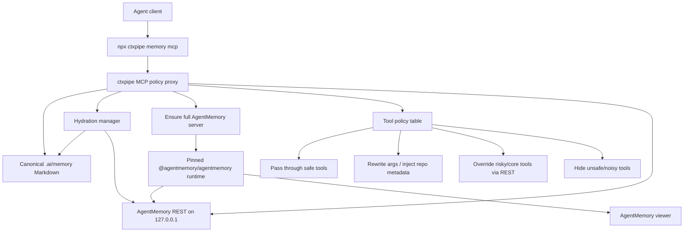
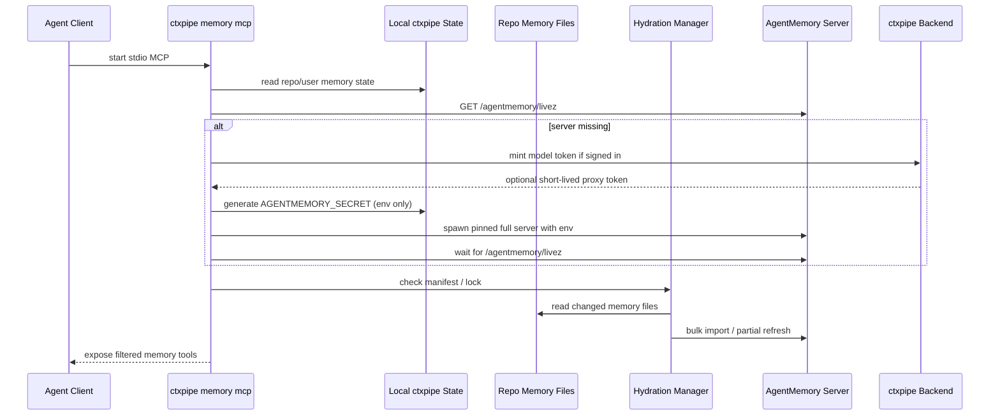
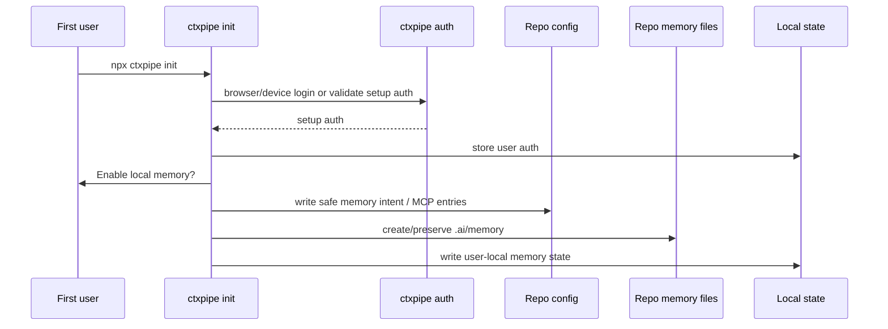
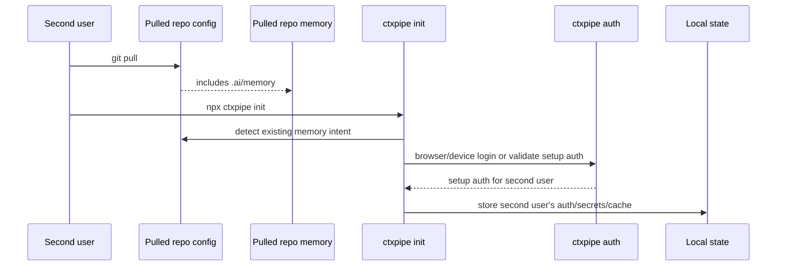
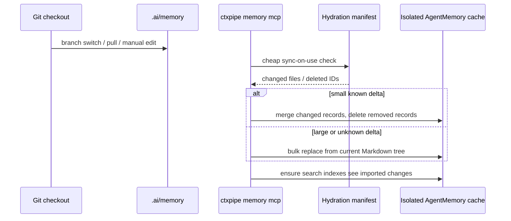

# ADR-021: Local agent memory with repo Markdown and AgentMemory hydrated cache

**Status:** Accepted (Implemented 2026-05-26) | **Date:** 2026-05-25 | **Tags:** memory, mcp, cli, agentmemory, auth, local-first, agents

**Implementation notes (2026-05-26):**

- Implementation shipped in `packages/cli/src/memory/**` (markdown.ts, hydration.ts, supervisor.ts, mcp-server.ts, policy.ts, agentmemory-client.ts, paths.ts) and `apps/backend/src/routes/v1/openai.ts`. Tests in `packages/cli/test/{memory,init-memory,init-claude-hooks,argv}.test.ts` and `apps/backend/src/routes/v1/openai.test.ts`.
- §9 amended: the CLI does **not** mint a new `ctxmem_*` model token. Instead the existing CLI OAuth bearer is refreshed via `ensureFreshAccessToken()` and passed directly as `OPENAI_API_KEY` to the AgentMemory child process. The backend exposes a generic org-scoped OpenAI proxy at `POST /:orgSlug/api/v1/openai/v1/{chat/completions,embeddings}` authenticated by the existing `withBearerAuth`; no new auth endpoint, no new operator env (reuses `MODEL_PROVIDER_*`).
- §5 implemented as a small hand-written JSON-RPC 2.0 server over stdio with a policy table (`POLICY` in `policy.ts`) — no `@modelcontextprotocol/sdk` dependency, to keep the published `ctxpipe` npm package light.
- Delta classifier in §7 uses an additional `DELTA_FLOOR = 10` so a 1-of-2 edit on a tiny corpus stays a merge import. Threshold formula: `smallLimit = min(fileThreshold, max(DELTA_FLOOR, floor(ratioThreshold * corpus)))`.
- `AGENTMEMORY_SECRET` is generated per spawn, passed only via child-process env and held in the supervisor process (not written to `runtime.json` or `agentmemory-secret` on disk). A new MCP process that finds a stale alive PID terminates it and respawns with a fresh secret.

## Context

ctxpipe configures MCP for coding agents, but agents still lose durable context across sessions, compactions, branch switches, git pulls, and tool changes. We researched local/coding-agent memory systems and shortlisted AgentMemory as a strong candidate because it is open source, Apache-2.0, local-first, coding-agent focused, and has a full local server with REST, MCP, session capture, summaries, consolidation, graph/crystal features, and agent hooks.

AgentMemory is not a drop-in product for ctxpipe:

- its normal setup expects users to run AgentMemory commands and edit `~/.agentmemory/.env`;
- full capabilities require a separate local server, not only an MCP shim;
- the MCP shim falls back to a weak 7-tool standalone local KV mode when the full server is missing;
- model setup is env/API-key based;
- upstream MCP save/search paths are not strongly repo-scoped enough for ctxpipe team defaults;
- AgentMemory stores runtime state outside the project folder and does not natively hydrate from human-readable repo Markdown;
- agent lifecycle hooks vary significantly by client.

The product requirement is documented in [2026-05-25-local-memory.md](../../product/2026-05-25-local-memory.md): `npx ctxpipe init` should configure local memory next to ctxpipe MCP, users should not manage model keys/env/daemons, canonical memory must be human-readable and committed inside the repo, and memory should remain useful locally when signed out.

## Decision

Implement local agent memory as a ctxpipe-owned integration where `.ai/memory/` Markdown is the canonical durable memory store and AgentMemory is a pinned, per-repo/per-worktree hydrated local runtime/cache behind a hybrid MCP policy proxy.

### 1. ctxpipe Owns The User-Facing Memory Entry Point

`npx ctxpipe init` remains the primary human setup command. It may configure a second local MCP server for selected agents:

```json
{
  "mcpServers": {
    "ctxpipe": {
      "type": "streamable-http",
      "url": "https://app.ctxpipe.ai/mcp?orgSlug=acme"
    },
    "ctxpipe-memory": {
      "command": "npx",
      "args": ["-y", "ctxpipe", "memory", "mcp"]
    }
  }
}
```

The `ctxpipe-memory` command is stable. Its internal implementation can change without changing checked-in client config.

Add or support these CLI commands:

```bash
npx ctxpipe memory mcp            # stdio MCP command, written into client config
npx ctxpipe memory status         # human-readable current mode
npx ctxpipe memory doctor         # diagnostics and repair hints
npx ctxpipe memory stop           # stop managed local memory runtime
```

`memory mcp` is not a user command; it is launched by agent clients.

### 2. Repo Markdown Is The Canonical Memory Store

Durable project memory lives in `.ai/memory/` as human-readable Markdown, not in AgentMemory's runtime database.

Default canonical path:

```text
.ai/memory/
  README.md
  product-context.md
  patterns.md
  glossary.md
  decisions/
  lessons/
  sessions/              # curated summaries, not raw logs
```

The exact subfolder taxonomy can evolve, but every canonical memory record must be:

- readable and reviewable in Git without ctxpipe or AgentMemory;
- committed to the repo when it represents shared project knowledge;
- stable across file renames through a frontmatter `id`;
- parseable into AgentMemory-compatible records;
- safe to merge through normal Git workflows.

Automatic durable-memory writes modify the working tree directly. The Git diff and normal code-review flow are the review step; ctxpipe should not create a separate hidden approval queue for canonical memory updates.

Raw sessions, prompts, tool observations, command output, and transcripts are not canonical memory. They may be captured into the local AgentMemory runtime/cache when hooks are enabled, but they are local-only disposable state and are not committed to `.ai/memory/` by default.

Example record:

```md
---
id: mem-auth-session-refresh
type: architecture
concepts: [auth, sessions, better-auth]
files:
  - apps/backend/src/auth.ts
createdAt: 2026-05-25T00:00:00.000Z
updatedAt: 2026-05-25T00:00:00.000Z
---

# Auth Session Refresh

We use Better Auth session refresh through ...
```

ctxpipe maps this canonical record to AgentMemory's `Memory` shape:

```ts
{
  id: "ctxpipe_mem-auth-session-refresh",
  type: "architecture",
  title: "Auth Session Refresh",
  content: "We use Better Auth session refresh through ...",
  concepts: ["auth", "sessions", "better-auth"],
  files: ["apps/backend/src/auth.ts"],
  sessionIds: [],
  strength: 7,
  version: 1,
  isLatest: true
}
```

AgentMemory data is disposable. If it is deleted, corrupted, stale, or incompatible with a pinned runtime upgrade, ctxpipe rebuilds canonical memory from `.ai/memory/**`. Local-only raw observation/session cache may be lost during cache rebuild, branch-switch full replace, or runtime repair.

### 3. AgentMemory Is The Local Runtime, Not The Product Surface

Use AgentMemory as the local retrieval/runtime engine for v1:

- package: `@agentmemory/agentmemory`;
- inspected version: `0.9.21`;
- license: Apache-2.0;
- runtime: full AgentMemory server through `iii-engine`;
- REST default: `127.0.0.1:3111`;
- streams default: `3112`;
- viewer default: `3113`;
- engine websocket default: `49134`.

Do not import AgentMemory as an SDK. It is not currently shaped as a stable JS client library for ctxpipe, and it does not natively provide repo-Markdown hydration. Use:

- child process for lifecycle;
- REST for control and core tool behavior;
- optionally upstream MCP for pass-through tools;
- no direct iii SDK calls in v1.

Pin AgentMemory by version and invoke it without vendoring source. The selected initial implementation path is dynamic pinned execution, for example:

```bash
npx -y @agentmemory/agentmemory@0.9.21
```

Avoid blindly running `agentmemory connect` because it mutates user config outside ctxpipe's operation model, does not know ctxpipe org/repo/auth state, and does not solve lifecycle/model provisioning.

### 4. Full AgentMemory Server Is Required

For advertised ctxpipe memory functionality, the full AgentMemory server must be running.

Do not silently accept upstream `@agentmemory/mcp` standalone fallback as the normal product. That fallback supports only:

- `memory_save`;
- `memory_recall`;
- `memory_smart_search`;
- `memory_sessions`;
- `memory_export`;
- `memory_audit`;
- `memory_governance_delete`.

It lacks the full runtime, REST API, viewer, rich session capture, consolidation, graph/crystal features, file history, and broader tool surface.

If full server startup fails:

- `ctxpipe memory mcp` should expose a clear setup/runtime error;
- `ctxpipe memory doctor` should explain the failed package/engine/port/auth state;
- any standalone fallback should be explicitly labelled degraded diagnostic mode, not "ready".

### 5. Use A Hybrid MCP Policy Proxy

`ctxpipe memory mcp` implements the agent-facing MCP server itself. It may mirror/pass through upstream AgentMemory tools, but ctxpipe owns the tool list exposed to agents.

Architecture:



The proxy can:

- filter tools;
- patch schemas;
- write canonical memory Markdown before updating AgentMemory;
- read/search canonical Markdown directly when AgentMemory is unavailable or stale;
- hydrate AgentMemory from Markdown through deterministic bulk import;
- inject `orgSlug`, `repoId`, `cwd`, project, user, and source metadata;
- rewrite arguments;
- post-filter results;
- normalize errors;
- hide unsafe or confusing tools;
- gate hosted-model features when signed out;
- expose stable `ctxpipe_memory_*` aliases where needed;
- selectively override tools with REST-backed implementations.

Initial policy direction:

| Upstream Capability | ctxpipe Policy |
|---|---|
| Save/remember | Override. Write/update repo Markdown in the working tree first, then hydrate AgentMemory. |
| Search/recall/smart search | Ensure hydration freshness, query AgentMemory when fresh, fall back to direct Markdown search when needed. |
| Summaries/consolidation/graph/crystal | Gate on hosted model availability; return visible login-required status when signed out. |
| Status/read-only health | Pass through or wrap. |
| Raw export/governance/delete | Hide initially or expose only through explicit ctxpipe admin tools. |
| Team mesh/actions/experimental tools | Hide until product semantics are decided. |

Maintain a policy table in code, for example:

```ts
{
  memory_recall: "hydrate-then-query-or-markdown-fallback",
  memory_smart_search: "hydrate-then-query-or-markdown-fallback",
  memory_save: "write-markdown-then-hydrate",
  memory_export: "hide",
  memory_governance_delete: "hide-or-ctxpipe-admin-tool",
  memory_summarize_session: "gate-hosted-model",
}
```

This is the selected middle path between:

- a pure launcher around upstream MCP, which is fast but inherits upstream scoping/tool churn;
- a fully native ctxpipe memory tool surface, which is safest but slower to build.

### 6. Lifecycle Is Lazy, Local, Repo-Isolated, And Managed By ctxpipe

`ctxpipe init` configures clients and local state, but does not install an always-on OS service.

Each repo/worktree gets an isolated AgentMemory runtime/cache and dynamic local ports for every AgentMemory listener: REST, streams, viewer, and engine websocket. This avoids:

- default port clashes when a user has multiple projects open;
- cross-project search leakage;
- unsafe full-replace imports that could wipe another repo's local memory cache.

AgentMemory currently derives its data directory from the process home directory. ctxpipe should launch the pinned runtime in a repo/worktree-scoped local sandbox, setting the child-process home/config/cache environment as needed so AgentMemory's `~/.agentmemory` resolves inside ctxpipe-managed local state rather than the user's real home-level AgentMemory store. If the pinned runtime later supports an explicit data-dir flag/env, prefer that over home sandboxing.

Lifecycle:



Local state should live under `~/.config/ctxpipe/`, for example:

```text
~/.config/ctxpipe/
  app.ctxpipe.ai.auth.json              # existing fallback setup auth
  memory/
    repos/
      <repo-id>/
        agentmemory-home/
        hydration-manifest.json
        runtime.json
        logs/
```

`runtime.json` can track:

```json
{
  "provider": "agentmemory",
  "agentmemoryVersion": "0.9.21",
  "url": "http://127.0.0.1:31741",
  "viewerUrl": "http://127.0.0.1:31743",
  "pid": 12345,
  "startedAt": "2026-05-25T00:00:00.000Z",
  "mode": "local-first",
  "hostedModel": "signed-out"
}
```

Do not require users to run a separate `agentmemory` command. Do not install an always-on OS service for this implementation.

### 7. Hydration Uses Bulk Import With Partial Refresh

AgentMemory does not natively hydrate from Markdown, so ctxpipe owns a deterministic Markdown-to-AgentMemory adapter.

Hydration pipeline:

```text
.ai/memory/**/*.md
  -> parse frontmatter and Markdown body
  -> validate stable IDs, types, files, concepts, conflict markers
  -> normalize to ctxpipe memory records
  -> map to AgentMemory ExportData / Memory records
  -> import into isolated AgentMemory cache
  -> ensure live AgentMemory indexes are fresh
```

Use AgentMemory's bulk import endpoint as the primary write path for hydration:

```http
POST /agentmemory/import
Authorization: Bearer <local AgentMemory secret>
Content-Type: application/json

{
  "strategy": "merge",
  "exportData": {
    "version": "0.9.21",
    "exportedAt": "2026-05-25T00:00:00.000Z",
    "sessions": [],
    "observations": {},
    "memories": [
      {
        "id": "ctxpipe_mem-auth-session-refresh",
        "createdAt": "2026-05-25T00:00:00.000Z",
        "updatedAt": "2026-05-25T00:00:00.000Z",
        "type": "architecture",
        "title": "Auth Session Refresh",
        "content": "We use Better Auth session refresh through ...",
        "concepts": ["auth", "sessions", "better-auth"],
        "files": ["apps/backend/src/auth.ts"],
        "sessionIds": [],
        "strength": 7,
        "version": 1,
        "isLatest": true
      }
    ],
    "summaries": []
  }
}
```

Refresh policy:

| Case | Action |
|---|---|
| First hydrate | Full bulk import into empty isolated cache. |
| No file changes | Do nothing; retrieval uses hydrated AgentMemory immediately. |
| Small added/edited file set | Bulk import changed records with `strategy: "merge"`. |
| Deleted source files | Delete mapped AgentMemory memory IDs through AgentMemory delete/forget/governance API. |
| File rename | Use stable frontmatter `id`; update manifest path mapping and merge the same memory ID. |
| Branch switch/git pull/rebase | Detect manifest mismatch; use partial refresh for small known deltas, otherwise full `strategy: "replace"` in the isolated cache. |
| Manifest missing/corrupt | Full `strategy: "replace"` from canonical Markdown. |
| Runtime version incompatible | Full rebuild in a fresh isolated cache. |
| Merge conflict markers present | Refuse hydration, report paths, and fall back to previous hydrated cache or direct Markdown search where safe. |
| Duplicate frontmatter IDs | Refuse hydration and report all conflicting file paths. |

Hydration imports canonical durable memories only. Empty `sessions` and `observations` in hydration payloads are intentional: raw sessions and observations are local-only disposable cache, not repo-shared memory. A full replace may discard that local raw cache.

A small known delta means the manifest can identify every added, edited, renamed, and deleted file, and the changed file count is below the internal threshold. The default threshold should be at most 50 changed files or 10% of the memory corpus, whichever is lower. Larger or ambiguous changes use full replace.

Hydration manifest:

```json
{
  "schemaVersion": 1,
  "memoryRoot": ".ai/memory",
  "repoId": "repo_fingerprint",
  "worktreeId": "worktree_fingerprint",
  "agentmemoryVersion": "0.9.21",
  "lastHydratedAt": "2026-05-25T00:00:00.000Z",
  "gitHead": "abc123",
  "files": {
    ".ai/memory/decisions/auth-session-refresh.md": {
      "hash": "sha256:...",
      "mtimeMs": 1770000000000,
      "size": 1234,
      "memoryIds": ["ctxpipe_mem-auth-session-refresh"]
    }
  }
}
```

The manifest is local and uncommitted. It can live in the repo's git-local storage or under `~/.config/ctxpipe/memory/repos/<repo-id>/`. It is an optimization and repair guide, not product state.

Before every memory tool call, ctxpipe performs a cheap manifest check:

1. Check tracked memory file paths, mtimes, sizes, and hashes only where needed.
2. If unchanged, skip hydration entirely.
3. If changed, acquire a local hydration lock.
4. Recompute the delta.
5. Apply partial or full hydration.
6. Recheck AgentMemory health/index freshness.
7. Serve the original memory request.

Index consistency is mandatory. AgentMemory's `mem::import` path writes KV state directly; ctxpipe must verify whether the pinned AgentMemory runtime updates or rebuilds live BM25/vector indexes after import. If no explicit rebuild endpoint exists for the pinned version, ctxpipe restarts the isolated AgentMemory runtime after imports that change searchable records. Because the runtime is per-repo/per-worktree and the fast path skips import, this restart is bounded to actual memory changes and cannot affect other projects.

### 8. Configuration Is Hidden And Safe

ctxpipe should avoid user-facing AgentMemory config.

Do:

- pass AgentMemory settings as child-process env;
- pass dynamic AgentMemory listener ports for REST, streams, viewer, and engine websocket;
- pass repo/worktree-specific home/cache/data settings as child-process env so AgentMemory state is isolated;
- allocate dynamic loopback ports and record them in local runtime state;
- generate `AGENTMEMORY_SECRET` locally;
- keep AgentMemory local REST on loopback;
- store ctxpipe setup auth in keyring or private fallback as current CLI auth does;
- commit only safe repo memory intent in `.ctxpipe/config.json` if memory intent cannot be inferred from client config;
- use relative config references in repo client config.

Do not:

- ask users to edit `~/.agentmemory/.env`;
- commit `AGENTMEMORY_SECRET`;
- commit ctxpipe model proxy tokens;
- commit AgentMemory data;
- commit pid files or package cache paths;
- commit absolute user hook paths.

If a memory stanza is needed in `.ctxpipe/config.json`, keep it non-secret and portable:

```json
{
  "memory": {
    "provider": "agentmemory",
    "enabled": true,
    "runtime": "ctxpipe-managed",
    "agentmemoryVersion": "0.9.21",
    "mode": "local-first",
    "model": "ctxpipe-managed",
    "memoryRoot": ".ai/memory"
  }
}
```

Prefer avoiding a dedicated memory stanza if client config plus existing ctxpipe org/base URL are enough.

### 9. Hosted Model Access Uses ctxpipe Proxy Tokens

Users must not provide model API keys. AgentMemory's OpenAI-compatible provider should point to ctxpipe-hosted proxy endpoints when enhanced memory is enabled.

Launch env for signed-in enhanced mode:

```text
OPENAI_BASE_URL=https://app.ctxpipe.ai/api/agentmemory/openai
OPENAI_API_KEY=<short-lived ctxpipe memory model token>
OPENAI_MODEL=<ctxpipe-selected model>
OPENAI_EMBEDDING_MODEL=<ctxpipe-selected embedding model>
OPENAI_EMBEDDING_DIMENSIONS=<known dimension>
```

The model credential is not minted only during `ctxpipe init`. It is minted just in time by `ctxpipe memory mcp` before starting or restarting AgentMemory, because a short-lived 8-24 hour token could expire between setup and actual agent use.

Backend endpoint shape:

```http
POST /api/v1/memory/model-token
Authorization: Bearer <ctxpipe setup access token>
Content-Type: application/json

{
  "orgSlug": "acme",
  "repoId": "<stable repo fingerprint if available>",
  "runtime": "agentmemory",
  "capabilities": ["chat.completions", "embeddings"],
  "mode": "developer-local-memory"
}
```

Response shape:

```json
{
  "accessToken": "ctxmem_...",
  "tokenType": "Bearer",
  "expiresAt": "2026-05-25T12:00:00.000Z",
  "openaiBaseUrl": "https://app.ctxpipe.ai/api/agentmemory/openai",
  "chatModel": "gpt-5.4-nano",
  "embeddingModel": "text-embedding-3-small",
  "quota": {
    "monthlyUsdSoftLimit": 5,
    "monthlyUsdHardLimit": 15
  }
}
```

Token constraints:

- scoped to one user;
- scoped to one org;
- optionally scoped to one repo/project;
- valid only for model proxy endpoints;
- limited to allowed model classes;
- short-lived;
- quota and audit enforced server-side;
- not usable for general ctxpipe APIs, remote MCP, billing, admin APIs, or org data.

Do not build a local OpenAI-compatible proxy process for this implementation. Use just-in-time short-lived model proxy tokens passed through AgentMemory child-process env.

### 10. Signed-Out Users Get Full No-LLM Server Mode

When no valid ctxpipe setup auth exists or token minting fails, run the full AgentMemory server without hosted model env:

```text
AGENTMEMORY_AUTO_COMPRESS=false
AGENTMEMORY_INJECT_CONTEXT=false
CONSOLIDATION_ENABLED=false
GRAPH_EXTRACTION_ENABLED=false
OPENAI_API_KEY=<unset>
OPENAI_BASE_URL=<unset>
```

This mode should still provide canonical repo-memory save/search and may keep raw capture/session continuity in local-only disposable cache. LLM-backed tools should be hidden or return a structured result such as:

```json
{
  "status": "enhanced-memory-unavailable",
  "reason": "signed-out",
  "message": "Enhanced memory summaries need ctxpipe auth login. Local memory is still running. Run `npx ctxpipe auth login` to enable hosted summaries and consolidation."
}
```

Do not open a browser from `ctxpipe memory mcp`. MCP startup is non-interactive and often runs without a TTY.

### 11. Login UX Uses Existing Setup Auth

The current CLI device-code login remains the base auth flow:

1. CLI calls `/.auth/api/v1/auth/device/code`.
2. User approves in browser.
3. CLI polls `/.auth/api/v1/auth/device/token`.
4. CLI stores setup auth in system keyring or `~/.config/ctxpipe/<base>.auth.json` with `0600` fallback.

Use the existing `npx ctxpipe auth login` command for setup auth. Do not add a separate top-level login alias or memory-specific login command.

Prompt timing:

| Moment | Decision |
|---|---|
| Interactive `ctxpipe init` | Full setup includes ctxpipe auth/org selection before memory is configured; after successful init the current user is signed in. |
| Non-interactive `ctxpipe init --yes` | Do not open browser; require existing setup auth or explicit local-only/non-hosted behavior. |
| `ctxpipe memory mcp` launched by agent before local login/init | Never prompt interactively; use no-LLM mode and expose status. This is mainly the second-user/no-local-setup case. |
| Agent hook with visible output | May show a rate-limited login nudge. |
| `ctxpipe memory status/doctor` | Show exact mode and login command. |

Second users must mint their own credentials. The first user's login/token is never committed and never shared through repo config.

### 12. Agent Hooks Are Capability-Based

Do not use Git hooks or package-install hooks as the primary automation/login surface. They require local bootstrap, are awkward for non-Node repos, and feel too much like hidden machinery.

Use agent-native lifecycle hooks where stable:

| Client | Strategy |
|---|---|
| Claude Code | First-class hook target. Use `SessionStart` for status/login nudge and readiness; use `Stop`/`SessionEnd` for enqueueing summaries/consolidation/graph. |
| Codex | MCP-only baseline unless existing supported hooks can be configured by ctxpipe without new product surface. |
| Cursor | MCP-only baseline. |
| OpenCode | MCP-only baseline until local MCP command schema is verified. |
| VS Code/generic MCP | MCP-only baseline. |

Hook behavior:

- explicit opt-in during setup;
- summarized during init because hooks may capture prompts, tool inputs/outputs, paths, errors, and command output;
- no surprise browser prompts;
- rate-limited login nudges;
- enqueue long-running work instead of blocking the agent.

Example Claude hook intent:

```json
{
  "hooks": {
    "SessionStart": [
      {
        "hooks": [
          {
            "type": "command",
            "command": "npx -y ctxpipe memory hook claude-session-start"
          }
        ]
      }
    ],
    "Stop": [
      {
        "hooks": [
          {
            "type": "command",
            "command": "npx -y ctxpipe memory hook claude-stop",
            "async": true
          }
        ]
      }
    ]
  }
}
```

Prefer local/user hook installs initially. Project-shared hooks execute commands for anyone running that agent in the repo; require explicit consent before writing committed hook config.

### 13. Hosted Processing Is Batched And Quota-Aware

Do not enable LLM processing on every observation by default. Use hosted models primarily for:

- session-end summaries;
- scheduled consolidation;
- graph/crystal extraction for promoted memories;
- on-demand summarize/consolidate commands.

Hosted processing writes durable results back to canonical repo Markdown first. AgentMemory sees those results only after hydration. This keeps summaries, lessons, and promoted facts reviewable and mergeable instead of hiding them in a local database.

Expected default model cost target:

- likely under `$1-$5` per active developer/month;
- budget `$5-$10` including retries/noisy projects;
- cap or degrade before `$15-$20` unless org opts into aggressive capture.

Per-observation compression can reach `$5-$20` per average developer/month and `$40+` for heavy users; keep it disabled or opt-in.

## User And Team Flow

### First User



### Second User



If the second user does not run init, the committed MCP entry may still start `ctxpipe memory mcp`; it will run full local no-LLM mode and surface the login command through status/tool responses.

### Branch Switch / Pull



## Consequences

Positive:

- Users get one-command setup for local memory.
- Durable memory is human-readable, reviewable, mergeable, and committed with the project.
- Automatic durable-memory writes are visible as normal working-tree changes.
- No user model-key setup is needed.
- Memory remains useful offline/signed out.
- ctxpipe can enforce repo/org policy, filtering, auth, and status UX.
- AgentMemory can be replaced or constrained later because ctxpipe owns the agent-facing surface and the canonical file format.
- Teams avoid committing user secrets.
- Claude can get a high-quality automatic summary/consolidation flow through native hooks.

Tradeoffs:

- More implementation work than simply writing `npx @agentmemory/mcp` into config.
- ctxpipe must maintain an MCP bridge/policy layer and compatibility tests.
- Some upstream AgentMemory tools will be hidden or delayed until product policy is clear.
- Agent automation will differ by client capability.
- Server lifecycle, first-run downloads, and runtime health become ctxpipe responsibilities.
- ctxpipe must maintain a Markdown parser/serializer, hydration manifest, import adapter, and index-consistency checks.
- Full replace hydration requires repo/worktree-isolated AgentMemory caches.
- AgentMemory's imported KV records may require runtime restart or an upstream rebuild endpoint before live search sees changes.

## Alternatives Considered

### Raw upstream MCP entry

Write `npx -y @agentmemory/mcp` directly into client config.

Rejected for default product because it does not start the full server, silently falls back to the weak standalone mode, does not solve model provisioning, does not enforce repo scoping, and exposes upstream behavior directly.

### `agentmemory connect` from `ctxpipe init`

Rejected because it mutates user config outside ctxpipe's operation model, is not repo/org aware, does not manage ctxpipe auth/model proxy, and does not solve server lifecycle.

### Pure launcher around upstream MCP

Rejected as the final implementation. It is simpler, but it inherits upstream MCP tool surface, scoping gaps, fallback semantics, and UX.

### Fully native ctxpipe memory engine

Rejected for v1 because research found AgentMemory is already a capable local retrieval/runtime engine and Apache-2.0 permits use/redistribution. ctxpipe still owns the canonical Markdown memory format, so revisiting the runtime later does not require changing committed memory files.

### Fork AgentMemory

Rejected for this implementation. Apache-2.0 allows it, but the goal is a focused CLI integration using the published runtime.

### AgentMemory as canonical store

Rejected because AgentMemory persists runtime data outside the repo in implementation-specific formats. It would make memory harder to review, merge, share with teammates, and commit. AgentMemory remains an index/cache hydrated from repo Markdown.

### Full bulk replace before every retrieval

Rejected because larger teams can accumulate substantial memory and retrieval must stay fast. Use manifest-based sync-on-use: skip hydration when unchanged, partial refresh small deltas, and reserve full replace for first hydrate, cache repair, incompatible runtime, or large/unknown deltas.

### Git hooks / package-install hooks

Rejected as the primary automation/login surface. They require per-checkout bootstrap, are awkward outside Node repos, and hide behavior behind package install. Agent-native hooks are a better fit where available.

### User-provided model keys

Rejected. The product goal is no model setup, no env variables, and no AgentMemory config editing.

### Always-on OS service

Rejected. Lazy MCP startup is less invasive and easier to uninstall/debug.

## Implementation Plan

Build one focused CLI integration:

1. Add `ctxpipe memory mcp`, `ctxpipe memory status`, `ctxpipe memory doctor`, and `ctxpipe memory stop`.
2. Update `ctxpipe init` so it can add a `ctxpipe-memory` MCP entry next to the existing ctxpipe MCP entry and create/preserve `.ai/memory/`.
3. Define the repo Markdown memory schema and parser/serializer, including stable frontmatter IDs and conflict-marker validation.
4. Pin AgentMemory dynamically and start the full AgentMemory server lazily from `ctxpipe memory mcp`.
5. Run AgentMemory in a repo/worktree-isolated local cache with dynamic loopback ports.
6. Generate a local `AGENTMEMORY_SECRET` per spawn and pass AgentMemory configuration only as child-process env (not persisted to disk).
7. Implement deterministic Markdown-to-AgentMemory bulk import.
8. Implement duplicate-ID detection, merge-conflict detection, and clear path-specific hydration errors.
9. Implement the hydration manifest, sync-on-use check, local hydration lock, partial refresh, deletion handling, small-delta threshold, and full replace repair path.
10. Ensure imported changes are visible to AgentMemory search, using an explicit rebuild endpoint if available or restarting the isolated runtime after import.
11. Use existing `ctxpipe auth login` credentials to mint a just-in-time short-lived hosted model proxy token.
12. Run full no-LLM server mode when no local ctxpipe auth exists.
13. Implement the hybrid MCP policy proxy:
   - pass through safe AgentMemory functionality;
   - override save/search so canonical Markdown is written/read first, durable writes modify the working tree directly, and AgentMemory is used as hydrated cache;
   - override or rewrite status/summarize/consolidate paths;
   - inject repo/org/user metadata where possible;
   - hide unsafe, noisy, or unscoped tools.
14. Add Claude Code hook configuration only when supported and selected during `ctxpipe init`.
15. Add acceptance coverage for two projects open, branch switch, git pull, deleted/renamed memory files, duplicate IDs, merge conflicts, concurrent hydration, signed-out save/search, and imported-memory search visibility.

## Risks And Mitigations

| Risk | Severity | Mitigation |
|---|---:|---|
| Cross-repo memory leakage | High | Policy proxy injects repo metadata and filters results; override search/save; hide tools that cannot be scoped. |
| AgentMemory cache diverges from repo Markdown | High | Markdown is canonical; use manifest checks, partial refresh, full replace repair, and direct Markdown fallback. |
| Slow retrieval after branch switches or large pulls | Medium | Fast path skips hydration; partial refresh small deltas; full replace only on first hydrate/cache repair/large or unknown deltas. |
| Imported records are not visible in live AgentMemory indexes | Medium | Verify pinned import behavior; use rebuild endpoint if available or restart isolated runtime after import. |
| Hidden capture of sensitive prompts/tool output | High | Hooks are opt-in and summarized during setup; do not silently install broad hooks. |
| Raw session cache is mistaken for shared memory | Medium | Status/docs label raw capture as local-only disposable; only `.ai/memory/` is canonical shared memory. |
| Secret leakage into git | High | Store all tokens/secrets in keyring/local state; never write them to repo/client config. |
| Secrets accidentally committed in memory Markdown | High | Canonical files are human-reviewable; setup copy must warn not to store secrets; future scanning can flag likely secrets. |
| AgentMemory version churn | Medium | Pin the runtime version and keep the exposed tool surface small. |
| First-run download/runtime failure | Medium | Report clearly through `doctor`; no-LLM fallback where possible. |
| Hosted model cost | Medium | Batch features; quotas; disable per-observation compression by default. |
| Agent hooks differ by client | Medium | Capability matrix; MCP status fallback; start with Claude. |
| Login message missed | Medium | Surface through init/status/doctor/tool responses/hooks; point users to existing `ctxpipe auth login`. |
| Windows setup weaker | Medium | Detect early; clear messaging; start support where AgentMemory runtime is reliable. |

## References

- PRD: [2026-05-25-local-memory.md](../../product/2026-05-25-local-memory.md)
- Research index: [local-memory/index.md](../research/local-memory/index.md)
- AgentMemory integration research: [agentmemory-integration.md](../research/local-memory/agentmemory/agentmemory-integration.md)
- AgentMemory repository: https://github.com/rohitg00/agentmemory
- AgentMemory website: https://www.agent-memory.dev/
