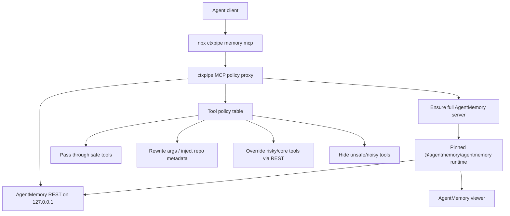
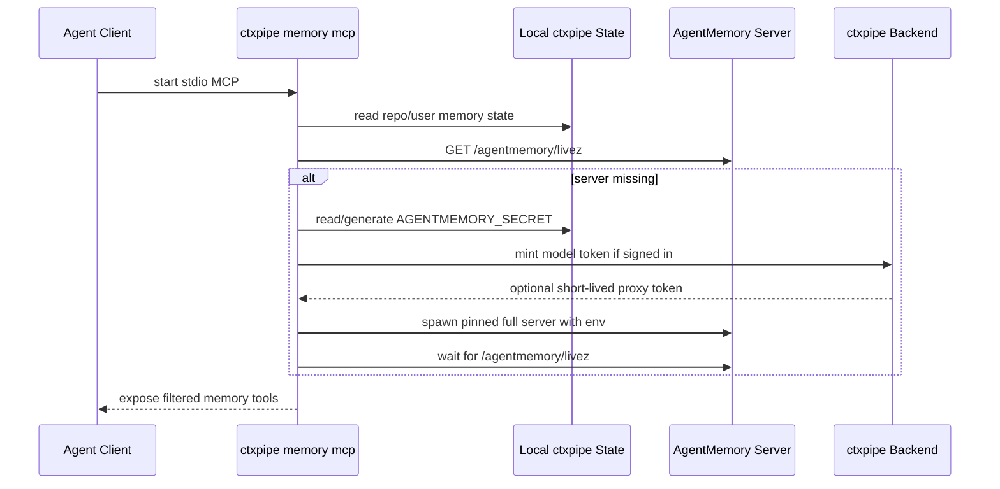
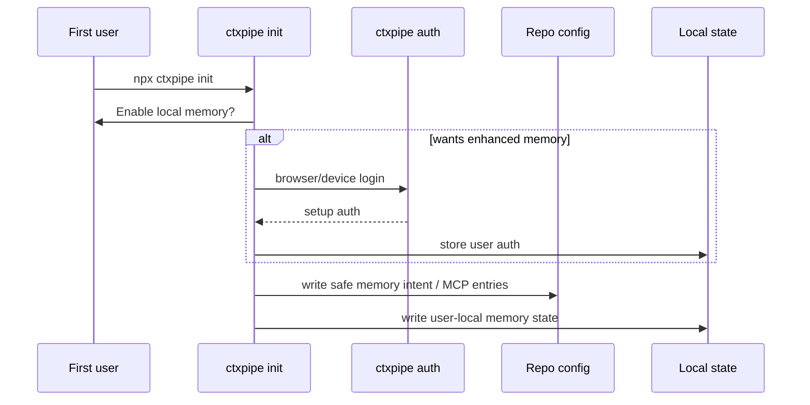
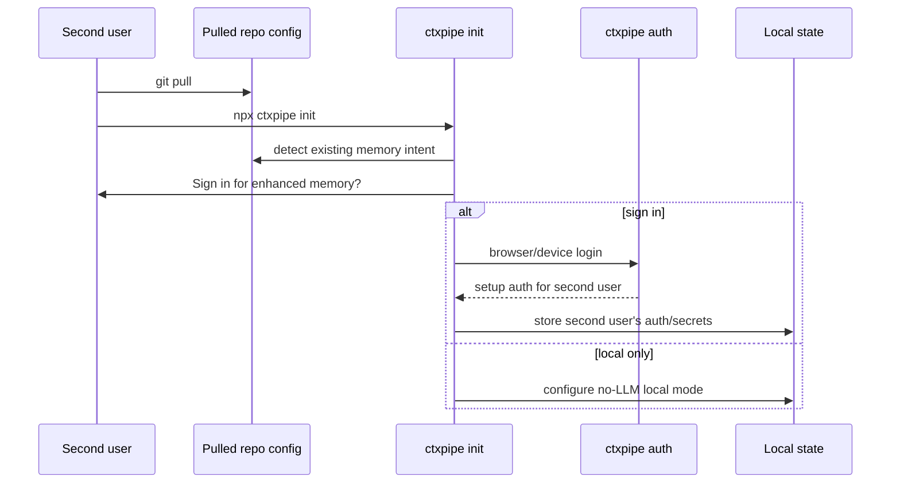

# ADR-021: Local agent memory with AgentMemory hybrid MCP proxy

**Status:** Accepted | **Date:** 2026-05-25 | **Tags:** memory, mcp, cli, agentmemory, auth, local-first, agents

## Context

ctxpipe configures MCP for coding agents, but agents still lose durable context across sessions, compactions, branch switches, and tool changes. We researched local/coding-agent memory systems and shortlisted AgentMemory as a strong candidate because it is open source, Apache-2.0, local-first, coding-agent focused, and has a full local server with REST, MCP, session capture, summaries, consolidation, graph/crystal features, and agent hooks.

AgentMemory is not a drop-in product for ctxpipe:

- its normal setup expects users to run AgentMemory commands and edit `~/.agentmemory/.env`;
- full capabilities require a separate local server, not only an MCP shim;
- the MCP shim falls back to a weak 7-tool standalone local KV mode when the full server is missing;
- model setup is env/API-key based;
- upstream MCP save/search paths are not strongly repo-scoped enough for ctxpipe team defaults;
- agent lifecycle hooks vary significantly by client.

The product requirement is documented in [2026-05-25-local-memory.md](../../product/2026-05-25-local-memory.md): `npx ctxpipe init` should configure local memory next to ctxpipe MCP, users should not manage model keys/env/daemons, and memory should remain useful locally when signed out.

## Decision

Implement local agent memory as a ctxpipe-owned integration that uses AgentMemory as a pinned local runtime behind a hybrid MCP policy proxy.

### 1. ctxpipe Owns The User-Facing Memory Entry Point

`npx ctxpipe init` remains the primary human setup command. It may configure a second local MCP server for selected agents:

```json
{
  "mcpServers": {
    "ctxpipe": {
      "type": "streamable-http",
      "url": "https://app.ctxpipe.ai/mcp?orgSlug=acme"
    },
    "ctxpipe-memory": {
      "command": "npx",
      "args": ["-y", "ctxpipe", "memory", "mcp"]
    }
  }
}
```

The `ctxpipe-memory` command is stable. Its internal implementation may evolve from spike to production without changing checked-in client config.

Add or support these CLI commands:

```bash
npx ctxpipe login                 # alias for setup auth login
npx ctxpipe memory mcp            # stdio MCP command, written into client config
npx ctxpipe memory status         # human-readable current mode
npx ctxpipe memory doctor         # diagnostics and repair hints
npx ctxpipe memory stop           # stop managed local memory runtime
npx ctxpipe memory login          # optional focused alias: login + test model-token mint
```

`memory mcp` is not a user command; it is launched by agent clients.

### 2. AgentMemory Is The Local Runtime, Not The Product Surface

Use AgentMemory as the local engine for v1:

- package: `@agentmemory/agentmemory`;
- inspected version: `0.9.21`;
- license: Apache-2.0;
- runtime: full AgentMemory server through `iii-engine`;
- REST default: `127.0.0.1:3111`;
- streams default: `3112`;
- viewer default: `3113`;
- engine websocket default: `49134`.

Do not import AgentMemory as an SDK. It is not currently shaped as a stable JS client library for ctxpipe. Use:

- child process for lifecycle;
- REST for control and core tool behavior;
- optionally upstream MCP for pass-through tools;
- no direct iii SDK calls in v1.

Prefer pinning AgentMemory over vendoring source. Acceptable pinning paths:

1. **Spike:** dynamic pinned `npx -y @agentmemory/agentmemory@<version>`.
2. **Polished optional runtime:** companion package such as `@ctxpipe/agentmemory-runtime` that pins AgentMemory and related runtime glue.
3. **Base CLI dependency:** only if memory becomes mandatory and package size is acceptable.

Avoid blindly running `agentmemory connect` because it mutates user config outside ctxpipe's operation model, does not know ctxpipe org/repo/auth state, and does not solve lifecycle/model provisioning.

### 3. Full AgentMemory Server Is Required

For advertised ctxpipe memory functionality, the full AgentMemory server must be running.

Do not silently accept upstream `@agentmemory/mcp` standalone fallback as the normal product. That fallback supports only:

- `memory_save`;
- `memory_recall`;
- `memory_smart_search`;
- `memory_sessions`;
- `memory_export`;
- `memory_audit`;
- `memory_governance_delete`.

It lacks the full runtime, REST API, viewer, rich session capture, consolidation, graph/crystal features, file history, and broader tool surface.

If full server startup fails:

- `ctxpipe memory mcp` should expose a clear setup/runtime error;
- `ctxpipe memory doctor` should explain the failed package/engine/port/auth state;
- any standalone fallback should be explicitly labelled degraded diagnostic mode, not "ready".

### 4. Use A Hybrid MCP Policy Proxy

`ctxpipe memory mcp` implements the agent-facing MCP server itself. It may mirror/pass through upstream AgentMemory tools, but ctxpipe owns the tool list exposed to agents.

Architecture:



The proxy can:

- filter tools;
- patch schemas;
- inject `orgSlug`, `repoId`, `cwd`, project, user, and source metadata;
- rewrite arguments;
- post-filter results;
- normalize errors;
- hide unsafe or confusing tools;
- gate hosted-model features when signed out;
- expose stable `ctxpipe_memory_*` aliases where needed;
- selectively override tools with REST-backed implementations.

Initial policy direction:

| Upstream Capability | ctxpipe Policy |
|---|---|
| Save/remember | Rewrite with repo/org metadata; call REST directly if needed. |
| Search/recall/smart search | Override or rewrite to enforce repo scope; post-filter cross-repo results. |
| Summaries/consolidation/graph/crystal | Gate on hosted model availability; return visible login-required status when signed out. |
| Status/read-only health | Pass through or wrap. |
| Raw export/governance/delete | Hide initially or expose only through explicit ctxpipe admin tools. |
| Team mesh/actions/experimental tools | Hide until product semantics are decided. |

Maintain a policy table in code, for example:

```ts
{
  memory_recall: "override-with-repo-filter",
  memory_smart_search: "override-with-repo-filter",
  memory_save: "rewrite-and-forward",
  memory_export: "hide",
  memory_governance_delete: "hide-or-ctxpipe-admin-tool",
  memory_summarize_session: "gate-hosted-model",
}
```

This is the selected middle path between:

- a pure launcher around upstream MCP, which is fast but inherits upstream scoping/tool churn;
- a fully native ctxpipe memory tool surface, which is safest but slower to build.

### 5. Lifecycle Is Lazy, Local, And Managed By ctxpipe

`ctxpipe init` configures clients and local state, but does not install an always-on OS service.

Lifecycle:



Local state should live under `~/.config/ctxpipe/`, for example:

```text
~/.config/ctxpipe/
  app.ctxpipe.ai.auth.json              # existing fallback setup auth
  memory/
    repos/
      <repo-id>/
        runtime.json
        agentmemory-secret
        model-proxy-token-cache
        logs/
```

`runtime.json` can track:

```json
{
  "provider": "agentmemory",
  "agentmemoryVersion": "0.9.21",
  "url": "http://127.0.0.1:3111",
  "viewerUrl": "http://127.0.0.1:3113",
  "pid": 12345,
  "startedAt": "2026-05-25T00:00:00.000Z",
  "mode": "local-first",
  "hostedModel": "signed-out"
}
```

Do not require users to run a separate `agentmemory` command. Later, an optional `ctxpipe memory install-service` can be considered for power users, but v1 should avoid launchd/systemd/Windows-service complexity.

### 6. Configuration Is Hidden And Safe

ctxpipe should avoid user-facing AgentMemory config.

Do:

- pass AgentMemory settings as child-process env;
- generate `AGENTMEMORY_SECRET` locally;
- keep AgentMemory local REST on loopback;
- store ctxpipe setup auth in keyring or private fallback as current CLI auth does;
- optionally commit only safe repo memory intent in `.ctxpipe/config.json`;
- use relative config references in repo client config.

Do not:

- ask users to edit `~/.agentmemory/.env`;
- commit `AGENTMEMORY_SECRET`;
- commit ctxpipe model proxy tokens;
- commit AgentMemory data;
- commit pid files or package cache paths;
- commit absolute user hook paths.

If a memory stanza is needed in `.ctxpipe/config.json`, keep it non-secret and portable:

```json
{
  "memory": {
    "provider": "agentmemory",
    "enabled": true,
    "runtime": "ctxpipe-managed",
    "agentmemoryVersion": "0.9.21",
    "mode": "local-first",
    "model": "ctxpipe-managed"
  }
}
```

Prefer avoiding a dedicated memory stanza if client config plus existing ctxpipe org/base URL are enough.

### 7. Hosted Model Access Uses ctxpipe Proxy Tokens

Users must not provide model API keys. AgentMemory's OpenAI-compatible provider should point to ctxpipe-hosted proxy endpoints when enhanced memory is enabled.

Launch env for signed-in enhanced mode:

```text
OPENAI_BASE_URL=https://app.ctxpipe.ai/api/agentmemory/openai
OPENAI_API_KEY=<short-lived ctxpipe memory model token>
OPENAI_MODEL=<ctxpipe-selected model>
OPENAI_EMBEDDING_MODEL=<ctxpipe-selected embedding model>
OPENAI_EMBEDDING_DIMENSIONS=<known dimension>
```

The model credential is not minted only during `ctxpipe init`. It is minted just in time by `ctxpipe memory mcp` before starting or restarting AgentMemory, because a short-lived 8-24 hour token could expire between setup and actual agent use.

Backend endpoint shape:

```http
POST /api/v1/memory/model-token
Authorization: Bearer <ctxpipe setup access token>
Content-Type: application/json

{
  "orgSlug": "acme",
  "repoId": "<stable repo fingerprint if available>",
  "runtime": "agentmemory",
  "capabilities": ["chat.completions", "embeddings"],
  "mode": "developer-local-memory"
}
```

Response shape:

```json
{
  "accessToken": "ctxmem_...",
  "tokenType": "Bearer",
  "expiresAt": "2026-05-25T12:00:00.000Z",
  "openaiBaseUrl": "https://app.ctxpipe.ai/api/agentmemory/openai",
  "chatModel": "gpt-5.4-nano",
  "embeddingModel": "text-embedding-3-small",
  "quota": {
    "monthlyUsdSoftLimit": 5,
    "monthlyUsdHardLimit": 15
  }
}
```

Token constraints:

- scoped to one user;
- scoped to one org;
- optionally scoped to one repo/project;
- valid only for model proxy endpoints;
- limited to allowed model classes;
- short-lived;
- quota and audit enforced server-side;
- not usable for general ctxpipe APIs, remote MCP, billing, admin APIs, or org data.

Future option: run a local OpenAI-compatible ctxpipe proxy process. AgentMemory would point to localhost, while the local proxy refreshes setup auth per request, applies redaction, and forwards to hosted ctxpipe. This is better for true per-request refresh and revocation but adds lifecycle complexity. Start with just-in-time short-lived tokens unless product/security needs require the local proxy immediately.

### 8. Signed-Out Users Get Full No-LLM Server Mode

When no valid ctxpipe setup auth exists or token minting fails, run the full AgentMemory server without hosted model env:

```text
AGENTMEMORY_AUTO_COMPRESS=false
AGENTMEMORY_INJECT_CONTEXT=false
CONSOLIDATION_ENABLED=false
GRAPH_EXTRACTION_ENABLED=false
OPENAI_API_KEY=<unset>
OPENAI_BASE_URL=<unset>
```

This mode should still provide local capture/search/session continuity. LLM-backed tools should be hidden or return a structured result such as:

```json
{
  "status": "enhanced-memory-unavailable",
  "reason": "signed-out",
  "message": "Enhanced memory summaries need ctxpipe login. Local memory is still running. Run `npx ctxpipe login` to enable hosted summaries and consolidation."
}
```

Do not open a browser from `ctxpipe memory mcp`. MCP startup is non-interactive and often runs without a TTY.

### 9. Login UX Uses Existing Setup Auth

The current CLI device-code login remains the base auth flow:

1. CLI calls `/.auth/api/v1/auth/device/code`.
2. User approves in browser.
3. CLI polls `/.auth/api/v1/auth/device/token`.
4. CLI stores setup auth in system keyring or `~/.config/ctxpipe/<base>.auth.json` with `0600` fallback.

Add `npx ctxpipe login` as a simple top-level alias for this setup auth.

Prompt timing:

| Moment | Decision |
|---|---|
| Interactive `ctxpipe init` | Prompt if memory is enabled and no valid setup auth exists. |
| Non-interactive `ctxpipe init --yes` | Do not open browser unless future explicit flag allows it. |
| `ctxpipe memory mcp` launched by agent | Never prompt interactively; use no-LLM mode and expose status. |
| Agent hook with visible output | May show a rate-limited login nudge. |
| `ctxpipe memory status/doctor` | Show exact mode and login command. |

Second users must mint their own credentials. The first user's login/token is never committed and never shared through repo config.

### 10. Agent Hooks Are Capability-Based

Do not use Git hooks or package-install hooks as the primary automation/login surface. They require local bootstrap, are awkward for non-Node repos, and feel too much like hidden machinery.

Use agent-native lifecycle hooks where stable:

| Client | Strategy |
|---|---|
| Claude Code | First-class hook target. Use `SessionStart` for status/login nudge and readiness; use `Stop`/`SessionEnd` for enqueueing summaries/consolidation/graph. |
| Codex | Experimental. AgentMemory already has a `~/.codex/hooks.json` workaround; verify current CLI/Desktop behavior before defaulting on. |
| Cursor | MCP-only baseline. Consider extension/rules later. |
| OpenCode | MCP-only baseline until plugin/hook API is verified. |
| VS Code/generic MCP | MCP-only baseline unless a dedicated extension is built. |

Hook behavior:

- explicit opt-in during setup;
- summarized during init because hooks may capture prompts, tool inputs/outputs, paths, errors, and command output;
- no surprise browser prompts;
- rate-limited login nudges;
- enqueue long-running work instead of blocking the agent.

Example Claude hook intent:

```json
{
  "hooks": {
    "SessionStart": [
      {
        "hooks": [
          {
            "type": "command",
            "command": "npx -y ctxpipe memory hook claude-session-start"
          }
        ]
      }
    ],
    "Stop": [
      {
        "hooks": [
          {
            "type": "command",
            "command": "npx -y ctxpipe memory hook claude-stop",
            "async": true
          }
        ]
      }
    ]
  }
}
```

Prefer local/user hook installs initially. Project-shared hooks execute commands for anyone running that agent in the repo; require explicit consent before writing committed hook config.

### 11. Hosted Processing Is Batched And Quota-Aware

Do not enable LLM processing on every observation by default. Use hosted models primarily for:

- session-end summaries;
- scheduled consolidation;
- graph/crystal extraction for promoted memories;
- on-demand summarize/consolidate commands.

Expected default model cost target:

- likely under `$1-$5` per active developer/month;
- budget `$5-$10` including retries/noisy projects;
- cap or degrade before `$15-$20` unless org opts into aggressive capture.

Per-observation compression can reach `$5-$20` per average developer/month and `$40+` for heavy users; keep it disabled or opt-in.

## User And Team Flow

### First User



### Second User



If the second user does not run init, the committed MCP entry may still start `ctxpipe memory mcp`; it will run full local no-LLM mode and surface the login command through status/tool responses.

## Consequences

Positive:

- Users get one-command setup for local memory.
- No user model-key setup is needed.
- Memory remains useful offline/signed out.
- ctxpipe can enforce repo/org policy, filtering, auth, and status UX.
- AgentMemory can be replaced or constrained later because ctxpipe owns the agent-facing surface.
- Teams avoid committing user secrets.
- Claude can get a high-quality automatic summary/consolidation flow through native hooks.

Tradeoffs:

- More implementation work than simply writing `npx @agentmemory/mcp` into config.
- ctxpipe must maintain an MCP bridge/policy layer and compatibility tests.
- Some upstream AgentMemory tools will be hidden or delayed until product policy is clear.
- Agent automation will differ by client capability.
- Server lifecycle, first-run downloads, and runtime health become ctxpipe responsibilities.
- Strong repo isolation may require upstream AgentMemory patches or additional local isolation work.

## Alternatives Considered

### Raw upstream MCP entry

Write `npx -y @agentmemory/mcp` directly into client config.

Rejected for default product because it does not start the full server, silently falls back to the weak standalone mode, does not solve model provisioning, does not enforce repo scoping, and exposes upstream behavior directly.

### `agentmemory connect` from `ctxpipe init`

Rejected because it mutates user config outside ctxpipe's operation model, is not repo/org aware, does not manage ctxpipe auth/model proxy, and does not solve server lifecycle.

### Pure Option 3 launcher around upstream MCP

Useful as an implementation spike, but not enough for team-safe v1. It inherits upstream MCP tool surface, scoping gaps, fallback semantics, and UX.

### Fully native ctxpipe memory engine

Rejected for v1 because research found AgentMemory is already a capable local engine and Apache-2.0 permits use/redistribution. Revisit only if AgentMemory cannot meet repo-scoping, privacy, or runtime reliability requirements.

### Fork AgentMemory immediately

Deferred. Apache-2.0 allows it, but the first step should be wrapper/proxy validation and upstream patches where possible. Fork only if necessary.

### Git hooks / package-install hooks

Rejected as the primary automation/login surface. They require per-checkout bootstrap, are awkward outside Node repos, and hide behavior behind package install. Agent-native hooks are a better fit where available.

### User-provided model keys

Rejected. The product goal is no model setup, no env variables, and no AgentMemory config editing.

### Always-on OS service

Deferred. Lazy MCP startup is less invasive and easier to uninstall/debug. Service install can be an advanced future feature.

## Implementation Plan

### Phase 0: Spike

- Add `ctxpipe memory mcp` command.
- Pin AgentMemory dynamically.
- Start full AgentMemory server lazily.
- Generate local `AGENTMEMORY_SECRET`.
- Prove no-LLM full-server mode.
- Prove OpenAI-compatible hosted proxy env.
- Measure upstream MCP scoping behavior.

### Phase 1: Product MVP

- Implement ctxpipe MCP policy proxy.
- Add backend model-token mint endpoint.
- Add `ctxpipe login`, `memory status`, `memory doctor`, `memory stop`.
- Override/rewrite save/search/status/summarize/consolidate paths.
- Hide unsafe/noisy tools.
- Add Claude hook integration as explicit opt-in.
- Keep Codex hook support experimental.
- Add compatibility tests for pinned AgentMemory tool schemas.

### Phase 2: Hardening

- Add redaction/ignore rules.
- Add quota/usage reporting.
- Add local OpenAI-compatible proxy if short-lived direct tokens are insufficient.
- Add per-repo isolation or upstream patches.
- Add additional agent hook/plugin adapters after verification.
- Add viewer/review UX if needed for trust.

## Risks And Mitigations

| Risk | Severity | Mitigation |
|---|---:|---|
| Cross-repo memory leakage | High | Policy proxy injects repo metadata and filters results; override search/save; consider per-repo isolation/upstream patch. |
| Hidden capture of sensitive prompts/tool output | High | Hooks are opt-in; setup copy explains capture; add redaction/ignore before broad automation. |
| Secret leakage into git | High | Store all tokens/secrets in keyring/local state; never write them to repo/client config. |
| AgentMemory version churn | Medium | Pin runtime; compatibility tests; deliberate upgrades. |
| First-run download/runtime failure | Medium | Optional prepare step; clear `doctor`; no-LLM fallback where possible. |
| Hosted model cost | Medium | Batch features; quotas; disable per-observation compression by default. |
| Agent hooks differ by client | Medium | Capability matrix; MCP status fallback; start with Claude. |
| Login message missed | Medium | Surface through init/status/doctor/tool responses/hooks; add top-level `ctxpipe login`. |
| Windows setup weaker | Medium | Detect early; clear messaging; start support where AgentMemory runtime is reliable. |

## Open Questions

1. Is memory enabled by default in interactive `ctxpipe init`, or explicit opt-in until privacy/scoping is proven?
2. Should the runtime pin live in dynamic `npx`, a companion package, or the base CLI?
3. Can v1 enforce repo scoping strongly enough with policy proxy alone, or is per-repo AgentMemory isolation required?
4. Which exact AgentMemory tools make the initial allowlist?
5. Should Claude hooks be written to project-shared `.claude/settings.json`, local settings, or user settings by default?
6. Is direct short-lived token passing enough, or is a local OpenAI-compatible proxy needed in v1?
7. What redaction/ignore syntax should be used before hosted processing?

## References

- PRD: [2026-05-25-local-memory.md](../../product/2026-05-25-local-memory.md)
- Research index: [local-memory/index.md](../research/local-memory/index.md)
- AgentMemory integration research: [agentmemory-integration.md](../research/local-memory/agentmemory/agentmemory-integration.md)
- AgentMemory repository: https://github.com/rohitg00/agentmemory
- AgentMemory website: https://www.agent-memory.dev/

