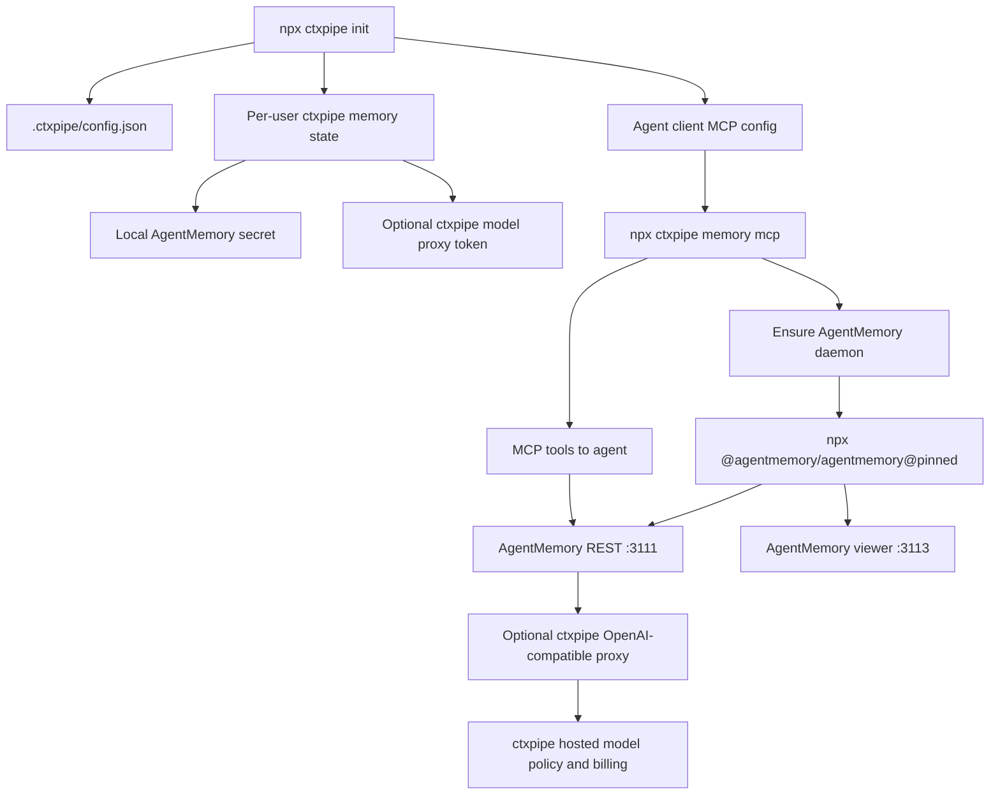

# AgentMemory Integration Options For ctxpipe CLI

Research date: 2026-05-25

## Goal

Explore how AgentMemory could be integrated into the ctxpipe CLI so a user can run:

```bash
npx ctxpipe init
```

and get local coding-agent memory installed next to the existing ctxpipe MCP setup, without needing to configure models, API keys, environment variables, extra daemons, or AgentMemory-specific commands by hand.

The ideal UX:

- `npx ctxpipe init` remains the single human entrypoint.
- The existing hosted ctxpipe MCP remains configured as today.
- A local AgentMemory-backed memory MCP is also configured for selected agents.
- AgentMemory starts automatically when the agent needs it.
- AgentMemory gets any needed model access through ctxpipe, not user-provided keys.
- Repo-shared config contains only safe, portable intent. Per-user secrets and runtime state stay local.

## Sources Reviewed

ctxpipe local sources:

- `packages/cli/src/program.ts`
- `packages/cli/src/commands.ts`
- `packages/cli/src/mcp/mcp-operations.ts`
- `packages/cli/src/fs-operations.ts`
- `packages/cli/src/auth.ts`
- `proposals/universal-ctxpipe-cli.md`

AgentMemory public and source sources:

- Website: https://www.agent-memory.dev/
- Repository: https://github.com/rohitg00/agentmemory
- README: https://github.com/rohitg00/agentmemory/blob/main/README.md
- Changelog: https://github.com/rohitg00/agentmemory/blob/main/CHANGELOG.md
- Package metadata: https://github.com/rohitg00/agentmemory/blob/main/package.json
- MCP shim package: https://github.com/rohitg00/agentmemory/tree/main/packages/mcp
- Source files inspected from a fresh clone:
  - `src/cli.ts`
  - `src/config.ts`
  - `src/mcp/standalone.ts`
  - `src/mcp/rest-proxy.ts`
  - `src/mcp/server.ts`
  - `src/cli/connect/*.ts`
  - `src/providers/openai.ts`
  - `src/providers/embedding/index.ts`
  - `src/functions/search.ts`
  - `src/functions/smart-search.ts`
  - `src/functions/observe.ts`
  - `src/prompts/compression.ts`
  - `src/prompts/consolidation.ts`

Pricing/auth reference:

- OpenAI API pricing: https://developers.openai.com/api/docs/pricing
- `text-embedding-3-small` model pricing: https://developers.openai.com/api/docs/models/text-embedding-3-small

## Current ctxpipe CLI Shape

`ctxpipe init` is already the right user-facing entrypoint. Today it:

- runs an interactive wizard unless `--yes` / non-interactive flags are supplied;
- signs the user into ctxpipe through device flow when org discovery is needed;
- writes `.ctxpipe/config.json` with `orgSlug`, `baseUrl`, and the hosted MCP URL;
- optionally configures selected agent clients;
- supports `codex`, `claude`, `cursor`, `opencode`, and `vscode`;
- can write JSON client config files or run native client commands;
- treats setup auth and MCP auth separately.

The important implementation seams:

- `buildCtxpipeConfigOperation()` writes `.ctxpipe/config.json`.
- `buildMcpOperations()` creates per-client setup operations.
- `Operation` currently supports `write-json`, `run`, and `manual`.
- JSON merge helpers exist for Cursor, Claude project config, OpenCode, and VS Code.
- Codex is mostly configured through `codex mcp add` for user scope; repo/project Codex TOML is not currently written by ctxpipe.

This means AgentMemory can fit cleanly as either:

- another MCP server entry written beside `ctxpipe`; or
- a new local wrapper command that ctxpipe writes into the same client config files.

The CLI does not currently have a daemon manager, local process supervisor, generic text/TOML writer, or local stdio MCP bridge. Those would be new capabilities if we want a polished AgentMemory integration.

## AgentMemory Source Findings

### Packaging And Runtime

AgentMemory is an Apache-2.0 TypeScript package:

- npm package: `@agentmemory/agentmemory`
- binary: `agentmemory`
- current inspected package version: `0.9.21`
- Node requirement: `>=20`
- MCP shim package: `@agentmemory/mcp`
- engine dependency: `iii-engine` pinned at `0.11.2`

The full runtime is not just an MCP server. It is:

- an `iii-engine` process;
- an AgentMemory worker loaded into that engine;
- REST API on `127.0.0.1:3111` by default;
- streams on `3112`;
- viewer on `3113`;
- engine websocket on `49134`;
- MCP exposed through a stdio shim that proxies to the REST server when reachable.

AgentMemory can auto-install `iii-engine` on macOS/Linux by downloading a GitHub release into `~/.local/bin`. It can also use Docker. Windows support exists but currently requires manual `iii.exe` installation or Docker Desktop.

### Configuration

AgentMemory reads configuration from:

- `~/.agentmemory/.env`;
- process environment.

The code path is in `src/config.ts`. There is no stable public config object passed through a JS SDK. The package's root export points at the worker entrypoint, not a client library.

Important env-style settings:

- `AGENTMEMORY_URL`
- `AGENTMEMORY_SECRET`
- `AGENTMEMORY_TOOLS`
- `AGENTMEMORY_AUTO_COMPRESS`
- `AGENTMEMORY_INJECT_CONTEXT`
- `CONSOLIDATION_ENABLED`
- `GRAPH_EXTRACTION_ENABLED`
- `EMBEDDING_PROVIDER`
- `OPENAI_API_KEY`
- `OPENAI_BASE_URL`
- `OPENAI_MODEL`
- `OPENAI_EMBEDDING_MODEL`
- `OPENAI_EMBEDDING_DIMENSIONS`

`agentmemory init` only copies the template env file to `~/.agentmemory/.env` and tells the user to edit it. First-run onboarding can ask for a provider and selected agents, but it still expects the user to edit the env file to add keys. That is not compatible with our desired one-command UX unless ctxpipe wraps or bypasses that config model.

### API Surfaces

AgentMemory has four relevant call surfaces:

| Surface | What It Is | Fit For ctxpipe |
|---|---|---|
| CLI | `agentmemory`, `agentmemory init`, `agentmemory connect`, `agentmemory mcp`, `agentmemory status`, etc. | Useful for lifecycle only. Not a good integration API. |
| REST | `/agentmemory/*` on local server. | Best management/control API for ctxpipe. |
| MCP shim | `npx -y @agentmemory/mcp`. Proxies to full server or falls back to local KV. | Best agent-facing API if we accept upstream tool surface. |
| iii SDK | Direct function calls such as `mem::remember`, `mem::observe`, `mem::search`. | Possible, but tightly couples ctxpipe to iii-engine internals. Avoid for v1. |

Practical REST endpoints for ctxpipe:

- `GET /agentmemory/livez`
- `GET /agentmemory/health`
- `GET /agentmemory/config/flags`
- `POST /agentmemory/session/start`
- `POST /agentmemory/session/end`
- `POST /agentmemory/observe`
- `POST /agentmemory/search`
- `POST /agentmemory/smart-search`
- `POST /agentmemory/remember`
- `GET /agentmemory/mcp/tools`
- `POST /agentmemory/mcp/call`

If `AGENTMEMORY_SECRET` is set, REST and MCP proxy calls use `Authorization: Bearer <secret>`. Without it, endpoints are open on loopback.

### MCP Shim Behavior

`npx -y @agentmemory/mcp` starts a stdio MCP server. On startup it:

1. checks `AGENTMEMORY_URL` or defaults to `http://localhost:3111`;
2. probes `/agentmemory/livez`;
3. if the full server is healthy, proxies tool listing and tool calls to the full server;
4. if no server is reachable, falls back to a standalone local JSON/KV store.

The local fallback supports only 7 tools:

- `memory_save`
- `memory_recall`
- `memory_smart_search`
- `memory_sessions`
- `memory_export`
- `memory_audit`
- `memory_governance_delete`

This fallback is useful for resilience but it is not the full AgentMemory product. It lacks the full runtime, viewer, hooks, rich API, consolidation, graph, and proper session capture.

### Native Agent Wiring

AgentMemory has its own `agentmemory connect` command. It can wire:

- Claude Code;
- Codex;
- Cursor;
- Gemini CLI;
- Hermes;
- OpenClaw;
- pi;
- OpenHuman.

For Codex, upstream writes global `~/.codex/config.toml` with:

```toml
[mcp_servers.agentmemory]
command = "npx"
args = ["-y", "@agentmemory/mcp"]

[mcp_servers.agentmemory.env]
AGENTMEMORY_URL = "http://localhost:3111"
```

It can also write `~/.codex/hooks.json` with `--with-hooks` as a workaround for current Codex Desktop plugin hook dispatch behavior.

For Claude Code, upstream writes MCP config and can merge hook scripts into `~/.claude/settings.json`.

We should not blindly call `agentmemory connect` from `ctxpipe init` because it:

- mutates user-level files outside ctxpipe's operation model;
- hardcodes local URL defaults;
- does not understand ctxpipe org/repo config;
- does not manage ctxpipe model auth;
- does not keep secrets out of repo-level config;
- is not scoped to ctxpipe's selected clients or summary UI;
- does not solve server lifecycle.

Use its code as a reference, not as the primary integration primitive.

### LLM And Embeddings

AgentMemory's OpenAI-compatible provider is real and simple:

- chat URL: `${OPENAI_BASE_URL}/v1/chat/completions`
- auth: `Authorization: Bearer ${OPENAI_API_KEY}` except Azure-style base URLs, which use `api-key`
- model: `OPENAI_MODEL`, default `gpt-4o-mini`
- timeout: `OPENAI_TIMEOUT_MS` or `AGENTMEMORY_LLM_TIMEOUT_MS`

OpenAI-compatible endpoints mentioned by upstream include OpenAI, Azure OpenAI, DeepSeek, vLLM, LM Studio, Ollama `/v1`, and other `/v1/chat/completions` providers.

Embeddings are separate but can reuse OpenAI-style settings:

- `OPENAI_API_KEY`
- `OPENAI_BASE_URL`
- `OPENAI_EMBEDDING_MODEL`
- `OPENAI_EMBEDDING_DIMENSIONS`

Code inspection showed that embeddings are only enabled when a provider is detected. `EMBEDDING_PROVIDER=local` explicitly enables local `Xenova/all-MiniLM-L6-v2` embeddings if optional dependencies are installed. With no provider detected, the runtime logs BM25-only mode. The `.env.example` describes a local fallback, but the current source path requires `EMBEDDING_PROVIDER=local` to select the local provider.

LLM-heavy features are off by default:

- `AGENTMEMORY_AUTO_COMPRESS=false`
- `AGENTMEMORY_INJECT_CONTEXT=false`
- `CONSOLIDATION_ENABLED` defaults effectively off unless enabled;
- `GRAPH_EXTRACTION_ENABLED=false`.

Default capture still works through zero-LLM synthetic compression.

### Project Scoping Concern

This is the biggest integration issue.

AgentMemory sessions store:

- `project`
- `cwd`
- `sessionId`

The REST `/agentmemory/search` endpoint accepts `project` and `cwd` filters. However, the upstream MCP `memory_recall` tool does not pass project or cwd through in the current server bridge, and `memory_smart_search` does not fully project-filter the hybrid search path. Manually saved memories through `memory_save` also do not carry an explicit project field.

Implication:

- A single global AgentMemory server can leak search results across repositories unless the agent or bridge injects scope.
- For ctxpipe, that is probably not acceptable as the default for team/repo memory.

Ways to solve:

- implement a ctxpipe-native MCP bridge that calls project-aware REST endpoints and injects `project` / `cwd`;
- run isolated AgentMemory state per repo;
- patch upstream to add first-class project scoping to MCP tools and saved memories;
- treat AgentMemory as user-global only and make that explicit in UX.

The first option is the best near-term control point. The second is cleaner conceptually but harder with the current hardcoded `~/.agentmemory` data dir and packaged iii config ports.

## Integration Options

### Option 1: Raw Upstream MCP Entry Only

What `ctxpipe init` would write:

```json
{
  "mcpServers": {
    "ctxpipe": {
      "type": "streamable-http",
      "url": "https://app.ctxpipe.ai/mcp?orgSlug=acme"
    },
    "agentmemory": {
      "command": "npx",
      "args": ["-y", "@agentmemory/mcp"],
      "env": {
        "AGENTMEMORY_URL": "http://localhost:3111"
      }
    }
  }
}
```

Then we could optionally tell the user to run `npx @agentmemory/agentmemory`.

Pros:

- Very easy to implement in existing CLI operations.
- Uses upstream's intended MCP package.
- Does not require us to build a local MCP bridge.
- Works even when no full server is running, through local fallback.

Cons:

- Violates the one-command goal if full AgentMemory server must be run separately.
- If no server is running, users get the weak 7-tool standalone fallback, not the actual AgentMemory runtime.
- Requires env entries in MCP configs if secret or custom URL is needed.
- Does not solve model provider setup.
- Does not solve project scoping.
- Does not install hooks, so automatic capture is weak.
- Hard to guarantee great UX across clients.

Verdict:

Useful as a quick experiment, but not good enough for ctxpipe's polished default.

### Option 2: Use `agentmemory connect` From `ctxpipe init`

`ctxpipe init` could run:

```bash
npx -y @agentmemory/agentmemory connect codex --with-hooks
```

or equivalent per detected client.

Pros:

- Leverages upstream adapter work.
- Can install Codex/Claude hook workarounds.
- Less custom client config code in ctxpipe.

Cons:

- Mutates user config outside ctxpipe's preview/apply operation model.
- Mostly user/global, not repo-aware.
- Hardcodes upstream assumptions.
- Still requires AgentMemory server lifecycle management.
- Still requires model/env setup.
- Does not integrate with ctxpipe auth, org selection, or repo config.
- Could conflict with ctxpipe's own MCP setup for the same clients.

Verdict:

Not recommended for default `ctxpipe init`. We can offer it as an advanced fallback or use it as implementation reference.

### Option 3: ctxpipe Launcher Around Upstream MCP

`ctxpipe init` writes a local MCP server command owned by ctxpipe:

```json
{
  "mcpServers": {
    "ctxpipe": {
      "type": "streamable-http",
      "url": "https://app.ctxpipe.ai/mcp?orgSlug=acme"
    },
    "ctxpipe-memory": {
      "command": "npx",
      "args": ["-y", "ctxpipe", "memory", "mcp"]
    }
  }
}
```

`ctxpipe memory mcp` would:

1. locate the repo's `.ctxpipe/config.json`;
2. read per-user memory runtime state from `~/.config/ctxpipe/memory/...`;
3. ensure the full AgentMemory server is running;
4. spawn it in the background when needed;
5. set AgentMemory env only for child processes;
6. exec or spawn `npx -y @agentmemory/mcp`;
7. pass `AGENTMEMORY_URL` and `AGENTMEMORY_SECRET` internally.

Pros:

- Preserves one-command user setup.
- Keeps user-facing config free of AgentMemory env variables.
- Allows ctxpipe to generate and store local secrets outside git.
- Lets ctxpipe manage package version pinning.
- Lets ctxpipe decide whether to use local-only mode or ctxpipe model proxy.
- Can auto-start the server lazily when an agent connects.
- Requires less MCP implementation work than a full bridge.

Cons:

- Still inherits upstream MCP tool schemas and project-scoping gaps.
- Still uses nested `npx` unless we vendor or depend on AgentMemory.
- First use may be slow while npm downloads AgentMemory and iii-engine.
- AgentMemory full server may fail to start in non-networked environments if iii-engine is missing.
- Hook integration remains separate.

Verdict:

Good v1 candidate if we accept global/user memory semantics initially. Not sufficient if repo isolation is a hard requirement.

### Option 4: ctxpipe-Native Local MCP Bridge

`ctxpipe init` writes:

```json
{
  "mcpServers": {
    "ctxpipe": {
      "type": "streamable-http",
      "url": "https://app.ctxpipe.ai/mcp?orgSlug=acme"
    },
    "ctxpipe-memory": {
      "command": "npx",
      "args": ["-y", "ctxpipe", "memory", "mcp"]
    }
  }
}
```

But instead of execing `@agentmemory/mcp`, `ctxpipe memory mcp` implements MCP itself and proxies to AgentMemory REST.

Tool strategy:

- expose a small curated tool set first;
- call `/agentmemory/search` with `project` / `cwd` filters;
- call `/agentmemory/remember` with ctxpipe-added metadata when possible;
- call `/agentmemory/session/start`, `/observe`, and `/session/end` from ctxpipe-owned hooks later;
- hide or defer high-risk tools such as team mesh, leases, raw governance, and broad graph queries.

Pros:

- Best UX and safety control.
- Can enforce project scoping even when upstream MCP does not.
- Can keep tool surface small and agent-friendly.
- Can normalize errors and setup messages.
- Can inject ctxpipe org/repo metadata.
- Can use ctxpipe auth/model proxy without leaking details.
- Can start AgentMemory automatically.

Cons:

- More implementation work.
- We must maintain MCP tool schemas or dynamically mirror upstream.
- Some upstream features become unavailable until explicitly bridged.
- Need to build a small stdio MCP server in `packages/cli` or a companion package.

Verdict:

Best long-term architecture. If we care about "great user experience" and repo-safe defaults, this is the recommended target.

### Option 5: Fork Or Patch AgentMemory

Because AgentMemory is Apache-2.0, ctxpipe can fork, patch, redistribute, or compete.

Useful patches:

- `AGENTMEMORY_DATA_DIR` or equivalent, so ctxpipe can isolate data per repo/user without spoofing `HOME`.
- configurable iii config path or generated runtime config, so per-repo ports/state are possible.
- first-class project scoping on every MCP search/save tool.
- model provider plugin or config file support beyond env variables.
- stable non-interactive connect mode that prints operations instead of mutating files directly.
- option for MCP shim to start the full server automatically.

Pros:

- Can fix exactly the gaps we care about.
- Lets us preserve AgentMemory architecture while simplifying UX.
- License permits redistribution.

Cons:

- Maintenance burden.
- Fast-moving upstream means frequent merges.
- We inherit security and runtime responsibilities.
- We may eventually be better off implementing a smaller memory layer ourselves.

Verdict:

Worth considering only after proving the UX and quality with a wrapper. For immediate exploration, patch upstream through PRs where possible rather than forking.

## Recommended Path

Recommended phased design:

1. Build a ctxpipe-owned memory launcher and MCP entrypoint.
2. Require the full AgentMemory server for the advertised integration; do not silently accept the 7-tool standalone fallback as "working".
3. Start with AgentMemory as a pinned runtime, not copied/vendorized source.
4. Default to zero user model setup:
   - no user API keys;
   - no user env variables;
   - no AgentMemory setup command;
   - hosted ctxpipe model proxy when the user is signed in;
   - full no-LLM server mode when the user is not signed in or token refresh fails.
5. Add a ctxpipe-hosted OpenAI-compatible model proxy for richer compression/consolidation, with auth and cost controls from day one.
6. Move from launcher-around-upstream-MCP to native ctxpipe MCP bridge if project scoping matters for v1.

In product terms:

- v0 experiment: Option 3.
- polished team-safe v1: Option 4, with upstream patches if needed.

## Practical Difference Between Option 3 And Option 4

Both options can keep the same user-facing setup:

```bash
npx ctxpipe init
```

and the same MCP command written into client configs:

```bash
npx -y ctxpipe memory mcp
```

The difference is what `ctxpipe memory mcp` does after it starts the full AgentMemory server.

### Option 3: ctxpipe Launcher Around Upstream MCP

Option 3 makes ctxpipe a supervisor/launcher.

Flow:

```text
agent -> ctxpipe memory mcp -> ensure AgentMemory server -> exec/proxy @agentmemory/mcp -> AgentMemory REST
```

ctxpipe owns:

- version pinning;
- starting/stopping the full server;
- local secrets;
- hosted model proxy env;
- no-LLM fallback;
- status/doctor;
- maybe hook installation.

AgentMemory owns:

- MCP tool schemas;
- tool names/descriptions;
- tool behavior;
- whether tools are project-scoped;
- what gets exposed to the agent;
- most error messages;
- fallback behavior unless ctxpipe actively blocks it.

Practical implications:

- fastest to build;
- easiest to keep up with upstream AgentMemory features;
- less code in ctxpipe;
- but the agent sees AgentMemory's raw tool surface;
- ctxpipe cannot fully enforce repo scoping unless upstream MCP supports it;
- ctxpipe cannot easily hide noisy/unsafe tools;
- ctxpipe gets less control over "enhanced memory signed out" UX;
- any upstream MCP behavior change is a ctxpipe product behavior change.

Option 3 is good for:

- proving server startup;
- proving hosted model proxy env;
- proving package pinning;
- proving no-LLM full-server fallback;
- internal dogfooding.

Option 3 is risky for:

- default team rollout;
- strict repo isolation;
- polished cross-agent UX;
- curated memory semantics;
- stable product promises.

### Option 4: ctxpipe-Native MCP Bridge

Option 4 makes ctxpipe the agent-facing memory product surface.

Flow:

```text
agent -> ctxpipe memory mcp -> ensure AgentMemory server -> ctxpipe MCP tools -> AgentMemory REST
```

ctxpipe owns:

- everything from Option 3;
- MCP tool schemas;
- tool names/descriptions;
- which capabilities are exposed;
- project/repo/org metadata injection;
- status and login messages;
- fallback behavior;
- error normalization;
- safety/redaction;
- cross-agent consistency.

AgentMemory owns:

- local storage/runtime;
- REST implementation;
- search/compression/consolidation internals;
- viewer;
- server-side memory mechanics.

Practical implications:

- more implementation work;
- we must maintain a small MCP server/tool layer;
- we may need to bridge new AgentMemory features deliberately;
- but we can ship a much cleaner and safer product;
- ctxpipe can make "repo memory" actually repo-scoped even if upstream MCP is user-global;
- ctxpipe can expose only high-confidence tools;
- ctxpipe can make logged-out hosted-model state visible in a consistent way;
- ctxpipe can switch later from AgentMemory to another backend without changing the agent-facing protocol as much.

Option 4 is good for:

- real v1;
- multi-agent support;
- team/repo-safe defaults;
- controlling privacy and capture;
- making memory semantics match ctxpipe's product;
- avoiding upstream MCP tool churn as a user-facing contract.

Option 4 is heavier because ctxpipe must design its own tool surface, for example:

```text
ctxpipe_memory_status
ctxpipe_memory_save
ctxpipe_memory_search
ctxpipe_memory_recent_sessions
ctxpipe_memory_summarize_session
ctxpipe_memory_consolidate
ctxpipe_memory_forget
```

Behind those tools, ctxpipe can call:

- `/agentmemory/remember`
- `/agentmemory/search`
- `/agentmemory/smart-search`
- `/agentmemory/session/start`
- `/agentmemory/observe`
- `/agentmemory/session/end`
- `/agentmemory/consolidate-pipeline`

### The Most Important Difference

Option 3 asks:

> "Can ctxpipe make upstream AgentMemory feel automatic?"

Option 4 asks:

> "Can ctxpipe provide a memory product, using AgentMemory as the local engine?"

That distinction matters. If AgentMemory is the product surface, ctxpipe inherits its defaults, tool taxonomy, scoping gaps, and UX. If ctxpipe is the product surface, AgentMemory is an implementation detail we can replace, patch, or constrain.

### Recommendation

Use Option 3 as an implementation spike only:

- can we start the full server reliably?
- can we pin the package without vendoring?
- can we provide hosted OpenAI-compatible model proxy?
- can no-LLM mode work cleanly?
- how bad are upstream MCP scoping gaps in practice?

Then ship Option 4 for any user-facing release where memory is enabled by default or presented as a ctxpipe feature.

The command boundary should be designed so the migration is invisible:

```bash
npx -y ctxpipe memory mcp
```

In the spike, that command delegates to upstream MCP. In v1, the same command becomes the native bridge.

### Hybrid Option: Policy Proxy Around AgentMemory MCP

There is a useful middle path between Option 3 and Option 4.

Flow:

```text
agent
  -> ctxpipe memory mcp
  -> ensure AgentMemory server
  -> fetch/list upstream AgentMemory MCP tools
  -> filter/rename/patch selected tools
  -> proxy allowed tool calls to AgentMemory MCP or REST
```

This is not just a launcher. ctxpipe still owns the agent-facing MCP server. But instead of hand-writing every tool from scratch, it can mirror most upstream AgentMemory tools and intercept only the ones that need product policy.

Ctxpipe can apply:

- **tool filtering**: hide tools that are too noisy, unsafe, experimental, or irrelevant;
- **schema patching**: add required `project`, `cwd`, `repoId`, or `orgSlug` fields internally without asking the agent;
- **argument rewriting**: inject repo/org/user metadata into search/save calls;
- **result filtering**: drop cross-repo results, redact secrets, normalize errors;
- **tool renaming/aliasing**: expose stable `ctxpipe_memory_*` aliases while still forwarding to upstream;
- **capability gating**: hide or degrade LLM-backed tools when signed out;
- **fallback control**: refuse upstream's 7-tool standalone mode unless explicitly requested;
- **telemetry/cost accounting**: annotate hosted-model calls by repo/user/org;
- **selective overrides**: implement specific tools ourselves via REST while passing others through.

Example policy:

| Upstream Tool Type | Hybrid Behavior |
|---|---|
| Save/remember tools | Rewrite arguments to include ctxpipe repo/org metadata; maybe call REST directly. |
| Search/recall tools | Inject repo filters; post-filter results; normalize ranking summary. |
| Summarize/consolidate/graph tools | Gate on hosted model token; return visible login message if signed out. |
| Raw export/governance/delete tools | Hide by default or require explicit ctxpipe tool names. |
| Experimental/team mesh/action tools | Hide until we decide they fit ctxpipe. |
| Safe read-only status tools | Pass through mostly unchanged. |

Implementation styles:

1. **MCP-to-MCP proxy**:
   - start upstream `@agentmemory/mcp` as a child stdio process;
   - call its `tools/list`;
   - expose a filtered/patched list to the agent;
   - forward `tools/call` with rewritten args.
   - Pros: easiest to mirror upstream breadth.
   - Cons: harder to enforce deep behavior if upstream tool does not accept needed fields.

2. **REST-backed hybrid bridge**:
   - list a curated/mirrored tool set in ctxpipe;
   - implement risky/core tools directly against AgentMemory REST;
   - optionally pass through safe tools via upstream MCP or REST.
   - Pros: stronger policy and repo scoping.
   - Cons: more schema maintenance.

3. **Generated tool mirror with policy table**:
   - at build/test time, snapshot upstream tool schemas;
   - define a policy table for hide/pass/rewrite/override;
   - fail compatibility tests when upstream schema changes.
   - Pros: stable product contract with faster upstream sync.
   - Cons: build/release workflow needed.

Recommended hybrid:

- `ctxpipe memory mcp` always implements the MCP server itself.
- For v1, expose a curated set:
  - pass through safe status/read tools;
  - override save/search/summarize/consolidate;
  - hide dangerous or confusing tools.
- Keep an internal policy table:

```ts
{
  memory_recall: "override-with-repo-filter",
  memory_smart_search: "override-with-repo-filter",
  memory_save: "rewrite-and-forward",
  memory_export: "hide",
  memory_governance_delete: "hide-or-ctxpipe-admin-tool",
  memory_summarize_session: "gate-hosted-model",
}
```

This gives most of Option 4's control with less initial tool-authoring work. It also makes it possible to graduate individual tools:

- start as pass-through;
- add argument rewrite;
- add result filtering;
- fully override with REST when necessary.

This is probably the best practical v1 direction:

- Option 3 spike to prove lifecycle;
- hybrid policy proxy for v1;
- full ctxpipe-native tool surface only where product semantics need it.

## Refined Direction From Follow-Up

The desired product shape is now:

- full AgentMemory server, not the weak standalone fallback;
- all runtime/model/auth details hidden behind ctxpipe;
- hosted ctxpipe model proxy for full AgentMemory capabilities;
- no-LLM full-server fallback when the user is not logged in;
- no user-facing AgentMemory config file if avoidable;
- most settings supplied as ctxpipe-managed child-process env or CLI args;
- a wildcard/pass-through command is acceptable for advanced AgentMemory subcommands, as long as ctxpipe still hydrates runtime env and protects the happy path.

### Package Pin Instead Of Vendoring

Yes, ctxpipe can avoid vendoring AgentMemory source. There are three viable pinning models:

| Model | How It Works | Pros | Cons | Recommendation |
|---|---|---|---|---|
| Direct dependency in `ctxpipe` | Add exact `@agentmemory/agentmemory` version to `packages/cli/package.json`; spawn its packaged `dist/cli.mjs` by resolving package root. | Reproducible; no nested `npx`; faster after `ctxpipe` install. | Makes every `npx ctxpipe` install much heavier even when user does not enable memory; optional deps may be large. | Avoid for base CLI unless memory becomes mandatory. |
| Dynamic pinned `npx` | Keep base CLI light; spawn `npx -y @agentmemory/agentmemory@0.9.21 ...`. | Small base package; easy upgrades by changing a constant. | First memory startup can be slow; package downloaded separately. | Good prototype path. |
| Companion runtime package | `ctxpipe` stays small; `ctxpipe memory mcp` bootstraps or delegates to a `@ctxpipe/agentmemory-runtime` package that pins AgentMemory. | Clean dependency boundary; exact pin; easier runtime-specific code. | More packages and release coordination. | Best polished path if memory remains optional. |

If using a package dependency, do not rely on an exported SDK. Resolve `@agentmemory/agentmemory/package.json`, derive the package root, then spawn:

```text
node <package-root>/dist/cli.mjs <args...>
```

The current package exports `./dist/standalone.mjs` but not `./dist/cli.mjs`, so direct subpath import may be blocked by package exports. Spawning by resolved package root avoids treating AgentMemory as a library.

### Wildcard Bridge

A wildcard bridge is useful:

```bash
npx ctxpipe memory status
npx ctxpipe memory doctor
npx ctxpipe memory import-jsonl <path>
npx ctxpipe memory stop
```

Conceptually:

```text
ctxpipe memory <args...> -> hydrated AgentMemory runtime -> agentmemory <args...>
```

But `mcp` should remain special:

- `ctxpipe memory mcp` must ensure the full server is running first;
- it must inject `AGENTMEMORY_URL`, model proxy settings, and local runtime state;
- it may later proxy MCP itself for project scoping;
- it must not degrade silently to upstream's 7-tool fallback.

So the bridge should be "wildcard with reserved commands":

- reserved/owned: `mcp`, `doctor`, `status`, `stop`, maybe `start`;
- pass-through: any other AgentMemory subcommand, with ctxpipe env hydration;
- blocked or wrapped: `connect`, because ctxpipe should own client config mutation.

### Full Server Startup From MCP Lifecycle

Yes, the best UX is automatic startup from the MCP lifecycle.

Flow:

1. `npx ctxpipe init` writes selected agent configs with `ctxpipe-memory` pointing at `npx -y ctxpipe memory mcp`.
2. The user starts an agent.
3. The agent launches the stdio MCP command.
4. `ctxpipe memory mcp` checks the full AgentMemory server health.
5. If not running, it starts the full server detached with ctxpipe-managed env.
6. It waits for `/agentmemory/livez`.
7. It exposes/proxies MCP tools only after the full server is reachable.

This means the second user does not need a separate "start the server" command after they run `npx ctxpipe init`. The MCP command is the lazy launcher.

If a second user pulls a repo where memory config is committed but has never run init:

- `ctxpipe memory mcp` can self-initialize local no-LLM state and start the full server;
- if hosted model proxy is required for a specific LLM-backed feature, it should return a friendly "sign in to enable enhanced memory" message;
- it should not block basic full-server no-LLM memory.

### Full Server, Not Standalone Fallback

The wrapper should treat upstream `@agentmemory/mcp` local fallback as a last-resort diagnostic mode, not the product. Default behavior should be:

- full server reachable: serve memory tools;
- full server start failed: report setup/runtime error through MCP;
- user not logged in: start full server in no-LLM mode;
- never silently report "memory is ready" while only the 7-tool local fallback is active.

This means `ctxpipe memory mcp` should not simply exec `npx @agentmemory/mcp` and hope for the best. It must either:

- ensure the full server first, then exec upstream MCP; or
- implement the MCP bridge itself and call AgentMemory REST.

If upstream's standalone fallback is exposed at all, it should be visible in `ctxpipe memory doctor` as "degraded standalone mode", not the normal integration.

## Minimal User-Visible Config

We can likely avoid a user-facing AgentMemory config file.

AgentMemory supports process env overrides. Since ctxpipe starts the AgentMemory child process, ctxpipe can supply:

- `AGENTMEMORY_SECRET` if we use one;
- `AGENTMEMORY_TOOLS`;
- `OPENAI_BASE_URL`;
- `OPENAI_API_KEY`;
- `OPENAI_MODEL`;
- `OPENAI_EMBEDDING_MODEL`;
- `OPENAI_EMBEDDING_DIMENSIONS`;
- feature flags such as `AGENTMEMORY_AUTO_COMPRESS`, `CONSOLIDATION_ENABLED`, and `GRAPH_EXTRACTION_ENABLED`;
- `III_REST_PORT`, `III_STREAMS_PORT`, `III_ENGINE_URL` if needed.

The user should not edit `~/.agentmemory/.env`. Ideally, ctxpipe never creates it. AgentMemory may still create internal state under `~/.agentmemory`; that is runtime data, not configuration the user needs to understand.

If we need per-repo ports or storage isolation, ctxpipe may need to generate hidden runtime files under `~/.config/ctxpipe/memory/...`, including an iii config file. That is acceptable as internal state, not user configuration.

The cleanest shape is:

- no `~/.agentmemory/.env` created or edited by ctxpipe;
- no AgentMemory knobs in checked-in client config;
- no model keys or local REST secrets in any repo file;
- optional memory intent only in the existing `.ctxpipe/config.json`, if needed for team rehydration;
- all operational details supplied by `ctxpipe memory mcp` as child-process env.

If we can infer memory intent from the MCP client entry itself, we may not need a dedicated memory config stanza at all. That is preferable. The only committed source of truth would be:

```json
{
  "mcpServers": {
    "ctxpipe-memory": {
      "command": "npx",
      "args": ["-y", "ctxpipe", "memory", "mcp"]
    }
  }
}
```

For the second user, this is enough to trigger local no-LLM startup. Hosted LLM features become available only after their own ctxpipe sign-in.

## Calling AgentMemory Functions

Do not import `@agentmemory/agentmemory` as an SDK.

Reasons:

- the package root is the worker/server entrypoint, not a client API;
- config is env-driven;
- direct function access requires iii-engine and `iii-sdk`;
- importing the package risks starting runtime side effects inside the ctxpipe CLI process.

Use these instead:

### Server Lifecycle

Use child processes:

- start: spawn `npx -y @agentmemory/agentmemory@<pinned>` detached;
- stop: either call upstream `agentmemory stop` equivalent or track pid/port in ctxpipe state;
- health: `GET /agentmemory/livez`;
- status: `GET /agentmemory/health` and `/agentmemory/config/flags`.

### Management Calls

Use REST:

- `POST /agentmemory/remember`
- `POST /agentmemory/search`
- `POST /agentmemory/smart-search`
- `POST /agentmemory/session/start`
- `POST /agentmemory/observe`
- `POST /agentmemory/session/end`
- `GET /agentmemory/export`

### Agent Tool Calls

Either:

- exec upstream `@agentmemory/mcp` after ensuring the server; or
- implement ctxpipe's own MCP bridge and call REST.

For a polished UX, the native bridge is better because it can project-scope calls and hide setup complexity.

### Direct iii SDK Calls

AgentMemory docs mention direct functions:

- `mem::remember`
- `mem::observe`
- `mem::context`
- `mem::smart-search`
- `mem::forget`

Avoid this in ctxpipe v1. It couples us to iii-engine details, ports, worker lifecycle, and function IDs. REST is enough.

## Model Provisioning

### Baseline: No LLM Required

AgentMemory now has a zero-LLM synthetic compression path. This means we can run it without a chat model:

- `AGENTMEMORY_AUTO_COMPRESS=false`
- `AGENTMEMORY_INJECT_CONTEXT=false`
- `CONSOLIDATION_ENABLED=false`
- `GRAPH_EXTRACTION_ENABLED=false`

This gives:

- hook/session capture if hooks are installed;
- synthetic compressed observations;
- BM25 search;
- optional local embeddings if `EMBEDDING_PROVIDER=local` works reliably.

Pros:

- exactly matches "no model setup";
- no ctxpipe-hosted model cost;
- lower privacy risk;
- no remote traffic from local memory by default.

Cons:

- weaker summaries;
- no rich consolidation;
- no graph extraction;
- less differentiation from simpler local memory.

This should be the safe default unless we decide memory quality requires a hosted model from day one.

### Hosted Model Proxy

AgentMemory's OpenAI-compatible provider makes a ctxpipe model proxy feasible.

We can expose:

```text
https://app.ctxpipe.ai/api/agentmemory/openai/v1/chat/completions
https://app.ctxpipe.ai/api/agentmemory/openai/v1/embeddings
```

Then launch AgentMemory with child-process env:

```text
OPENAI_BASE_URL=https://app.ctxpipe.ai/api/agentmemory/openai
OPENAI_API_KEY=<ctxpipe-issued-local-memory-token>
OPENAI_MODEL=<ctxpipe-selected-small-model>
OPENAI_EMBEDDING_MODEL=<ctxpipe-selected-embedding-model>
OPENAI_EMBEDDING_DIMENSIONS=<known-dim>
AGENTMEMORY_AUTO_COMPRESS=false initially
CONSOLIDATION_ENABLED=false initially
GRAPH_EXTRACTION_ENABLED=false initially
```

Important: use the proxy token only as an OpenAI-compatible bearer token. Do not expose the user's setup access token to AgentMemory. Setup access tokens expire and are not designed for a long-running local daemon.

Auth flow:

1. User signs in through the existing ctxpipe device flow during `npx ctxpipe init`.
2. CLI calls a new ctxpipe endpoint to mint a local memory proxy token scoped to:
   - user;
   - org;
   - optionally repo/project id;
   - model proxy only;
   - bounded quota.
3. CLI stores that token in OS keyring or `~/.config/ctxpipe/...` with strict permissions.
4. `ctxpipe memory mcp` reads it and passes it only to the AgentMemory child process.
5. No key is written to repo config or MCP JSON.

Pros:

- users still do no model setup;
- ctxpipe can manage model choice centrally;
- ctxpipe can enforce org policy, quotas, and audit;
- AgentMemory uses an interface it already supports.

Cons:

- backend work required;
- cost and abuse controls required;
- offline/local-only story becomes weaker if enabled by default;
- need clear privacy messaging because local memory observations may be sent to ctxpipe for compression.

Recommendation:

- Enable the hosted proxy automatically when the user is signed in and org policy allows it.
- Do not require the user to choose a model, paste a key, or set env vars.
- Start with the high-value LLM features that are naturally batched:
  - session-end summaries;
  - consolidation on a schedule with small quotas;
  - graph/crystal extraction for promoted memories;
  - on-demand summarize/consolidate commands.
- Be careful with per-observation LLM auto-compression because it can multiply cost quickly.
- Keep raw tool-output capture local unless the user/org enables hosted processing.

### Local ctxpipe Proxy Process

Alternative: run a local ctxpipe helper that exposes an OpenAI-compatible endpoint on localhost and refreshes ctxpipe auth itself.

AgentMemory would see:

```text
OPENAI_BASE_URL=http://127.0.0.1:<ctxpipe-local-port>
OPENAI_API_KEY=ctxpipe-local
```

The local helper would:

- read ctxpipe auth from keyring;
- refresh tokens;
- call hosted ctxpipe model APIs;
- enforce per-repo/org policy;
- avoid long-lived model proxy tokens.

Pros:

- no long-lived backend-issued proxy token in AgentMemory env;
- easier auth refresh;
- can add local redaction before sending to hosted model.

Cons:

- now there are two local processes: ctxpipe helper plus AgentMemory;
- more failure modes;
- more lifecycle work.

Recommendation:

Use a ctxpipe-managed hosted proxy from day one for signed-in users. There are two viable transport shapes:

1. Pass a short-lived ctxpipe model proxy token directly as `OPENAI_API_KEY` to AgentMemory.
2. Point AgentMemory at a local ctxpipe OpenAI-compatible proxy that refreshes auth per request.

The direct token is simpler. The local proxy is cleaner for true short-lived auth, revocation, redaction, and per-request policy. For a polished product, the local proxy can live inside the same `ctxpipe memory mcp` launcher/runtime process family rather than being exposed as a separate user command.

### No-LLM Fallback When Logged Out

Logged-out users should still get the full AgentMemory server, just without hosted LLM features.

Suggested launch env:

```text
AGENTMEMORY_AUTO_COMPRESS=false
AGENTMEMORY_INJECT_CONTEXT=false
CONSOLIDATION_ENABLED=false
GRAPH_EXTRACTION_ENABLED=false
OPENAI_API_KEY=<unset>
OPENAI_BASE_URL=<unset>
```

This gives local capture/search continuity while making it obvious that enhanced summaries/consolidation require sign-in. It is a much better fallback than upstream's 7-tool standalone MCP because the full REST server, viewer, sessions, and storage model are still present.

### Expected Hosted Model Cost

Cost depends almost entirely on whether we call the LLM for every observation or only for batched/promoted events.

Current reference prices checked 2026-05-25:

- OpenAI lists `gpt-5.4-mini` standard pricing at `$0.75` input / `$4.50` output per 1M tokens and `gpt-5.4-nano` at `$0.20` input / `$1.25` output per 1M tokens.
- `text-embedding-3-small` is listed at `$0.02` per 1M tokens.

Rough monthly envelope for one average developer:

| Feature | Assumption | Nano-Class Cost | Mini-Class Cost | Notes |
|---|---:|---:|---:|---|
| Embeddings | 2M-20M embedded tokens/month | `$0.04-$0.40` | same if same embedding model | Usually negligible. Local embeddings may avoid this entirely. |
| Session-end summaries | 40 sessions/month, 10k input + 1k output each | `~$0.13` | `~$0.48` | Cheap because it batches. |
| Scheduled consolidation | 500-2,000 candidate memories/month, 1k input + 100 output each | `~$0.16-$0.65` | `~$0.60-$2.40` | Also cheap if batched. |
| Graph/crystal extraction | 500-2,000 promoted memories/month, 1.5k input + 200 output each | `~$0.28-$1.10` | `~$1.00-$4.05` | Keep this on promoted memories, not every raw event. |
| Per-observation compression | 2,000-6,000 observations/month, 1.5k input + 200 output each | `~$1.10-$3.30` | `~$4.05-$12.15` | This is where cost starts to matter. |
| Heavy per-observation compression | 20,000 observations/month | `~$11` | `~$40+` | Plausible for very active hook capture. |

Expected product default if we use hosted LLMs only for batched/session features:

- likely under `$1-$5` per developer/month in model cost;
- budget `$5-$10` per developer/month including retries, overhead, and noisy projects;
- cap or degrade before `$15-$20` per developer/month unless the org opts into aggressive capture.

If we turn on per-observation compression everywhere, budget more like `$5-$20` per average developer/month and `$40+` for heavy users. That argues for full server plus hosted model proxy, but with quota-aware feature scheduling rather than naive LLM-on-every-hook behavior.

## Auth And Secrets

There are two auth surfaces:

### AgentMemory Local REST Auth

AgentMemory uses `AGENTMEMORY_SECRET` as a static bearer token for REST/viewer/integration calls.

Options:

| Approach | Pros | Cons |
|---|---|---|
| No local secret | Zero config; works on loopback | Local processes can call AgentMemory; bad if bound beyond loopback |
| Generated per-user secret | Safer; no repo leakage if hidden by ctxpipe wrapper | Requires wrapper so MCP config does not contain secret |
| Commit secret into MCP config | Simple | Do not do this |

Recommendation:

- Generate a local secret per user or per repo.
- Store it in ctxpipe local state.
- Pass it as child env from `ctxpipe memory mcp`.
- Never write it into `.ctxpipe/config.json`, `.cursor/mcp.json`, `.mcp.json`, `.codex/config.toml`, or any checked-in file.

If we choose no local secret for v0, document that AgentMemory is loopback-only and ensure it never binds beyond `127.0.0.1`.

### ctxpipe Hosted Model Auth

Use a separate local memory proxy token, not:

- the user's OpenAI key;
- the ctxpipe setup access token;
- the agent's MCP OAuth token;
- an env var the user must manage.

Store in:

- OS keyring where possible;
- fallback file under `~/.config/ctxpipe/` with `0600`, matching existing CLI auth fallback pattern.

#### Token Options

| Option | How It Works | Second User Flow | Pros | Cons | Fit |
|---|---|---|---|---|---|
| Long-ish proxy token | `ctxpipe init` mints a model-proxy token, stores it locally, and passes it to AgentMemory as `OPENAI_API_KEY`. | Second user runs `ctxpipe init` and gets their own token. If not signed in, no-LLM mode. | Simplest; works with AgentMemory unchanged. | Token may live in child env for hours/days; refresh means restarting the daemon. | Good prototype. |
| Short-lived token refreshed by launcher | `ctxpipe memory mcp` refreshes before starting AgentMemory; token TTL covers one work session. | Same: each user refreshes from their own ctxpipe auth. | Better security; still simple. | AgentMemory cannot refresh its own OpenAI key mid-process; daemon restart may be needed on expiry. | Good v1 if TTL is 8-24h. |
| Local OpenAI-compatible ctxpipe proxy | AgentMemory points to `http://127.0.0.1:<port>/v1`; the local proxy refreshes ctxpipe auth and forwards requests. | Second user starts their own local proxy from their own auth. | Best for short-lived tokens, revocation, redaction, request policy, and usage metering. | More moving parts and lifecycle complexity. | Best polished design. |
| AgentMemory provider patch | Add a ctxpipe provider/plugin directly to AgentMemory. | Same, but requires our runtime/fork/patch. | Cleanest inside AgentMemory. | Upstream maintenance and slower iteration. | Later, only if wrapper proves out. |

#### Login And Token Minting UX

Existing ctxpipe setup auth already uses a browser/device-code login:

- CLI calls `/.auth/api/v1/auth/device/code`.
- User approves in the browser.
- CLI polls `/.auth/api/v1/auth/device/token`.
- CLI stores setup auth in the system keyring, or in `~/.config/ctxpipe/<base>.auth.json` with `0600` fallback.

The memory model credential should be minted from that existing setup auth, not from the remote MCP OAuth token and not from a user-provided OpenAI key.

Important timing detail: do not mint the 8-24 hour AgentMemory model token only during `ctxpipe init` and then hope it is still valid when the developer opens their agent days later. Better:

1. `ctxpipe init` signs the user in and stores ctxpipe setup auth.
2. `ctxpipe memory mcp` starts later from the agent's MCP lifecycle.
3. The launcher reads stored setup auth.
4. It calls a new backend endpoint to mint a fresh short-lived memory model token just before starting or restarting AgentMemory.
5. It passes that fresh token to AgentMemory as `OPENAI_API_KEY`.

Proposed backend shape:

```http
POST /api/v1/memory/model-token
Authorization: Bearer <ctxpipe setup access token>
Content-Type: application/json

{
  "orgSlug": "acme",
  "repoId": "<stable repo fingerprint if available>",
  "runtime": "agentmemory",
  "capabilities": ["chat.completions", "embeddings"],
  "mode": "developer-local-memory"
}
```

Response:

```json
{
  "accessToken": "ctxmem_...",
  "tokenType": "Bearer",
  "expiresAt": "2026-05-25T12:00:00.000Z",
  "openaiBaseUrl": "https://app.ctxpipe.ai/api/agentmemory/openai",
  "chatModel": "gpt-5.4-nano",
  "embeddingModel": "text-embedding-3-small",
  "quota": {
    "monthlyUsdSoftLimit": 5,
    "monthlyUsdHardLimit": 15
  }
}
```

The token should be scoped to:

- one user;
- one org;
- optionally one repo/project;
- model proxy endpoints only;
- allowed model classes;
- short expiry;
- server-side quota and audit.

It should not be usable for ctxpipe API actions, remote MCP, billing/admin APIs, or other org data.

#### When To Prompt Login

There are three different moments:

| Moment | Should We Prompt? | Behavior |
|---|---|---|
| Interactive `npx ctxpipe init` | Yes, if memory is enabled and no valid setup auth exists. | Prompt with "Sign in to enable enhanced memory. Skip for local-only memory." Existing org selection already signs in when org discovery is needed. |
| Non-interactive `npx ctxpipe init --yes` | No browser prompt unless explicitly allowed. | If stored auth exists, enable hosted model proxy. If not, configure memory but mark hosted model proxy unavailable until login. |
| `ctxpipe memory mcp` launched by an agent | No interactive prompt. | Start full AgentMemory in no-LLM mode if auth is missing/expired and refresh fails. Expose a tool/status message saying enhanced memory needs `npx ctxpipe auth login` or `npx ctxpipe init`. |

Why not prompt inside `ctxpipe memory mcp`?

- MCP startup should be fast and non-interactive.
- Browser prompts from an agent-launched stdio process are surprising.
- Some clients run MCP servers in contexts where TTY/browser prompts do not work.
- The user may only want local/offline memory for that session.

`ctxpipe memory doctor` can be more helpful:

- if not signed in, show "Enhanced memory is off. Run `npx ctxpipe auth login` or `npx ctxpipe init`."
- if signed in but token mint fails, show the backend error and keep no-LLM mode available.
- if token exists but expires soon, mint a fresh one.

#### First User And Second User Flow

First user:

1. Runs `npx ctxpipe init`.
2. Chooses or confirms memory integration.
3. If interactive and not already signed in, approves browser/device login.
4. CLI writes safe repo/client config.
5. Later, when their agent starts, `ctxpipe memory mcp` mints a fresh model token and starts AgentMemory with hosted LLM features.

Second user after pulling the repo:

1. Runs `npx ctxpipe init`.
2. CLI sees existing repo ctxpipe/memory intent.
3. If interactive and not already signed in, prompts browser/device login for that second user's ctxpipe account.
4. CLI stores only that second user's setup auth locally.
5. Later, `ctxpipe memory mcp` mints that second user's own memory model token.

The committed changes do not and should not prompt the second user by themselves. A git pull can only deliver safe repo config. The prompt happens when the second user runs a ctxpipe setup command locally.

Recommended second-user UX:

```bash
npx ctxpipe init
```

If the repo already contains ctxpipe memory intent, `init` should detect it and say something like:

```text
This repo uses ctxpipe-managed local memory.
Sign in to enable enhanced memory summaries and consolidation?
```

Choices:

- sign in: start the existing browser/device-code flow and store that user's setup auth locally;
- local only: keep full AgentMemory server but no hosted model proxy;
- skip memory: do not configure this user's client entries.

This is the only reliable place to ask, because it is interactive and explicitly user-run.

Second user who does not run init:

1. Agent launches committed `ctxpipe-memory` MCP command, if present.
2. `ctxpipe memory mcp` finds no stored ctxpipe auth.
3. It still starts the full local AgentMemory server in no-LLM mode.
4. LLM-backed tools either hide themselves, degrade, or return "sign in to enable enhanced memory".
5. User can run `npx ctxpipe auth login` or `npx ctxpipe init` later; next MCP start can mint the token.

This keeps the one-command happy path while avoiding a hard login dependency for local/offline memory.

Do not auto-open a browser from `ctxpipe memory mcp` by default. That process is launched by the agent as a stdio server; many clients run it without a TTY, and surprise browser prompts from agent startup would feel broken. Instead, the MCP server should make the degraded state visible:

- `ctxpipe memory doctor` says enhanced memory is off and gives the login command;
- a `memory_status` / `ctxpipe_memory_status` tool or resource reports `hostedModel: "signed-out"`;
- LLM-backed tools either hide themselves or return a clear "sign in to enable hosted memory processing" response;
- the normal local/no-LLM memory tools continue to work.

Places the user can actually see the message:

| Surface | Visible To User? | Recommended Message |
|---|---|---|
| `npx ctxpipe init` | Yes | Show during setup summary if enhanced memory is disabled or skipped. |
| `npx ctxpipe login` / `npx ctxpipe memory login` | Yes | After login, confirm enhanced memory is enabled or show why token mint failed. |
| `npx ctxpipe memory status` / `doctor` | Yes | Show current mode: `full local server, hosted model signed out`; include the login command. |
| Agent chat, when an LLM-backed memory tool is used | Yes | Tool returns a friendly result the agent can relay: `Enhanced memory summaries need ctxpipe login. Local memory is still running.` |
| Agent chat, optional first-use status tool | Usually | Expose `ctxpipe_memory_status`; tool description can tell the agent to check status before using enhanced memory and mention sign-in once if needed. |
| MCP server startup stderr/logs | Usually no | Do not rely on this for user-facing guidance. |
| MCP resources | Client-dependent | Useful as a status panel for clients that show resources, but not enough alone. |

Best behavior:

- Do not warn on every local memory save/search; that would feel noisy.
- Warn when the user explicitly asks for something LLM-backed, such as summarization, consolidation, graph extraction, or "what did you learn from my sessions?"
- Include status in `ctxpipe_memory_status`, and encourage agents through tool descriptions to call it before enhanced workflows.
- Add `npx ctxpipe login` as a simple alias for the current `npx ctxpipe auth login`; keep `npx ctxpipe memory login` optional as a focused alias that also verifies the memory model token.

Example LLM-backed tool result:

```json
{
  "status": "enhanced-memory-unavailable",
  "reason": "signed-out",
  "message": "Enhanced memory summaries need ctxpipe login. Local memory is still running. Run `npx ctxpipe login` to enable hosted summaries and consolidation."
}
```

The agent would then show the message in the chat because it came back as the result of the tool it tried to use.

#### Git Hook As Login/Background Processing Surface

Git hooks are a good optional surface for auto summaries/consolidation/graph, but they should not be the only mechanism.

Why hooks help:

- they run in a user-visible terminal, unlike MCP server startup logs;
- commits/merges/checkouts are natural moments to summarize project work;
- they can trigger background consolidation without waiting for an agent to call a tool;
- they can display a concise login nudge when hosted processing is disabled.

Limitations:

- `.git/hooks/*` is not committed to git;
- committed hook directories only work after each user configures `core.hooksPath`;
- hooks should not block commits, surprise-open browsers, or run long LLM jobs inline;
- hooks do not fire if the user edits files but does not commit;
- some GUI Git clients suppress or truncate hook output.

This is how common pre-commit systems work too:

- `pre-commit` commits `.pre-commit-config.yaml`, then each checkout runs `pre-commit install`, which writes a local `.git/hooks/pre-commit` shim.
- Husky commits `.husky/pre-commit`; `npx husky init` adds `"prepare": "husky"` to `package.json`, and package install runs that prepare script to set up the checkout's local hook wiring, including `core.hooksPath`.
- Lefthook and similar tools commit config, then install local hook shims per checkout.

So the portable artifact is the hook config/script. The executable Git hook is local bootstrap state. For ctxpipe, `npx ctxpipe init` should play the same role as `pre-commit install` or `husky install`.

Recommended design:

1. During interactive `npx ctxpipe init`, ask:

   ```text
   Enable local memory automation for this repo?
   This installs local git hooks that can summarize commits and schedule memory consolidation.
   ```

2. If accepted, install local hooks into the user's repo checkout, not as shared secrets:
   - either direct `.git/hooks/post-commit` / `post-merge` / `post-checkout` snippets;
   - or set local `core.hooksPath` to a ctxpipe-managed hook directory if the repo does not already use one;
   - if the repo already uses hooks, merge by adding a small ctxpipe dispatcher script rather than replacing existing hooks.

3. The hook runs a fast, non-blocking command:

   ```bash
   npx ctxpipe memory hook post-commit --quiet
   ```

   That command should:
   - detect repo/org from `.ctxpipe/config.json`;
   - ensure the full local AgentMemory server if needed;
   - enqueue summary/consolidation/graph work;
   - exit quickly;
   - never fail the commit by default.

4. If the user is already logged in:
   - the hook silently mints/refreshes the model token if needed;
   - queues hosted summaries/consolidation;
   - prints nothing unless there is a meaningful local error.

5. If the user is not logged in:
   - do not block the git operation;
   - do not auto-open a browser by default on every commit;
   - print a one-time or rate-limited message:

   ```text
   ctxpipe memory is running locally. Enhanced summaries are off.
   Run `npx ctxpipe login` to enable hosted summaries and consolidation.
   ```

   If the hook is running in an interactive terminal and this is the first setup moment, it may print a URL to an explanatory page:

   ```text
   Why sign in? https://app.ctxpipe.ai/memory/login-info?repo=...
   ```

   The page should explain:
   - what will be sent to ctxpipe;
   - what stays local;
   - which features need hosted LLMs;
   - expected cost/quota behavior;
   - how to disable hooks or use local-only mode.

6. Provide focused commands:

   ```bash
   npx ctxpipe login
   npx ctxpipe memory hooks install
   npx ctxpipe memory hooks uninstall
   npx ctxpipe memory hooks status
   ```

Best hook set:

| Hook | Purpose | Blocking? |
|---|---|---|
| `post-commit` | Summarize commit/session delta, capture commit SHA, schedule consolidation. | No |
| `post-merge` | Capture upstream changes and maybe invalidate/re-scope memory. | No |
| `post-checkout` | Notice branch changes and load branch-specific context. | No |
| `pre-push` | Optional final consolidation/checkpoint before sharing work. | Prefer no for v1; too easy to annoy users. |

Do not rely on hooks for every automatic feature. The best architecture is a combination:

- MCP lifecycle starts the full local server.
- Agent hooks/tool events capture session details while the agent is active.
- Git hooks create durable project milestones and a visible login nudge.
- Background queue performs summaries/consolidation/graph work outside the git hook path.

Team flow:

- First user can commit memory intent in `.ctxpipe/config.json`, but not their installed `.git/hooks`.
- Second user runs `npx ctxpipe init`; ctxpipe detects memory intent and asks whether to install that user's local hooks.
- If the second user never runs init, no hooks are installed for them. They still get local no-LLM behavior only if a committed MCP entry launches `ctxpipe memory mcp`.

#### Agent-Native Hooks As A Better Login Surface

Because repo-level Git hook bootstrapping is awkward, agent-native hooks are probably a better fit where the agent supports them.

Claude Code is the strongest current example:

- hooks can be configured in user or project settings;
- project settings can live in `.claude/settings.json`;
- `SessionStart` runs when a Claude session starts;
- `UserPromptSubmit` runs before Claude processes a prompt;
- `Stop` / `SessionEnd`-style events can capture session completion;
- stdout from `SessionStart` and `UserPromptSubmit` is added as context Claude can act on;
- hook JSON can surface a `systemMessage` to the user;
- async hooks can run background work without blocking Claude.

This enables a cleaner flow:

```json
{
  "hooks": {
    "SessionStart": [
      {
        "hooks": [
          {
            "type": "command",
            "command": "npx -y ctxpipe memory hook claude-session-start"
          }
        ]
      }
    ],
    "Stop": [
      {
        "hooks": [
          {
            "type": "command",
            "command": "npx -y ctxpipe memory hook claude-stop",
            "async": true
          }
        ]
      }
    ]
  }
}
```

Behavior:

- if signed in, `claude-session-start` silently ensures the full server and hosted token are ready;
- if not signed in, it returns a visible/rate-limited message:

  ```json
  {
    "systemMessage": "ctxpipe enhanced memory is off. Run `npx ctxpipe login` to enable hosted summaries, consolidation, and graph memory. Local memory is still running."
  }
  ```

- it can also return `additionalContext` telling Claude to mention the login command only once when the user asks for memory/summaries;
- `claude-stop` can enqueue summarization/consolidation/graph work after the session ends;
- if no hosted token exists, `claude-stop` records local-only session metadata and exits quietly.

This solves the "where would they see it?" problem better than Git hooks:

- the message appears inside the agent UI or terminal session the user is already using;
- it runs at session start, before the user expects memory to work;
- it does not require package install scripts;
- it can be committed as `.claude/settings.json` if the team wants a shared Claude setup, or installed into `.claude/settings.local.json` / user settings for local-only opt-in.

Security and consent caveat:

- committed Claude hooks execute commands for users who run Claude in that repo;
- this is powerful and should be treated like any other executable project automation;
- `ctxpipe init` should ask before writing project-shared hooks;
- for a conservative default, write `.claude/settings.local.json` or user settings first, then offer project-shared hooks as a team option.

Other agent surfaces:

| Agent/client surface | Login prompt fit | Auto summary fit | Notes |
|---|---|---|---|
| Claude Code hooks | Strong | Strong | Best current option because SessionStart/UserPromptSubmit/Stop hooks map directly to memory lifecycle. |
| Claude Code MCP tools/resources | Medium | Medium | Good fallback, but depends on Claude/tool behavior surfacing status. |
| Codex hooks/plugins | Medium but less proven | Medium if available | AgentMemory already has a Codex hooks workaround via `~/.codex/hooks.json`; current public Codex issues suggest hooks exist but repo-local/project behavior has been brittle. Use cautiously and keep MCP fallback. |
| Cursor rules/MCP | Medium | Weak/medium | Can document memory status, but less reliable as a login prompt. |
| OpenCode hooks/plugins/config | Medium if hook/plugin support is stable | Medium if hook support is stable | Needs separate verification before design. MCP is the safe baseline. |
| Remote ctxpipe MCP OAuth | Strong for hosted ctxpipe MCP | Weak for local AgentMemory | Good for remote tools, but it does not automatically authenticate the local memory daemon. |

More precise client matrix:

| Client | Can Proactively Prompt At Session Start? | Can Auto-Run End-Of-Session Work? | Recommended ctxpipe Strategy |
|---|---|---|---|
| Claude Code | Yes. Rich first-class hooks include `SessionStart`, `UserPromptSubmit`, `Stop`, `SessionEnd`, and async handlers. | Yes. `Stop`/`SessionEnd` can enqueue work. | Primary target for agent-native login nudge and automatic summaries. |
| Codex | Probably, but treat as unstable until verified against current CLI/Desktop. Upstream AgentMemory mirrors hook entries into `~/.codex/hooks.json` as a workaround. | Probably for `Stop`/session hooks, but verify. | Experimental support behind `--memory-hooks codex`; MCP status fallback always. |
| Cursor | Not via a documented Claude-style lifecycle hook surface. Cursor's stable extension point is MCP configuration/tools. | Not reliably through hooks. | Use MCP status/resources/tools. For first-class prompts later, consider a Cursor extension or rule-based guidance. |
| OpenCode | Possible if its plugin/hook system is stable in the target version; not verified enough for a default. | Possible if hook events exist. | Start with MCP. Add plugin/hook adapter after verification. |
| VS Code MCP / generic MCP clients | Usually no. | Usually no. | MCP status/tool responses only, or a dedicated VS Code extension later. |

Therefore the design should be capability-based:

1. `ctxpipe init` detects selected clients.
2. For clients with stable lifecycle hooks, offer "Enable enhanced memory automation in <client>".
3. For clients without stable hooks, configure MCP only.
4. `ctxpipe memory mcp` always exposes a status tool/resource and full no-LLM local mode.
5. Hosted summarization/consolidation runs automatically only where we have either:
   - an agent lifecycle hook; or
   - a ctxpipe-owned local background worker started by the MCP launcher; or
   - explicit user login plus a scheduler.

This avoids pretending Claude's hook UX is portable to every agent.

Possible device-link improvement:

- a hook or MCP status tool could start a device-code flow and return a login URL instead of only saying `npx ctxpipe login`;
- the local process would need to keep polling in the background and store auth when the user approves;
- this could make the agent message: "Click this link to enable enhanced memory";
- it is more complex than a CLI login command but may be the best product UX later.

Recommendation:

- For Claude, prefer agent-native hooks over Git hooks.
- Use `SessionStart` for auth/status nudge and server/token readiness.
- Use `Stop`/`SessionEnd` for automatic summarization/consolidation/graph enqueue.
- Keep MCP tool fallback for clients without hooks.
- Keep `npx ctxpipe login` as the reliable manual escape hatch.

Optional convenience command:

```bash
npx ctxpipe memory login
```

This can be an alias/wrapper around `npx ctxpipe auth login` plus a test mint of the memory model token. It gives users a focused command if the agent tells them enhanced memory is disabled.

Implementation note: current CLI auth stores a `refreshToken` when the device flow returns one, but the setup commands mainly read the stored `accessToken`. Memory integration should add an `ensureSetupAuth()` helper that refreshes setup auth when possible, falls back to browser/device login during interactive `init`, and never tries to prompt from the MCP stdio path.

Recommended auth path:

1. `npx ctxpipe init` signs the user in through the existing device flow.
2. Store refresh-capable ctxpipe setup auth in the existing CLI auth store, not in repo config.
3. `ctxpipe memory mcp` mints the short-lived memory model token just-in-time before starting or restarting AgentMemory.
4. The minted credential is scoped to user/org/repo/model-proxy/quota and passed only as AgentMemory child-process env.
5. For v1, either:
   - mint an 8-24 hour short-lived model proxy token before starting AgentMemory; or
   - start a local proxy that refreshes per request.
6. If refresh fails, restart or continue AgentMemory in no-LLM mode and surface enhanced-memory-disabled status in `doctor`.

Do not share a token from the first user to the second user. The committed repo state should only say "this repo uses ctxpipe-managed AgentMemory"; every user mints their own local credential after sign-in.

## Server Lifecycle

### Can `init` Be The Only User Command?

Yes, if ctxpipe owns a lazy launcher.

`npx ctxpipe init` cannot leave a server running forever by itself unless it installs a background service. But it can configure the agent so that the local memory MCP command starts AgentMemory when needed.

Recommended lifecycle:

1. `npx ctxpipe init`
   - writes repo config;
   - configures selected clients;
   - writes local per-user memory state;
   - optionally preflights AgentMemory package/engine;
   - does not require the user to start a server.
2. Agent starts and connects to `ctxpipe-memory` MCP.
3. `ctxpipe memory mcp` runs as the MCP stdio process.
4. It checks AgentMemory health.
5. If not running, it starts AgentMemory detached with managed env.
6. It waits for `/agentmemory/livez`.
7. It serves/proxies MCP tool calls.

This produces the user-facing behavior we want: one init command, no separate start command.

### Why Not Install A Login Service?

Installing a launchd/systemd/Windows service during `init` would make the daemon always available, but it is invasive:

- cross-platform service management is fiddly;
- uninstall and upgrades become heavier;
- some users dislike background services;
- project-specific state/ports become harder.

Recommendation:

- v1: lazy start from MCP wrapper.
- later: optional `ctxpipe memory install-service` for power users or teams.

### First-Run Slowness

Lazy start means first agent use may download:

- `ctxpipe` through `npx`;
- `@agentmemory/agentmemory`;
- `iii-engine`;
- optional embedding model assets.

Mitigations:

- during `npx ctxpipe init`, offer or silently run a "prepare local memory" task when network is available;
- pin AgentMemory version;
- cache package/version in ctxpipe state;
- make `ctxpipe doctor` report memory readiness;
- show a clear one-time status if first agent call is slow.

## Repo And Team Flow

### What Gets Committed

Safe to commit:

- `.ctxpipe/config.json` with org/base URL and maybe memory intent, if we cannot infer it from client config;
- repo-level MCP config if the team already commits it;
- a minimal memory feature stanza only if needed, such as:

```json
{
  "orgSlug": "acme",
  "baseUrl": "https://app.ctxpipe.ai",
  "mcp": {
    "url": "https://app.ctxpipe.ai/mcp?orgSlug=acme",
    "clients": ["codex", "claude"]
  },
  "memory": {
    "provider": "agentmemory",
    "enabled": true,
    "runtime": "ctxpipe-managed",
    "agentmemoryVersion": "0.9.21",
    "mode": "local-first",
    "model": "ctxpipe-managed"
  }
}
```

Do not commit:

- `AGENTMEMORY_SECRET`;
- ctxpipe model proxy token;
- AgentMemory local data;
- absolute paths to user-level hook scripts;
- generated pid files;
- package cache paths.

### First User Configures, Pushes, Second User Pulls

Desired behavior:

1. First user runs `npx ctxpipe init`.
2. CLI writes repo-safe memory intent and maybe repo-level client MCP entries.
3. First user commits/pushes.
4. Second user pulls.
5. Second user runs `npx ctxpipe init`.
6. CLI detects `.ctxpipe/config.json`.
7. CLI reuses the repo memory intent:
   - signs the user in if needed;
   - mints their own model proxy token if enabled;
   - generates their own local AgentMemory secret;
   - configures their selected clients or repairs repo/user config.
8. No first-user local secrets are needed or reused.

If the second user does not run `npx ctxpipe init`, the behavior depends on the committed MCP config:

- if repo config points to `npx -y ctxpipe memory mcp`, the wrapper can start local zero-LLM memory without hosted auth, or return a friendly setup-needed error when hosted model proxy is required;
- if no repo-level MCP config was committed, nothing happens until they run init.

Recommendation:

- Make `npx ctxpipe init` idempotent and rehydrating.
- If memory is enabled in `.ctxpipe/config.json`, do not ask the user to understand AgentMemory. Just set up their local state.
- Prefer no dedicated memory config file; use existing ctxpipe config plus local state.
- Avoid forcing repo-level MCP config for all teams; let scope selection keep its current meaning.

## Client Config Design

### Cursor / Claude-style JSON

Add a second server next to the existing remote ctxpipe server:

```json
{
  "mcpServers": {
    "ctxpipe": {
      "type": "streamable-http",
      "url": "https://app.ctxpipe.ai/mcp?orgSlug=acme"
    },
    "ctxpipe-memory": {
      "command": "npx",
      "args": ["-y", "ctxpipe", "memory", "mcp"]
    }
  }
}
```

For repo configs, avoid absolute user paths. If the wrapper needs the repo root, prefer:

- infer from current working directory when the client launches the project config;
- or pass a relative config path argument such as `--config .ctxpipe/config.json`;
- avoid absolute paths in committed files.

### OpenCode

Existing ctxpipe writes:

```json
{
  "mcp": {
    "ctxpipe": {
      "type": "remote",
      "url": "..."
    }
  }
}
```

AgentMemory local wrapper likely needs:

```json
{
  "mcp": {
    "ctxpipe-memory": {
      "type": "local",
      "command": ["npx", "-y", "ctxpipe", "memory", "mcp"],
      "enabled": true
    }
  }
}
```

Need verify exact OpenCode local MCP shape before implementing.

### Codex

Current ctxpipe uses `codex mcp add ctxpipe --url ...` for user scope when the `codex` command is available.

For local memory, likely command shape:

```bash
codex mcp add ctxpipe-memory -- npx -y ctxpipe memory mcp
```

or TOML:

```toml
[mcp_servers.ctxpipe-memory]
command = "npx"
args = ["-y", "ctxpipe", "memory", "mcp"]
```

The current ctxpipe CLI does not have a TOML writer. For repo-scope Codex support we would need either:

- a native `codex mcp add` repo/project scope if Codex supports it;
- a `write-text` or TOML operation type;
- manual instructions as a fallback.

### VS Code

Existing ctxpipe writes a remote HTTP server in `.vscode/mcp.json`. Need verify VS Code's local stdio command shape before adding AgentMemory.

Recommendation:

- implement Cursor, Claude, Codex user-scope, and OpenCode first;
- add VS Code after confirming command schema.

## Hooks And Automatic Capture

MCP tools alone are not enough for AgentMemory's best value. The strongest AgentMemory feature is automatic lifecycle capture through hooks.

Current options:

- upstream Codex plugin plus marketplace;
- upstream `agentmemory connect codex --with-hooks`;
- upstream Claude Code plugin;
- upstream absolute-path hook merge into user settings;
- ctxpipe-owned hooks that call AgentMemory REST.

Recommendation:

- v1: configure MCP tools and lazy server only.
- v1.1: add ctxpipe-owned hook installers for clients where hook semantics are stable.
- Do not silently install broad hooks in repo config.
- If hooks are enabled, make it explicit in the init summary because hooks capture prompts, tool inputs, tool outputs, file paths, errors, and command output.

The ctxpipe-owned hook approach is preferable:

- hook scripts can call `npx -y ctxpipe memory observe ...`;
- ctxpipe can apply redaction before forwarding to AgentMemory;
- ctxpipe can inject repo/org metadata;
- ctxpipe can avoid upstream absolute path/version drift;
- ctxpipe can use the same local secret/model state.

## Proposed Internal Architecture



### Local State Layout

Proposed local user state:

```text
~/.config/ctxpipe/
  app.ctxpipe.ai.auth.json              # existing fallback auth shape
  memory/
    repos/
      <repo-id>/
        runtime.json
        agentmemory-secret
        model-proxy-token
        logs/
```

Potential `runtime.json`:

```json
{
  "provider": "agentmemory",
  "agentmemoryVersion": "0.9.21",
  "url": "http://127.0.0.1:3111",
  "viewerUrl": "http://127.0.0.1:3113",
  "pid": 12345,
  "startedAt": "2026-05-25T00:00:00.000Z",
  "mode": "local-first",
  "modelProxy": "disabled"
}
```

If we choose one global AgentMemory server per user, repo state should point to the same URL but still keep repo-specific policy.

If we choose isolated per-repo AgentMemory, we need upstream data-dir and port fixes or a more invasive launcher that generates iii config.

## CLI Changes Needed

### User-Facing Commands

Keep the happy path:

```bash
npx ctxpipe init
```

Add hidden/advanced commands:

```bash
npx ctxpipe memory status
npx ctxpipe memory doctor
npx ctxpipe memory stop
npx ctxpipe memory mcp
```

`memory mcp` is not something users should run manually. It is the command written into MCP client configs.

### Init Options

Potential flags:

```bash
npx ctxpipe init --memory
npx ctxpipe init --no-memory
npx ctxpipe init --memory-mode local
npx ctxpipe init --memory-mode ctxpipe-model
```

But avoid prompting too much. Default could be:

- ask once in interactive mode: "Set up local agent memory for this repo?"
- default yes only after we are confident in privacy/scoping;
- non-interactive requires explicit `--memory` initially.

### Operation Types

Needed additions:

- maybe `write-text` for TOML and hook files;
- maybe `write-json` can continue for Cursor/Claude/OpenCode/VS Code;
- maybe `run` can invoke native client commands for Codex/Claude user scope;
- maybe a higher-level operation description for "configure ctxpipe memory".

### Client Registry

The existing client registry can grow a second adapter surface:

- hosted ctxpipe MCP adapter;
- local memory MCP adapter;
- optional hooks adapter.

Keep them separate. A client may support hosted HTTP MCP but not local stdio, or vice versa.

## Risk Register

| Risk | Severity | Notes | Mitigation |
|---|---:|---|---|
| Cross-repo memory leakage | High | Upstream MCP search/save paths are not strongly repo-scoped. | Native ctxpipe bridge with project filters, or per-repo isolated state, or upstream patch. |
| Hidden prompt/tool capture | High | Hooks can persist sensitive prompts and tool outputs. | Make hooks opt-in at first, add redaction, show summary, support ignore rules. |
| User secrets in repo config | High | `AGENTMEMORY_SECRET` and model tokens must never be committed. | Store in keyring/local ctxpipe state; wrapper passes child env. |
| First-run downloads fail | Medium | AgentMemory may need npm package, iii-engine, and optional model assets. | Preflight during init, clear doctor output, pinned versions, fallback local mode. |
| AgentMemory moving fast | Medium | APIs and behavior may change. | Pin version, compatibility test, update deliberately. |
| Server lifecycle confusion | Medium | Full server is separate from MCP shim. | ctxpipe lazy launcher owns server start/status/stop. |
| Model proxy cost | Medium | Auto-compress can call LLM on every tool observation if enabled. | Keep off by default, quota proxy, batch/on-demand only. |
| Local REST open on loopback | Low/Medium | No secret by default means local processes can call it. | Generate local secret when using ctxpipe wrapper. |
| Windows support | Medium | iii-engine setup is less automatic on Windows. | Detect and show clear fallback; maybe start with macOS/Linux support. |
| Tool surface overload | Medium | Full AgentMemory has 50+ tools. | Expose curated core tools in ctxpipe bridge. |

## Open Decisions

1. Should local memory be enabled by default in interactive `ctxpipe init`, or should it start behind an explicit opt-in?
2. Is user-global memory acceptable, or must v1 be repo-isolated?
3. Should the first implementation use direct short-lived proxy tokens, or build the local OpenAI-compatible proxy immediately?
4. Are hooks required for v1, or is MCP/manual save/search enough for the first release?
5. Should repo-level MCP config include `ctxpipe-memory`, or should memory be installed only into user-level client configs?
6. Should the AgentMemory pin live in the base CLI, a dynamic pinned `npx`, or a companion runtime package?
7. Do we want to upstream patches to AgentMemory before building the full integration?

My recommendation:

- Require explicit memory opt-in until project scoping and privacy controls are proven.
- Treat repo isolation as required for team-friendly defaults.
- When signed in, provide hosted ctxpipe model proxy automatically; when logged out, run full server in no-LLM mode.
- Start with direct short-lived proxy tokens if we need speed, but design for a local OpenAI-compatible proxy if we want true refresh/revocation/redaction.
- Build a ctxpipe-native MCP bridge if we intend to ship this broadly.
- Avoid exposing AgentMemory config files; hydrate everything from ctxpipe local state and child-process env.

## Concrete Next Step

Prototype Option 3 first, but design the command boundary so it can evolve into Option 4:

```bash
npx ctxpipe memory mcp
```

Prototype behavior:

1. Read `.ctxpipe/config.json`.
2. Generate/read a local `AGENTMEMORY_SECRET`.
3. Start `@agentmemory/agentmemory@0.9.21` if `/agentmemory/livez` fails.
4. Launch with env set by ctxpipe, not the user:
   - `AGENTMEMORY_SECRET`
   - `AGENTMEMORY_TOOLS=core`
   - `EMBEDDING_PROVIDER=local` if reliable
   - `AGENTMEMORY_AUTO_COMPRESS=false`
   - `AGENTMEMORY_INJECT_CONTEXT=false`
   - `OPENAI_*` only if signed in and a ctxpipe proxy credential is available
5. Exec `@agentmemory/mcp` or proxy core tools directly.
6. Add `ctxpipe memory doctor` to inspect server, package, ports, and feature flags.

Exit criteria for prototype:

- one `npx ctxpipe init` writes both ctxpipe MCP and memory MCP for at least Cursor and Claude-style JSON clients;
- agent can call memory tools without the user running AgentMemory separately;
- server starts lazily and survives the MCP process;
- no secrets or env values are committed;
- uninstall/stop path is clear;
- project leakage behavior is measured and documented.

If project leakage shows up in practice, move immediately to the native bridge or upstream scoping patch before any default rollout.
