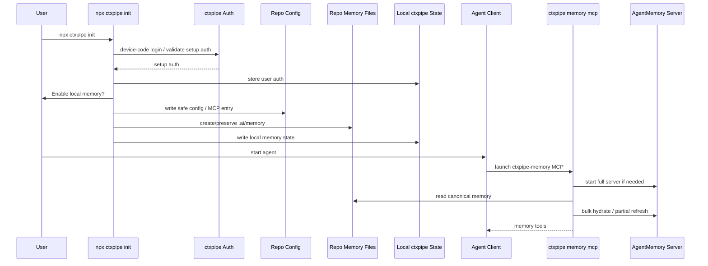
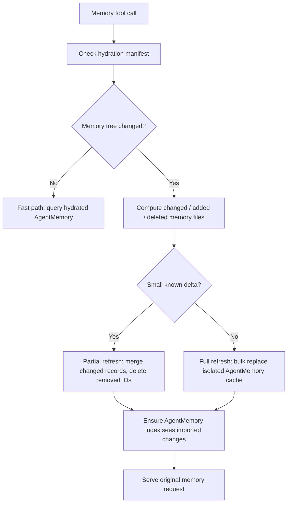

# PRD: Local Agent Memory

**Status:** Draft accepted for implementation design  
**Date:** 2026-05-25  
**Related ADR:** [ADR-021: Local agent memory with repo Markdown and AgentMemory hydrated cache](../memory/decisions/ADR-021-local-agent-memory-agentmemory-hybrid-mcp-proxy.md)
**Research corpus:** [Local agent memory research](../memory/research/local-memory/index.md)

## Summary

ctxpipe should provide a local-first memory layer for coding agents. A user should be able to run `npx ctxpipe init` and get a local memory MCP next to the existing ctxpipe MCP without manually installing AgentMemory, running a daemon, creating model API keys, editing env files, or learning a separate memory product.

The canonical memory state must be human-readable files in `.ai/memory/`, committed to the repo. Durable memory writes modify the working tree directly; the normal Git diff and code-review flow is the review step. The product will use AgentMemory as a local runtime/index/cache hydrated from those files, but AgentMemory's own runtime store is not the source of truth. Raw sessions and tool observations are local-only disposable cache. ctxpipe owns the file format, hydration, lifecycle, auth, policy, and agent-facing MCP surface. The implementation should maximize automatic memory benefits across supported agents while degrading gracefully for agents that do not expose lifecycle hooks.

The core product promise:

> Your coding agent remembers durable project context in repo-committed Markdown, hydrates a local AgentMemory cache for stronger retrieval when available, can use hosted ctxpipe models for richer summaries and consolidation when you are signed in, and remains useful in local-only mode when you are not.

## Problem

Coding agents lose valuable context across sessions, compactions, branch switches, and tool changes. Current memory options are fragmented:

- human-readable memory banks are inspectable but manual and inconsistent;
- raw vector memory can become noisy and hard to trust;
- hosted memory services often require separate setup, model keys, or cloud storage;
- local memory daemons often require users to manage processes, env files, and provider keys;
- agent-specific hooks and MCP support vary significantly across Claude, Codex, Cursor, OpenCode, VS Code, and generic MCP clients.

ctxpipe already configures MCP for multiple coding agents. Local memory should feel like an extension of that setup, not another toolchain the user must operate.

## Primary Goal

Ship a repo-aware, local-first coding-agent memory integration that:

- is installed through `npx ctxpipe init`;
- stores canonical durable memory in human-readable project files that can be reviewed, merged, and committed;
- hydrates AgentMemory from those files instead of treating AgentMemory runtime data as canonical state;
- detects branch changes, git pulls, and manual memory edits through a local hydration manifest;
- supports partial refresh for changed/deleted memory files and full bulk replace only when needed;
- starts automatically when an agent needs it;
- requires no user-provided model API key or env variable;
- uses hosted ctxpipe model proxy only when the user is signed in;
- falls back to full local no-LLM memory when the user is not signed in;
- supports automatic summaries/consolidation/graph memory where an agent exposes reliable lifecycle hooks;
- keeps secrets and runtime state out of git;
- makes memory behavior visible and controllable enough for teams to trust.

## Non-Goals

- Build a memory engine from scratch for v1.
- Require users to run a persistent OS service.
- Require users to install or configure AgentMemory directly.
- Require users to provide OpenAI/Anthropic/Gemini keys.
- Commit user tokens, local REST secrets, pid files, absolute hook paths, or AgentMemory runtime data.
- Use AgentMemory's home-directory runtime store as canonical project memory.
- Commit raw session logs, raw tool observations, prompt transcripts, command output, or other uncurated capture by default.
- Rehydrate the full memory corpus before every retrieval when no files changed.
- Depend on Git hooks or package-install hooks as the primary login/automation surface.
- Silently degrade to AgentMemory's weak standalone MCP fallback and call it "working".
- Guarantee identical automation depth across every agent client in v1.

## Target Users

| Persona | Need |
|---|---|
| Individual developer | Wants an agent to remember project facts, conventions, mistakes, and progress across sessions without setup friction. |
| Team member joining an existing repo | Pulls a repo already initialized by someone else and needs a clear local setup/login path that does not reuse another user's credentials. |
| Team lead/platform engineer | Wants repo-safe memory defaults, predictable privacy controls, and no secret leakage into committed config. |
| Heavy agent user | Wants automatic session summaries, consolidation, and graph memory with low repeated prompting. |
| Privacy-sensitive user | Wants local-only mode and clear boundaries around what is sent to ctxpipe-hosted models. |

## Product Principles

1. **One human setup path:** `npx ctxpipe init` is the primary onboarding command.
2. **Repo memory is canonical:** durable memory lives in committed, human-readable project files.
3. **Runtime cache is disposable:** AgentMemory can be rebuilt from repo memory at any time.
4. **Local-first by default:** local memory should still work when signed out.
5. **Full server or explicit degradation:** do not hide the difference between full AgentMemory and standalone fallback.
6. **No model setup:** users should not paste model keys or edit env files.
7. **No secret sharing through git:** every user mints and stores their own local credentials.
8. **Visible only when useful:** do not spam warnings during normal local memory operations; surface login/status when enhanced features are requested or during explicit setup/status checks.
9. **Agent capability-based:** use native lifecycle hooks where stable; use MCP status/tool responses everywhere else.
10. **ctxpipe-owned policy:** ctxpipe controls repo scoping, auth, filtering, hydration, and product semantics even when AgentMemory provides the runtime.

## User Workflows

### 1. First User Initializes A Repo

1. User runs:

   ```bash
   npx ctxpipe init
   ```

2. CLI performs the normal ctxpipe auth/org setup as part of full initialization.
3. By the time memory setup runs, the first user has local ctxpipe setup auth.
4. CLI detects agents and asks whether to enable local agent memory.
5. User can choose:
   - enable memory with ctxpipe-hosted enhanced summaries/consolidation available through their signed-in account;
   - enable local-only memory for privacy/cost reasons;
   - skip memory setup.
6. CLI creates or preserves the repo-local memory folder, `.ai/memory/`.
7. CLI writes safe repo/client config and local per-user state.
8. CLI does not start a permanent daemon.
9. When the agent starts, `ctxpipe-memory` MCP lazily starts the full local AgentMemory server and hydrates it from repo memory files.



### 2. Returning Logged-In User Starts An Agent

1. Agent launches `npx -y ctxpipe memory mcp`.
2. Launcher reads local ctxpipe state and setup auth.
3. If signed in, launcher mints or refreshes the short-lived model proxy token before starting or restarting AgentMemory.
4. Launcher checks local AgentMemory health.
5. If server is not running, launcher starts the full server with the correct signed-in or no-LLM env.
6. Launcher checks the repo memory hydration manifest.
7. If `.ai/memory/**` changed since last hydration, launcher refreshes AgentMemory before serving search/save tools:
   - no changes: return tools immediately;
   - small deltas: import changed records and delete removed records;
   - large/unknown deltas: run a full bulk replace against the isolated local cache.
8. Enhanced memory tools are available.

### 3. Agent Starts Before The Current User Has Logged In

This is not the first-user `ctxpipe init` path. It happens when a checkout already has committed memory/MCP config, but the current user has not run `npx ctxpipe init` or `npx ctxpipe auth login` locally. The common case is a second user pulling a repo initialized by someone else.

1. Agent launches memory MCP from committed/local client config.
2. Launcher finds no valid setup auth for the current user.
3. Full AgentMemory server still starts in no-LLM mode.
4. Local repo-memory save/search continues to work. Raw session/tool observation capture, if enabled, remains local-only disposable cache.
5. LLM-backed tools hide themselves or return a clear status:

   ```json
   {
     "status": "enhanced-memory-unavailable",
     "reason": "signed-out",
     "message": "Enhanced memory summaries need ctxpipe auth login. Local memory is still running. Run `npx ctxpipe auth login` to enable hosted summaries and consolidation."
   }
   ```

6. `ctxpipe memory mcp` must not open a browser or block agent startup.

Local no-LLM mode still reads and writes canonical repo memory files. If AgentMemory cannot be hydrated, ctxpipe should fall back to direct Markdown search/save so project memory remains usable.

### 4. Second User Pulls A Repo Initialized By Someone Else

1. First user commits only safe repo intent/client config.
2. Second user pulls.
3. Second user runs:

   ```bash
   npx ctxpipe init
   ```

4. CLI detects existing ctxpipe memory intent.
5. CLI performs normal ctxpipe auth/org setup for the second user.
6. Second user gets their own local auth, local AgentMemory secret, local hydration manifest, isolated AgentMemory cache, and model proxy token.
7. No first-user secrets or tokens are reused.

If the second user does not run `ctxpipe init`, behavior depends on committed client config:

- if a committed MCP entry launches `ctxpipe memory mcp`, they get local no-LLM memory;
- enhanced hosted features remain disabled until they run `npx ctxpipe auth login` or `npx ctxpipe init`;
- no browser prompt should be triggered from MCP startup.

### 5. Branch Switches, Git Pulls, And External Memory Edits

Repo memory files under `.ai/memory/` are the source of truth, so all external updates are handled through sync-on-use hydration.



Required behavior:

| Event | Expected Handling |
|---|---|
| Branch switch | Detect manifest mismatch; partial refresh if the delta is small, otherwise full bulk replace. |
| Git pull/rebase | Same as branch switch; never require Git hooks. |
| Manual Markdown edit | Detect changed file by mtime/size/hash and import that record. |
| Memory file deletion | Delete the mapped AgentMemory memory IDs. |
| File rename | Preserve identity through stable frontmatter `id`; treat as update, not duplicate. |
| Merge conflict | Refuse hydration while conflict markers are present and report the file paths. |
| Two agents open | Use a hydration lock so one process refreshes while others wait or recheck. |
| AgentMemory unavailable | Continue direct Markdown search/save and retry hydration later. |

### 6. Agent-Native Automation

For agents with reliable lifecycle hooks, ctxpipe should offer automatic memory automation:

- session start: check auth/status, ensure local server, optionally nudge login;
- prompt submit / tool events: capture useful raw observations into local-only disposable cache when supported and consented;
- stop/session end: write durable repo memory updates directly into the working tree, then hydrate AgentMemory from the updated files.

Claude Code is the first-class target because it has rich lifecycle hooks. Other clients should use MCP setup/status behavior unless their existing supported integration surface can be wired with the same CLI command.

## Functional Requirements

### Setup And CLI

| Priority | Requirement |
|---|---|
| Required | `npx ctxpipe init` can configure local memory alongside existing ctxpipe MCP setup. |
| Required | `npx ctxpipe memory mcp` is the command written into agent MCP configs. |
| Required | `npx ctxpipe memory status` and `npx ctxpipe memory doctor` show memory mode, server health, auth state, hosted model availability, package/runtime status, and next action. |
| Required | `npx ctxpipe memory stop` stops the managed local memory runtime. |
| Required | Non-interactive setup never opens a browser. |

### Local Runtime

| Priority | Requirement |
|---|---|
| Required | Use the full AgentMemory server, not its 7-tool standalone fallback, for advertised memory functionality. |
| Required | Start AgentMemory lazily from MCP lifecycle when an agent connects. |
| Required | Treat AgentMemory runtime data as a local cache/index that can be deleted and rebuilt from repo memory files. |
| Required | Use a per-repo/per-worktree isolated AgentMemory cache/runtime so full replace hydration cannot wipe unrelated project memory and multiple projects do not clash. |
| Required | Allocate all AgentMemory local ports per running repo/worktree instead of assuming defaults are globally available: REST, streams, viewer, and engine websocket. |
| Required | Generate a local AgentMemory REST secret and store it outside git. |
| Required | Pass AgentMemory config as child-process env; do not ask users to edit `~/.agentmemory/.env`. |
| Required | Keep AgentMemory bound to loopback. |
| Required | Support no-LLM full-server mode when signed out. |

### Agent-Facing MCP

| Priority | Requirement |
|---|---|
| Required | ctxpipe owns the MCP command and product behavior. |
| Required | Implement a hybrid policy proxy that can pass through, filter, rewrite, or override AgentMemory tools. |
| Required | Hide or gate tools that are unsafe, noisy, experimental, not repo-scoped, or confusing. |
| Required | Intercept memory writes so canonical state is written to repo memory Markdown first, then hydrated into AgentMemory. |
| Required | Automatic durable memory writes modify the working tree directly; Git diff/code review is the review step. |
| Required | Intercept memory reads so retrieval uses hydrated AgentMemory when fresh and direct Markdown search when AgentMemory is unavailable or stale. |
| Required | Inject repo/org/user metadata into save/search/session calls where possible. |
| Required | Expose a status tool/resource reporting local server state and hosted model state. |
| Required | LLM-backed tools return a visible login-required result when signed out. |

### Hosted Model Proxy

| Priority | Requirement |
|---|---|
| Required | Users do not provide model API keys. |
| Required | Signed-in users use a ctxpipe-hosted OpenAI-compatible model proxy. |
| Required | Short-lived model proxy tokens are minted just in time before starting/restarting AgentMemory. |
| Required | Tokens are scoped to user/org/repo/model-proxy/quota and cannot call general ctxpipe APIs. |
| Required | Missing/expired auth falls back to full local no-LLM mode. |
| Required | Server-side token quota limits exist for hosted model usage. |

### Memory Content And Automation

| Priority | Requirement |
|---|---|
| Required | Canonical memory is stored in human-readable Markdown under `.ai/memory/`. |
| Required | Each memory record has a stable ID in frontmatter so renames, branch changes, and imports do not create duplicates. |
| Required | Duplicate frontmatter IDs are hydration errors and must be reported with all conflicting file paths. |
| Required | Frontmatter captures machine-useful fields such as `id`, `type`, `concepts`, `files`, creation/update timestamps, and optional supersession metadata. |
| Required | Markdown body remains understandable in code review without needing AgentMemory or ctxpipe tooling. |
| Required | Store durable coding knowledge: project facts, conventions, architecture decisions, file paths, recurring errors, lessons, and curated session summaries. |
| Required | Raw session logs, prompts, tool observations, and command output are local-only disposable cache and are not committed as canonical memory by default. |
| Required | Keep local raw capture local unless hosted processing is explicitly enabled by sign-in/org policy. |
| Required | Avoid LLM-on-every-observation by default. |
| Required | Prefer batched/session-end summaries, scheduled consolidation, and graph/crystal extraction for promoted memories. |
| Required | Provide local save/search even when hosted model is unavailable. |

### Hydration And External Updates

| Priority | Requirement |
|---|---|
| Required | Hydrate AgentMemory from canonical Markdown through deterministic bulk import. |
| Required | Maintain an uncommitted hydration manifest with file hashes, mapped memory IDs, last hydrated branch/ref metadata, and AgentMemory runtime version. |
| Required | On every memory tool call, perform a cheap manifest check before retrieval or write. |
| Required | If no memory files changed, do not rehydrate; retrieval must use the already-hydrated AgentMemory cache. |
| Required | If a small known delta exists, partially refresh only changed/deleted records. The internal default threshold is at most 50 changed files or 10% of the memory corpus, whichever is lower. |
| Required | If the manifest is missing/corrupt, the AgentMemory cache is incompatible, or the delta is too large/unknown, run a full bulk replace into the isolated local cache. |
| Required | Delete AgentMemory records whose source Markdown files were removed. |
| Required | Refuse hydration and report clear file paths if memory files contain unresolved merge-conflict markers. |
| Required | Use a local hydration lock to avoid concurrent imports from multiple agents. |
| Required | Ensure AgentMemory's live search/vector indexes see imported changes; if the pinned AgentMemory version has no rebuild endpoint, restart the isolated runtime after import. |
| Required | Do not use Git hooks as the primary way to detect branch changes or pulls. |

### Acceptance Cases

| Priority | Requirement |
|---|---|
| Required | Two projects can run memory MCP concurrently without port or cache collisions. |
| Required | A branch switch updates retrieval results after the next memory tool call. |
| Required | A `git pull` that adds, edits, deletes, or renames memory files is reflected after the next memory tool call. |
| Required | A duplicate memory ID blocks hydration and reports both conflicting file paths. |
| Required | Unresolved merge conflict markers block hydration and report file paths. |
| Required | Two agents starting in the same repo serialize hydration through the local lock. |
| Required | Signed-out users can search and save canonical `.ai/memory/` files without hosted model access. |
| Required | Imported memories are searchable after partial import, or the isolated runtime is restarted automatically. |

### Agent Hooks

| Priority | Requirement |
|---|---|
| Required | Treat hooks as capability-based per client; do not assume one hook model works everywhere. |
| Required | Claude Code hook integration is the first automation target. |
| Required | Hook installation is explicit and summarized during setup because hooks may capture prompts, tool inputs/outputs, paths, errors, and command output. |
| Required | If signed out, hooks should not open browsers automatically; they should emit rate-limited, visible login nudges where the client supports it. |
| Required | Hooks should enqueue work and exit quickly; they should not block agent usage. |
| Rejected | Git hooks or package-install hooks as primary automation/login surface. |

### Team And Repo Behavior

| Priority | Requirement |
|---|---|
| Required | Repo-shared config contains only safe memory intent and MCP commands. |
| Required | Repo-shared memory content is committed as human-readable files and goes through normal Git review/merge workflows. |
| Required | Per-user secrets, tokens, local AgentMemory data, package caches, pid files, and absolute hook paths are never committed. |
| Required | `ctxpipe init` is idempotent and rehydrates local state for each user. |
| Required | A second user must mint their own credentials after local login. |
| Required | Memory should be repo-aware and avoid cross-repo search leakage. |

## Client Support Requirements

| Client | Required v1 Behavior | Enhanced Automation |
|---|---|---|
| Claude Code | MCP setup plus optional hooks | First-class; session start/status and stop/session-end automation |
| Codex | MCP setup | MCP status/tool messaging |
| Cursor | MCP setup | MCP status/tool messaging |
| OpenCode | MCP setup after local command schema verified | MCP status/tool messaging |
| VS Code | MCP setup after local stdio schema verified | MCP status/tool messaging |
| Generic MCP | MCP setup/manual config | Status/tool messaging only |

## Auth UX Requirements

### Commands

- `npx ctxpipe auth login`: the single existing setup auth login command. Do not add separate top-level or memory-specific login commands.

### Login Prompt Timing

| Moment | Behavior |
|---|---|
| Interactive `ctxpipe init` | Full setup includes ctxpipe auth/org selection before memory is configured; after successful init the current user is signed in. |
| Non-interactive `ctxpipe init --yes` | Do not open browser; require existing setup auth or explicit local-only/non-hosted behavior. |
| Agent-launched `ctxpipe memory mcp` before local login/init | Never prompt interactively; start no-LLM mode and surface status through tools/resources. This is mainly the second-user/no-local-setup case. |
| Agent hook with visible UI | May return a rate-limited login nudge, never surprise-open browser by default. |
| `ctxpipe memory status/doctor` | Show exact mode and login command. |

## Privacy And Security Requirements

- Clear setup copy must explain what is local and what may be sent to ctxpipe-hosted models.
- Canonical project memory is committed to the repo, so setup copy must make clear that users should not store secrets, credentials, personal tokens, or private customer data in repo memory files.
- Hosted model processing requires user sign-in.
- No user model keys are requested or stored.
- Model proxy tokens are short-lived, scoped, quota-limited, and stored only locally.
- Local AgentMemory REST uses a generated local secret unless a deliberate no-secret prototype mode is chosen.
- Hook capture is opt-in and summarized.
- Raw exports/delete/governance tools should be hidden or restricted until safe product behavior is designed.

## Cost Requirements

Expected product default should keep model cost low by using batched workflows:

- session-end summaries;
- scheduled consolidation;
- graph/crystal extraction only for promoted memories;
- embeddings only where useful, ideally local or low-cost.

Targets:

- likely model cost under `$1-$5` per active developer/month for default batched features;
- budget `$5-$10` including retries and noisy projects;
- cap/degrade before `$15-$20` unless org explicitly enables aggressive capture;
- avoid per-observation LLM compression by default because heavy users can exceed `$40+/month`.

## Success Metrics

- Setup success: percentage of users who can run `npx ctxpipe init` and get memory MCP configured without manual AgentMemory steps.
- First-use success: percentage of agent launches where full AgentMemory server starts successfully.
- Enhanced activation: percentage of memory-enabled users who sign in and get hosted model token minted.
- Local fallback success: percentage of signed-out users who still get local memory search/save.
- Memory usefulness: frequency of agent recall/search usage and user-accepted memory references.
- Hydration performance: percentage of memory tool calls that use the fast path without refresh, plus p95 partial-refresh latency.
- Hydration correctness: low incidence of stale search results after branch switches, pulls, deletes, and renames.
- Trust: low incidence of cross-repo leakage, secret leakage, or unwanted capture reports.
- Cost: hosted model cost per active developer stays within target budget.
- Support: low rate of "daemon not running", "where do I login", and "why is memory not working" issues.

## Implementation Scope

Build one focused AgentMemory CLI integration:

- `ctxpipe init` can add the `ctxpipe-memory` MCP entry next to the existing ctxpipe MCP entry.
- `ctxpipe init` creates or preserves `.ai/memory/`, with canonical human-readable Markdown memory files committed to the repo.
- `ctxpipe memory mcp` is a ctxpipe-owned stdio MCP server.
- `ctxpipe memory mcp` lazily starts the pinned full AgentMemory server when needed.
- `ctxpipe memory mcp` keeps a per-repo/per-worktree isolated AgentMemory cache and dynamic local ports so multiple projects can be open at once.
- The AgentMemory runtime is pinned and invoked without vendoring its source.
- AgentMemory receives all config through ctxpipe-managed child-process env.
- AgentMemory is hydrated from repo memory files through deterministic bulk import; AgentMemory runtime data is disposable.
- Raw session/tool observation state stays in the local AgentMemory cache and may be lost on cache rebuild, branch switch full replace, or runtime repair.
- The hydration layer maintains an uncommitted manifest, performs cheap sync-on-use checks, supports partial refresh for changed/deleted files, and uses full replace for first hydrate, cache repair, incompatible runtime, or large/unknown deltas.
- The hydration layer guarantees imported changes are visible to AgentMemory search, restarting the isolated runtime after import if necessary for the pinned AgentMemory version.
- The integration uses the full AgentMemory server; it does not present the 7-tool standalone fallback as success.
- Signed-in users get hosted ctxpipe OpenAI-compatible model access through a just-in-time short-lived model proxy token.
- Users who have not run local auth get full local no-LLM mode.
- The MCP layer is a hybrid policy proxy: pass through safe AgentMemory functionality, rewrite or override save/search/status/summarize/consolidate behavior, write canonical memory to Markdown first, hydrate AgentMemory second, and hide unsafe/noisy tools.
- `ctxpipe memory status`, `ctxpipe memory doctor`, and `ctxpipe memory stop` provide basic local operation and diagnostics.
- Claude Code hooks may be installed when supported and selected during `ctxpipe init`; other agents use MCP behavior.

Anything beyond this CLI integration is out of scope for this document. In particular, do not add a separate login command, Git/package-install hooks, an always-on OS service, a local OpenAI proxy process, a separate ctxpipe-native memory engine, new agent extensions, or an AgentMemory fork.

## Risks And Mitigations

| Risk | Severity | Mitigation |
|---|---:|---|
| Cross-repo memory leakage | High | ctxpipe policy proxy injects repo/org metadata and filters results; hide/override tools that cannot be scoped. |
| AgentMemory cache diverges from repo Markdown | High | Treat Markdown as canonical; use manifest checks, partial refresh, full replace repair, and direct Markdown fallback. |
| Slow retrieval after large memory changes | Medium | Fast path skips hydration when unchanged; partial refresh small deltas; full replace only for first hydrate/cache repair/large or unknown changes. |
| Imported AgentMemory records are not visible in live indexes | Medium | Verify pinned runtime behavior; call rebuild endpoint if available or restart the isolated runtime after import. |
| Hidden capture surprises users | High | Hook setup is explicit; setup copy explains capture; hooks are not silently installed. |
| Raw session cache is mistaken for shared memory | Medium | Docs/status labels raw capture as local-only disposable; only `.ai/memory/` is canonical shared memory. |
| Secrets leak into repo config | High | Store secrets in keyring/local state only; never write model/local REST tokens to repo files. |
| Secrets accidentally committed in memory Markdown | High | Setup docs warn clearly; memory files are human-reviewable in Git; future scanners can flag likely secrets. |
| AgentMemory runtime breaks or changes | Medium | Pin the runtime version and keep the exposed tool surface small. |
| First-use downloads are slow/fail | Medium | Report clearly through status/doctor; keep no-LLM fallback where possible. |
| Hosted model cost grows unexpectedly | Medium | Default to batched features, quotas, usage accounting, no per-observation compression by default. |
| Agent hook support differs by client | Medium | Capability-based adapter matrix; MCP status fallback. |
| Login prompt is missed | Medium | Surface through init/status/doctor/LLM tool responses/agent hooks; point users to existing `ctxpipe auth login`. |
| Windows support is weaker | Medium | Detect unsupported runtime paths and show clear status; begin with macOS/Linux if necessary. |
