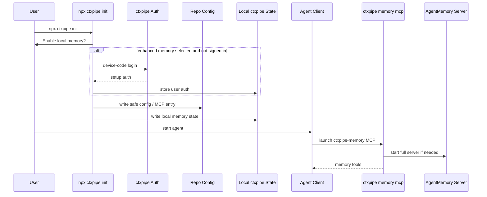

# PRD: Local Agent Memory

**Status:** Draft accepted for implementation design  
**Date:** 2026-05-25  
**Related ADR:** [ADR-021: Local agent memory with AgentMemory hybrid MCP proxy](../memory/decisions/ADR-021-local-agent-memory-agentmemory-hybrid-mcp-proxy.md)  
**Research corpus:** [Local agent memory research](../memory/research/local-memory/index.md)

## Summary

ctxpipe should provide a local-first memory layer for coding agents. A user should be able to run `npx ctxpipe init` and get a local memory MCP next to the existing ctxpipe MCP without manually installing AgentMemory, running a daemon, creating model API keys, editing env files, or learning a separate memory product.

The product will use AgentMemory as the local memory engine, but ctxpipe will own the user-facing integration, lifecycle, auth, policy, and agent-facing MCP surface. The implementation should maximize automatic memory benefits across supported agents while degrading gracefully for agents that do not expose lifecycle hooks.

The core product promise:

> Your coding agent remembers durable project context locally, can use hosted ctxpipe models for richer summaries and consolidation when you are signed in, and remains useful in local-only mode when you are not.

## Problem

Coding agents lose valuable context across sessions, compactions, branch switches, and tool changes. Current memory options are fragmented:

- human-readable memory banks are inspectable but manual and inconsistent;
- raw vector memory can become noisy and hard to trust;
- hosted memory services often require separate setup, model keys, or cloud storage;
- local memory daemons often require users to manage processes, env files, and provider keys;
- agent-specific hooks and MCP support vary significantly across Claude, Codex, Cursor, OpenCode, VS Code, and generic MCP clients.

ctxpipe already configures MCP for multiple coding agents. Local memory should feel like an extension of that setup, not another toolchain the user must operate.

## Primary Goal

Ship a repo-aware, local-first coding-agent memory integration that:

- is installed through `npx ctxpipe init`;
- starts automatically when an agent needs it;
- requires no user-provided model API key or env variable;
- uses hosted ctxpipe model proxy only when the user is signed in;
- falls back to full local no-LLM memory when the user is not signed in;
- supports automatic summaries/consolidation/graph memory where an agent exposes reliable lifecycle hooks;
- keeps secrets and runtime state out of git;
- makes memory behavior visible and controllable enough for teams to trust.

## Non-Goals

- Build a memory engine from scratch for v1.
- Require users to run a persistent OS service.
- Require users to install or configure AgentMemory directly.
- Require users to provide OpenAI/Anthropic/Gemini keys.
- Commit user tokens, local REST secrets, pid files, absolute hook paths, or AgentMemory runtime data.
- Depend on Git hooks or package-install hooks as the primary login/automation surface.
- Silently degrade to AgentMemory's weak standalone MCP fallback and call it "working".
- Guarantee identical automation depth across every agent client in v1.

## Target Users

| Persona | Need |
|---|---|
| Individual developer | Wants an agent to remember project facts, conventions, mistakes, and progress across sessions without setup friction. |
| Team member joining an existing repo | Pulls a repo already initialized by someone else and needs a clear local setup/login path that does not reuse another user's credentials. |
| Team lead/platform engineer | Wants repo-safe memory defaults, predictable privacy controls, and no secret leakage into committed config. |
| Heavy agent user | Wants automatic session summaries, consolidation, and graph memory with low repeated prompting. |
| Privacy-sensitive user | Wants local-only mode and clear boundaries around what is sent to ctxpipe-hosted models. |

## Product Principles

1. **One human setup path:** `npx ctxpipe init` is the primary onboarding command.
2. **Local-first by default:** local memory should still work when signed out.
3. **Full server or explicit degradation:** do not hide the difference between full AgentMemory and standalone fallback.
4. **No model setup:** users should not paste model keys or edit env files.
5. **No secret sharing through git:** every user mints and stores their own local credentials.
6. **Visible only when useful:** do not spam warnings during normal local memory operations; surface login/status when enhanced features are requested or during explicit setup/status checks.
7. **Agent capability-based:** use native lifecycle hooks where stable; use MCP status/tool responses everywhere else.
8. **ctxpipe-owned policy:** ctxpipe controls repo scoping, auth, filtering, and product semantics even when AgentMemory provides the runtime.

## User Workflows

### 1. First User Initializes A Repo

1. User runs:

   ```bash
   npx ctxpipe init
   ```

2. CLI detects agents and asks whether to enable local agent memory.
3. If memory is enabled and the user is not signed in, interactive setup asks them to sign in to enable enhanced memory.
4. User can choose:
   - sign in and enable hosted enhanced memory;
   - use local-only memory;
   - skip memory setup.
5. CLI writes safe repo/client config and local per-user state.
6. CLI does not start a permanent daemon.
7. When the agent starts, `ctxpipe-memory` MCP lazily starts the full local AgentMemory server.



### 2. Returning Logged-In User Starts An Agent

1. Agent launches `npx -y ctxpipe memory mcp`.
2. Launcher checks local AgentMemory health.
3. If server is not running, launcher starts the full server.
4. Launcher reads stored ctxpipe setup auth.
5. Launcher mints a short-lived model proxy token just in time.
6. Enhanced memory tools are available.

### 3. User Is Not Logged In

1. Agent launches memory MCP.
2. Launcher finds no valid setup auth.
3. Full AgentMemory server still starts in no-LLM mode.
4. Local save/search/session memory continues to work.
5. LLM-backed tools hide themselves or return a clear status:

   ```json
   {
     "status": "enhanced-memory-unavailable",
     "reason": "signed-out",
     "message": "Enhanced memory summaries need ctxpipe login. Local memory is still running. Run `npx ctxpipe login` to enable hosted summaries and consolidation."
   }
   ```

6. `ctxpipe memory mcp` must not open a browser or block agent startup.

### 4. Second User Pulls A Repo Initialized By Someone Else

1. First user commits only safe repo intent/client config.
2. Second user pulls.
3. Second user runs:

   ```bash
   npx ctxpipe init
   ```

4. CLI detects existing ctxpipe memory intent.
5. CLI asks the second user to sign in if they want enhanced memory.
6. Second user gets their own local auth, local AgentMemory secret, and model proxy token.
7. No first-user secrets or tokens are reused.

If the second user does not run `ctxpipe init`, behavior depends on committed client config:

- if a committed MCP entry launches `ctxpipe memory mcp`, they get local no-LLM memory;
- enhanced hosted features remain disabled until they run `npx ctxpipe login` or `npx ctxpipe init`;
- no browser prompt should be triggered from MCP startup.

### 5. Agent-Native Automation

For agents with reliable lifecycle hooks, ctxpipe should offer automatic memory automation:

- session start: check auth/status, ensure local server, optionally nudge login;
- prompt submit / tool events: capture useful observations when supported and consented;
- stop/session end: enqueue summaries, consolidation, graph/crystal extraction.

Claude Code is the first-class target because it has rich lifecycle hooks. Codex can be explored behind an experimental flag. Cursor, VS Code, and generic MCP clients should start with MCP-only behavior unless a stable extension/hook mechanism is added.

## Functional Requirements

### Setup And CLI

| Priority | Requirement |
|---|---|
| Required | `npx ctxpipe init` can configure local memory alongside existing ctxpipe MCP setup. |
| Required | `npx ctxpipe login` exists as a simple alias for setup auth login. |
| Required | `npx ctxpipe memory mcp` is the command written into agent MCP configs. |
| Required | `npx ctxpipe memory status` and `npx ctxpipe memory doctor` show memory mode, server health, auth state, hosted model availability, package/runtime status, and next action. |
| Required | `npx ctxpipe memory stop` stops the managed local memory runtime. |
| Required | Non-interactive setup never opens a browser unless explicitly allowed by a future flag. |
| Optional | `npx ctxpipe memory login` aliases login plus a test model-token mint. |
| Optional | `npx ctxpipe memory prepare` pre-downloads/pins runtime packages after init to reduce first-use delay. |

### Local Runtime

| Priority | Requirement |
|---|---|
| Required | Use the full AgentMemory server, not its 7-tool standalone fallback, for advertised memory functionality. |
| Required | Start AgentMemory lazily from MCP lifecycle when an agent connects. |
| Required | Generate a local AgentMemory REST secret and store it outside git. |
| Required | Pass AgentMemory config as child-process env; do not ask users to edit `~/.agentmemory/.env`. |
| Required | Keep AgentMemory bound to loopback. |
| Required | Support no-LLM full-server mode when signed out. |
| Optional | Preflight/download the pinned AgentMemory runtime during init. |
| Optional | Provide an advanced always-on service install later for power users. |

### Agent-Facing MCP

| Priority | Requirement |
|---|---|
| Required | ctxpipe owns the MCP command and product behavior. |
| Required | Implement a hybrid policy proxy that can pass through, filter, rewrite, or override AgentMemory tools. |
| Required | Hide or gate tools that are unsafe, noisy, experimental, not repo-scoped, or confusing. |
| Required | Inject repo/org/user metadata into save/search/session calls where possible. |
| Required | Expose a status tool/resource reporting local server state and hosted model state. |
| Required | LLM-backed tools return a visible login-required result when signed out. |
| Optional | Add stable `ctxpipe_memory_*` aliases for important tools. |
| Optional | Snapshot upstream tool schemas and fail compatibility tests on unexpected schema drift. |

### Hosted Model Proxy

| Priority | Requirement |
|---|---|
| Required | Users do not provide model API keys. |
| Required | Signed-in users use a ctxpipe-hosted OpenAI-compatible model proxy. |
| Required | Short-lived model proxy tokens are minted just in time before starting/restarting AgentMemory. |
| Required | Tokens are scoped to user/org/repo/model-proxy/quota and cannot call general ctxpipe APIs. |
| Required | Missing/expired auth falls back to full local no-LLM mode. |
| Required | Cost controls and server-side quotas exist before enabling broad hosted processing. |
| Optional | Use a local OpenAI-compatible proxy process to refresh per request and perform local redaction. |

### Memory Content And Automation

| Priority | Requirement |
|---|---|
| Required | Store durable coding knowledge: project facts, conventions, architecture decisions, file paths, recurring errors, lessons, and session summaries. |
| Required | Keep local raw capture local unless hosted processing is explicitly enabled by sign-in/org policy. |
| Required | Avoid LLM-on-every-observation by default. |
| Required | Prefer batched/session-end summaries, scheduled consolidation, and graph/crystal extraction for promoted memories. |
| Required | Provide local save/search even when hosted model is unavailable. |
| Optional | Add repo-specific ignore/redaction rules before forwarding observations to hosted processing. |
| Optional | Add memory review UI or viewer links once the local engine integration is stable. |

### Agent Hooks

| Priority | Requirement |
|---|---|
| Required | Treat hooks as capability-based per client; do not assume one hook model works everywhere. |
| Required | Claude Code hook integration is the first automation target. |
| Required | Hook installation is explicit and summarized during setup because hooks may capture prompts, tool inputs/outputs, paths, errors, and command output. |
| Required | If signed out, hooks should not open browsers automatically; they should emit rate-limited, visible login nudges where the client supports it. |
| Required | Hooks should enqueue work and exit quickly; they should not block agent usage. |
| Optional | Codex hook support can be beta after verification. |
| Optional | Cursor/OpenCode/VS Code can get deeper integrations through extensions/plugins later. |
| Rejected | Git hooks or package-install hooks as primary automation/login surface. |

### Team And Repo Behavior

| Priority | Requirement |
|---|---|
| Required | Repo-shared config contains only safe memory intent and MCP commands. |
| Required | Per-user secrets, tokens, local AgentMemory data, package caches, pid files, and absolute hook paths are never committed. |
| Required | `ctxpipe init` is idempotent and rehydrates local state for each user. |
| Required | A second user must mint their own credentials after local login. |
| Required | Memory should be repo-aware and avoid cross-repo search leakage. |
| Optional | Support per-repo isolated AgentMemory storage if upstream adds data-dir/port controls or ctxpipe implements strong isolation. |

## Client Support Requirements

| Client | Required v1 Behavior | Enhanced Automation |
|---|---|---|
| Claude Code | MCP setup plus optional hooks | First-class; session start/status and stop/session-end automation |
| Codex | MCP setup | Experimental hooks after current behavior is verified |
| Cursor | MCP setup | Status/tool messaging; extension/rules later |
| OpenCode | MCP setup after local command schema verified | Hook/plugin support after verification |
| VS Code | MCP setup after local stdio schema verified | Extension later |
| Generic MCP | MCP setup/manual config | Status/tool messaging only |

## Auth UX Requirements

### Commands

- `npx ctxpipe login`: human-friendly setup auth login.
- `npx ctxpipe auth login`: existing explicit auth namespace can remain.
- `npx ctxpipe memory login`: optional focused command that logs in and tests memory model-token minting.

### Login Prompt Timing

| Moment | Behavior |
|---|---|
| Interactive `ctxpipe init` | Prompt if memory is enabled and no valid setup auth exists. |
| Non-interactive `ctxpipe init --yes` | Do not open browser; configure local-only/enhanced-unavailable unless stored auth exists. |
| Agent-launched `ctxpipe memory mcp` | Never prompt interactively; start no-LLM mode and surface status through tools/resources. |
| Agent hook with visible UI | May return a rate-limited login nudge, never surprise-open browser by default. |
| `ctxpipe memory status/doctor` | Show exact mode and login command. |

## Privacy And Security Requirements

- Clear setup copy must explain what is local and what may be sent to ctxpipe-hosted models.
- Hosted model processing requires user sign-in and org policy approval.
- No user model keys are requested or stored.
- Model proxy tokens are short-lived, scoped, quota-limited, and stored only locally.
- Local AgentMemory REST uses a generated local secret unless a deliberate no-secret prototype mode is chosen.
- Hook capture is opt-in and summarized.
- Redaction/ignore rules are required before broad automatic capture is enabled.
- Raw exports/delete/governance tools should be hidden or restricted until safe product behavior is designed.

## Cost Requirements

Expected product default should keep model cost low by using batched workflows:

- session-end summaries;
- scheduled consolidation;
- graph/crystal extraction only for promoted memories;
- embeddings only where useful, ideally local or low-cost.

Targets:

- likely model cost under `$1-$5` per active developer/month for default batched features;
- budget `$5-$10` including retries and noisy projects;
- cap/degrade before `$15-$20` unless org explicitly enables aggressive capture;
- avoid per-observation LLM compression by default because heavy users can exceed `$40+/month`.

## Success Metrics

- Setup success: percentage of users who can run `npx ctxpipe init` and get memory MCP configured without manual AgentMemory steps.
- First-use success: percentage of agent launches where full AgentMemory server starts successfully.
- Enhanced activation: percentage of memory-enabled users who sign in and get hosted model token minted.
- Local fallback success: percentage of signed-out users who still get local memory search/save.
- Memory usefulness: frequency of agent recall/search usage and user-accepted memory references.
- Trust: low incidence of cross-repo leakage, secret leakage, or unwanted capture reports.
- Cost: hosted model cost per active developer stays within target budget.
- Support: low rate of "daemon not running", "where do I login", and "why is memory not working" issues.

## Rollout Plan

### Phase 0: Spike

- Implement `ctxpipe memory mcp` as a launcher.
- Pin AgentMemory runtime without vendoring.
- Start full AgentMemory server lazily.
- Provide full no-LLM mode when signed out.
- Validate hosted OpenAI-compatible proxy env works.
- Measure upstream MCP scoping gaps.

### Phase 1: Product MVP

- Implement ctxpipe-owned hybrid MCP policy proxy.
- Override or rewrite save/search/status/summarize/consolidate paths.
- Hide unsafe/noisy tools.
- Add `ctxpipe login`, `memory status`, `memory doctor`, `memory stop`.
- Add just-in-time backend model token minting.
- Add Claude Code hook automation as opt-in.
- Keep Codex hooks experimental; use MCP fallback everywhere.

### Phase 2: Hardening

- Add compatibility tests for AgentMemory version/tool schema.
- Add redaction/ignore rules.
- Add org policy/quota dashboards.
- Add local model proxy if per-request auth refresh/redaction is needed.
- Add more agent-specific hooks/plugins as stable surfaces become available.
- Explore per-repo AgentMemory isolation or upstream patches.

## Risks And Mitigations

| Risk | Severity | Mitigation |
|---|---:|---|
| Cross-repo memory leakage | High | ctxpipe policy proxy injects repo/org metadata and filters results; consider per-repo isolation/upstream patches. |
| Hidden capture surprises users | High | Hook setup is explicit; setup copy explains capture; redaction/ignore rules before broad automation. |
| Secrets leak into repo config | High | Store secrets in keyring/local state only; never write model/local REST tokens to repo files. |
| AgentMemory runtime breaks or changes | Medium | Pin versions, compatibility tests, staged upgrades. |
| First-use downloads are slow/fail | Medium | Optional prepare step, status/doctor, clear errors, no-LLM fallback. |
| Hosted model cost grows unexpectedly | Medium | Default to batched features, quotas, usage accounting, no per-observation compression by default. |
| Agent hook support differs by client | Medium | Capability-based adapter matrix; MCP status fallback. |
| Login prompt is missed | Medium | Surface through init/status/doctor/LLM tool responses/agent hooks; add `ctxpipe login`. |
| Windows support is weaker | Medium | Detect unsupported runtime paths and show clear status; begin with macOS/Linux if necessary. |

## Open Questions

1. Should memory be default-on in interactive `ctxpipe init`, or opt-in until privacy/scoping hardening is complete?
2. Should v1 use direct short-lived model proxy tokens, or build the local OpenAI-compatible proxy immediately?
3. How strongly can AgentMemory be repo-isolated without upstream changes?
4. Which AgentMemory tools should be exposed in the initial hybrid proxy allowlist?
5. Should project-shared Claude hooks be offered, or only local/user hooks initially?
6. What redaction/ignore rule syntax should ctxpipe use before hosted processing?
7. What is the minimum viewer/review UX needed for user trust?

