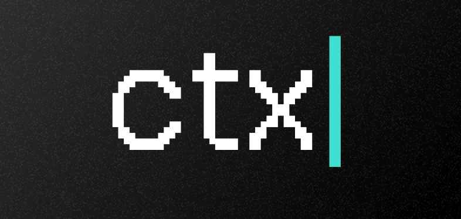
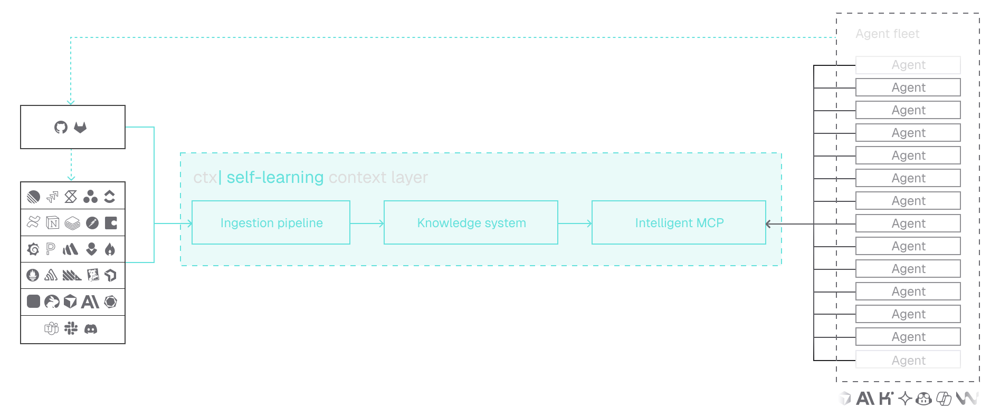

<p align="center">
  
</p>

<p align="center">
  <a href="https://img.shields.io/badge/License-ELv2-0f766e.svg"></a>
</p>

<p align="center">
  <a href="https://ctxpipe.ai">Get early access</a>
  ·
  <a href="https://docs.ctxpipe.ai">Docs</a>
  ·
  <a href="https://docs.ctxpipe.ai/docs/self-hosting">Self-host</a>
  ·
  <a href="https://github.com/ctxpipe-ai/ctxpipe/issues">Issues</a>
</p>

# ctx| (ctxpipe)

**Self-learning context infrastructure for AI engineering agents.**

ctx| gives coding agents the context they are missing: how your platform is
structured, which decisions already exist, what standards your team follows, and
how work should be done in your organization. It ingests repositories and source
material, builds a knowledge graph that compounds over time, and exposes that
context to agents through one MCP connection.

Use the open-source core yourself, or get in touch for early access to the
managed SaaS at [ctxpipe.ai](https://ctxpipe.ai/early-access).

## What ctx| does

- Makes engineering context portable across agents, repos, sessions, and tools.
- Uses Git as the source of truth for instructions, decisions, skills, and
  reviewable context changes.
- Builds a self-learning knowledge graph from code, docs, ADRs, instructions,
  usage, and connector data.
- Gives agents one MCP endpoint for architecture, standards, retrieval, and
  graph-backed context.
- Helps teams govern agent planning and execution with transparent,
  version-controlled context.
- Can be self-hosted or run as a managed SaaS.

## How it fits together

<p align="center">
  
</p>

## Core capabilities

| Capability | What it gives you |
|---|---|
| Cross-repo code search | Connect multiple repositories and let agents search across the codebase, not just the files currently open in an editor. |
| Product and engineering connectors | Bring in GitHub and Confluence today, with source material synced into Git-backed context your team can inspect. |
| Single org-scoped knowledge graph | Turn services, APIs, libraries, decisions, standards, and relationships into one shared graph for the organization. |
| One MCP for engineering knowledge | Give Cursor, Claude Code, Codex, and custom tools the same [MCP](https://docs.ctxpipe.ai/docs/mcp/mcp-docs) endpoint for ctx\| context. |
| Chat/MCP UI | Give new team members a place to ask questions about code, systems, and decisions without hunting through repos and docs. See agent interactions via MCP filter. |
| Human-readable context surfaces | Use Chat, repository management, and the [knowledge graph](https://docs.ctxpipe.ai/docs/knowledge-graph) to see what agents can use before they act. |

## Coming soon

- Git-backed instructions and memory. Keep AGENTS files, ADRs, skills, and synced docs versioned, reviewable, and close to the repos they affect.
- MCP CLI for easy installation across supported coding agents.
- Dashboard to see agent activity, patterns, and insights
- Proactive insights that surface stale context, missing instructions, and useful
  patterns from agent usage.
- More product and engineering connectors (Notion, Linear, Jira, Slack, Figma, and many more).

## Deployment options

### Managed SaaS

The easiest path is managed ctx|. It handles hosting, connector credentials,
model defaults, and production operations for you.

**Get early access:** [ctxpipe.ai](https://ctxpipe.ai)

### Self-host

Self-hosting is available for teams that need to run ctx| in their own
environment. Start with the self-hosting docs rather than treating the README as
the deployment runbook:

- [Self-hosting overview](https://docs.ctxpipe.ai/docs/self-hosting)
- [Quickstart](https://docs.ctxpipe.ai/docs/self-hosting/quickstart)
- [Docker Compose](https://docs.ctxpipe.ai/docs/self-hosting/deployment/docker)
- [Terraform](https://docs.ctxpipe.ai/docs/self-hosting/deployment/terraform)
- [AWS](https://docs.ctxpipe.ai/docs/self-hosting/deployment/aws)
- [Production readiness](https://docs.ctxpipe.ai/docs/self-hosting/production-readiness)

## Quickstart for local development

**Requirements:** Node.js 22+, pnpm 10, Docker with Compose v2.

```bash
pnpm install
cp apps/backend/.env.example apps/backend/.env.local
# Set AUTH_SECRET, at least 32 characters, in apps/backend/.env.local

pnpm dev:infra
pnpm dev
```

Open [https://app.ctxpipe.localhost](https://app.ctxpipe.localhost).

If your browser warns about the local certificate, run:

```bash
pnpm trust
```

For backend API, OpenAPI, MCP, and package scripts, see
[apps/backend/README.md](apps/backend/README.md).

## Documentation

- [Product docs](https://docs.ctxpipe.ai)
- [Getting started](https://docs.ctxpipe.ai/docs/getting-started)
- [Connections](https://docs.ctxpipe.ai/docs/connections)
- [Git repositories](https://docs.ctxpipe.ai/docs/git-repositories)
- [MCP setup](https://docs.ctxpipe.ai/docs/mcp/mcp-docs)
- [Self-hosting](https://docs.ctxpipe.ai/docs/self-hosting)

## Repository layout

| Path | Purpose |
|---|---|
| `apps/backend` | Hono API, auth, MCP endpoint, connectors, workflows, and migrations. |
| `apps/ui` | Product web app. |
| `apps/docs` | Fumadocs documentation site. |
| `apps/codesearch` | Zoekt-backed clone and code search service. |
| `apps/otel-collector` | OpenTelemetry Collector configuration. |
| `infra` | Terraform for the managed Railway and Neon deployment path. |
| `.ai/memory` | Architecture decisions and project memory used by coding agents. |

## Common commands

| Command | Purpose |
|---|---|
| `pnpm dev:infra` | Start Docker-backed dependencies for local development. |
| `pnpm dev` | Run backend and UI on the host, with codesearch in Docker. |
| `pnpm dev:docs` | Run the docs site on `http://localhost:3003`. |
| `pnpm start` | Run the full containerized stack with the Compose `deploy` profile. |
| `pnpm db:migrate` | Run backend database migrations. |
| `pnpm build` | Build the monorepo with Turborepo. |
| `pnpm lint` / `pnpm format` | Run Biome. |
| `pnpm mcp:inspect` | Open the MCP inspector for the backend. |

## Support and contributing

- Product or early access questions: [ctxpipe.ai](https://ctxpipe.ai)
- Docs and setup questions: [docs.ctxpipe.ai](https://docs.ctxpipe.ai)
- Bugs and feature requests: [GitHub issues](https://github.com/ctxpipe-ai/ctxpipe/issues)
- Technical context for agents: [AGENTS.md](AGENTS.md)

Contributions are welcome through issues and pull requests. For larger changes,
please open an issue first so the design and product direction can be aligned.

## License

This project is released under **Elastic License 2.0 (ELv2)**.

See the open-source guide:
[docs.ctxpipe.ai/docs/resources/open-source](https://docs.ctxpipe.ai/docs/resources/open-source)
